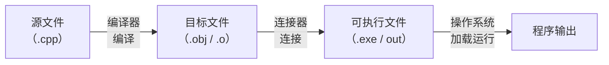

## 编程与算法

### 计算机程序设计语言

#### 什么是编程

**编程**的本质是**人与计算机之间的通信**。计算机只认识二进制指令，而人无法直接用 0 和 1 思考，于是每一层抽象都在做同一件事：让程序员用更接近人类思维的方式描述计算过程，再由工具把它翻译成机器能执行的指令。

交给计算机的一组完整指令就是一个**程序**（Program），编写程序的过程就是**编程**（Programming）。所谓"学习一门语言"，学的其实是**这套描述方式允许你表达什么、以及它把你挡在了哪些细节之外**。

#### 程序设计语言的层次

从机器语言到高级语言，这条演进线的主轴是**抽象层级的抬升**：越往上，越接近人的表达习惯；越往下，越接近硬件的真实动作。

| 层次 | 语言类型 | 示例 | 特点 |
| :--- | :--- | :--- | :--- |
| **第一代** | 机器语言 | `10110000 01100001` | CPU 直接执行；人类几乎无法阅读和编写 |
| **第二代** | 汇编语言 | `MOV AL, 61h` | 用助记符替代二进制码，需汇编器翻译；与硬件绑定 |
| **第三代** | 高级语言 | C、C++、Java、Python | 接近自然语言与数学表达；需编译器或解释器翻译 |

**机器语言**最底层，每条指令直接对应 CPU 的一个基本操作。它的优点是没有任何中间层，执行效率最高；缺点是那串 `0` 和 `1` 没人读得懂，而且不同 CPU 的指令集完全不同——Intel 芯片的机器码放到 ARM 芯片上就是乱码。

**汇编语言**用助记符（`MOV` 表示数据移动、`ADD` 表示加法）替代二进制操作码，由**汇编程序**（Assembler）翻译成机器语言，这个过程叫**汇编**。它比机器语言前进了一大步，但依然和硬件体系深度绑定，而且助记符语义很低级——你仍要自己关心寄存器分配和地址计算，开发效率很低。

**高级语言**提供变量、表达式、循环、函数这些接近人类思维的抽象，屏蔽了底层硬件的大部分细节。C++ 在这条线上的位置很特殊：它**同时保留高级抽象和底层控制**——既能写高度抽象的面向对象程序，也能在需要时直接操作内存地址（指针）。这种双面性是 C++ 最强的地方，也是它最复杂的地方。

#### 编译型语言与解释型语言

高级语言按执行方式分成两类，C++ 属于前者：

| 类型 | 执行方式 | 典型语言 | 特点 |
| :--- | :--- | :--- | :--- |
| **编译型** | 源码 → 编译器 → 机器码 → CPU 直接执行 | C、C++ | 运行速度快；换平台需要重新编译 |
| **解释型** | 源码 → 解释器逐行翻译执行 | Python、JavaScript | 跨平台方便；运行速度较慢 |

> **注意**：这个二分法在现代语言里已经不再绝对——Java 是"先编译为字节码、再由 JVM 解释执行"的混合模式，Python 也有 JIT（即时编译）实现。但 C++ 是**纯编译型**语言，这一条决定了它的两个核心优势：**执行效率极高**（直接跑机器码，没有中间层损耗）与**接近硬件的控制力**（指针、内存布局、内联汇编）。这正是它在游戏引擎、操作系统、高频交易、嵌入式领域难以被替代的原因。

### 算法

知道"用什么语言写"之后，下一个问题是"写什么"。程序的核心从来不是语法，而是**算法**——解决问题的思路和步骤。

#### 数据结构与算法

数据本身和操作数据的方法是两个不可分割的概念：

- **数据结构**（Data Structure）：对数据的描述，是数据组织、管理和存储的格式。它定义数据元素之间存在什么关系——线性排列（数组、链表）、层次关系（树），还是网状连接（图）。
- **算法**（Algorithm）：对数据处理的描述，为解决特定问题而规定的一系列有限操作步骤。

二者的关系可以用计算机科学中最著名的一个式子概括：

```
程序 = 数据结构 + 算法
```

这个式子由 Pascal 语言之父 Niklaus Wirth 提出，含义是：**任何程序本质上都是在某种数据结构上执行某种算法**。选对了数据结构，算法就简单；选错了，算法会复杂到难以维护。要频繁查找数据时，哈希表（$O(1)$ 查找）和数组（$O(n)$ 查找）的差距不在代码写得好不好，而在最初选了什么结构——这就是"数据结构决定算法效率"的具体含义。

#### 算法的五大特性

不是任何一组操作步骤都能叫算法。一个合格的算法必须同时满足五个条件：

| 特性 | 含义 | 违反示例 |
| :--- | :--- | :--- |
| **有穷性** | 必须在执行有限步后结束，每一步在有限时间内完成 | 死循环 `while (true) {}` |
| **确定性** | 每一步的含义必须明确，不能有二义性 | "把那个数加上去"——"那个"指代不明 |
| **可行性** | 每一步都能通过已知的基本操作实现 | "找出全宇宙最大的数"——无法实现 |
| **输入** | 可以有 0 个或多个输入（0 个表示算法内部自带初始数据） | — |
| **输出** | 必须有 1 个或多个输出，否则算法没有意义 | 只计算、不返回也不输出的函数 |

> **易错点**：有穷性说的是**步骤数量有限**，不是**运行时间有限**。`while (true) {}` 里每一步都很快，但步骤是无穷多个，所以它不满足有穷性。另外要区分**算法**和**程序**：算法在思路层面，程序在实现层面，同一个算法可以用不同语言实现成不同的程序。

#### 算法的描述方式

动手写代码之前，先把思路梳理清楚。常用的描述工具有三种。

**流程图**（Flowchart）用图形表示算法流程，是最直观的一种：

| 符号 | 名称 | 用途 |
| :--- | :--- | :--- |
| 圆角矩形（跑道形） | 起止框 | 算法的开始和结束 |
| 平行四边形 | 输入/输出框 | 数据的输入和输出 |
| 菱形 | 判断框 | 条件判断，通常引出两条分支 |
| 矩形 | 处理框 | 执行计算或数据处理 |
| 带箭头的线 | 流程线 | 指示执行顺序 |
| 圆形 | 连接点 | 连接分散的流程图部分 |
| 虚线或折角矩形 | 注释框 | 对流程图作补充说明 |

**N-S 图**是流程图的改进版：用矩形嵌套表示控制结构，完全取消流程线。它结构更紧凑，但绘制和修改不如流程图灵活。

**伪代码**（Pseudocode）用接近自然语言的方式描述步骤，不关心语法细节。它的核心价值是：**让你在纠结语法之前，先把逻辑想清楚**。

> **例 1（用伪代码描述算法）** 输入任意实数 $x$，输出它的绝对值 $|x|$。

**思路**：绝对值算法的核心逻辑只有一个判断——$x \ge 0$ 就输出 $x$ 本身，否则输出 $-x$。

**解**：

```
输入 x
如果 x ≥ 0
    输出 x
否则
    输出 -x
```

这个例子虽小，却完整包含了算法的三要素——**输入**（$x$）、**处理**（判断并计算）、**输出**（$|x|$）。伪代码的关键在于**逻辑清晰**而不是语法精确，你会发现它与 C++ 代码的对应关系非常直接，这正是伪代码的设计意图。

三种方式各有适用场景：流程图适合向别人展示整体逻辑，尤其是多分支的复杂流程；N-S 图适合结构化编程；伪代码适合写代码前快速梳理思路。学习阶段至少掌握流程图与伪代码两种。

### 程序的编写与调试

理解了算法，下一步是把它落实成能运行的代码。这个过程不是"一口气写完就能跑"的，它包含多个环节，而**绝大多数初学者的挫败感都来自分不清自己卡在了哪个环节**。

#### 编写程序的基本步骤

```
算法设计 → 编码 → 编译 → 连接 → 运行 → 调试 → 维护
```

1. **算法设计**：根据问题需求选择或设计合适的算法。这是最需要逻辑思维的环节，代码只是算法思想的载体。
2. **编码**（Coding）：用程序设计语言把算法写成源文件。它不只是"翻译"，还包含变量命名、代码结构、错误处理这些工程考量。
3. **编译**（Compile）：编译器把源文件翻译成目标文件（`.obj` / `.o`），此时还不是可执行文件。这个阶段检查**语法错误**——漏分号、括号不匹配、用了未定义的变量，都会在这里被拦下。
4. **连接**（Link）：连接器把目标文件与标准库、第三方库合并，生成可执行文件（`.exe` / `out`）。缺少库文件或函数定义重复，会在这个阶段报错。
5. **运行**（Run）：操作系统把可执行文件加载进内存，CPU 逐条执行指令。



#### 编译与连接

把高级语言翻译成机器语言的过程叫**编译**，执行编译任务的程序叫**编译器**。常见的 C++ 编译器有三家：

| 编译器 | 平台 | 特点 |
| :--- | :--- | :--- |
| **GCC / G++** | 跨平台（Linux / macOS / Windows） | 开源，行业标准；MinGW 提供 Windows 版本 |
| **MSVC**（Microsoft Visual C++） | Windows | 微软官方，与 Visual Studio 深度集成 |
| **Clang** | 跨平台 | 架构现代，错误提示清晰，编译速度快 |

编译阶段的核心任务是**语法检查**：编译器逐行扫描源文件，确认它符合 C++ 的语法规则，发现的问题统称**语法错误**（Syntax Error）。

连接阶段的核心任务是**符号解析**。你的代码里可能调用了别的文件里的函数（比如 `printf` 来自标准库），连接器负责找到这些外部符号的实际地址并建立跳转关系。**声明了一个函数却从未定义它**，编译能过（语法没错），连接会失败，报 `undefined reference`。

#### 调试与维护

程序编译通过、能跑起来，不等于它没有问题。

**逻辑错误**（Logic Error，俗称 **bug**）：语法正确、运行不崩溃，但结果不对。想写"求两数之和"却写成了 `a - b`，编译器完全不会觉得有问题——加减法的语法都合法，错的是你的逻辑。这类错误比语法错误难查得多，因为编译器帮不了你。

**调试**（Debugging）就是找出并改正逻辑错误，基本策略是三步：

1. **复现**：找到能稳定触发 bug 的操作步骤，让它"现形"。
2. **定位**：通过输出中间变量、设置断点、逐行跟踪程序状态，逐步缩小可疑范围，直到锁定 bug 的精确位置。
3. **修复**：改完后重新运行确认 bug 消失，并确认没有引入新问题。

> **注意**：初学者常常跳过"定位"直接猜着改代码，结果改掉一处又冒出两处。**花在准确定位上的时间，永远比盲目修改后反复调试的时间更划算。**

**维护**（Maintenance）是程序发布之后长期存在的环节：用户报出之前没发现的 bug、操作系统升级导致兼容性问题、业务变更需要加功能，都会触发维护。

维护之所以难，根源有两点。第一，**读懂别人的代码比写自己的难得多**——每个人的思维方式和编码风格不同，变量命名含糊、注释缺失的代码对维护者来说像考古。第二，**文档和代码通常不同步**：程序改了文档没改，维护者照着过时的文档理解代码，很容易又写出新 bug。这也是"写代码时要考虑六个月后的自己还能不能看懂"这句话真正的分量所在。

## C++ 快速入门

背景铺垫完了，现在进入正题。这一节从最小骨架入手，先回答"一个 C++ 程序长什么样"，再讲注释与命名——**这三件事决定了你写的代码能不能被别人（以及三个月后的自己）读懂**。

### C++ 程序的基本框架

任何 C++ 程序，无论多复杂，都建立在同一个骨架上：

```cpp
#include <iostream>
using namespace std;

int main() {
    // 你的代码写在这里
    return 0;
}
```

这五行里每一个元素都有明确分工：

| 代码 | 角色 | 说明 |
| :--- | :--- | :--- |
| `#include <iostream>` | **预处理指令** | 编译之前把头文件 `iostream` 的内容原样复制到此处；它包含 `cin`、`cout` 等标准输入输出的声明 |
| `using namespace std;` | **命名空间声明** | 告诉编译器使用标准库的 `std` 命名空间，此后写 `cout` 不必写 `std::cout` |
| `int main()` | **主函数** | 程序的入口；每个 C++ 程序有且仅有一个 `main`，执行从这里开始 |
| `{ ... }` | **函数体（程序块）** | 花括号括起的部分称为**块**（Block），界定了函数的执行范围 |
| `return 0;` | **返回值** | 向操作系统报告退出状态：`0` 表示正常结束，非 `0` 表示异常 |

#### 预处理指令 #include

`#include` 是 C++ 最重要的**预处理指令**之一。以 `#` 开头的指令在**编译之前**由**预处理器**处理，它是编译流水线上的第一个环节：

```
源文件(.cpp) → 预处理器 → 展开后的源码 → 编译器 → 目标文件(.obj)
```

预处理器看到 `#include <iostream>`，就在系统指定的头文件目录里找到 `iostream`，把它的全部内容复制并插入到这一行的位置。换句话说，`#include` 本质上是一次**文本替换**——它让你不必每次都把标准库的声明重抄一遍。

头文件有两种引用方式，区别只在**搜索顺序**：

| 方式 | 格式 | 搜索路径 | 适用场景 |
| :--- | :--- | :--- | :--- |
| 尖括号 | `#include <iostream>` | 先在系统目录中查找 | **标准库头文件** |
| 双引号 | `#include "myheader.h"` | 先在当前源文件目录查找，再查系统目录 | **自定义头文件** |

#### 命名空间 using namespace std

标准库的所有标识符（`cout`、`cin`、`string`、`vector` 等）都定义在 `std`（standard）命名空间里。命名空间的作用是**防止命名冲突**：当你自己也定义了一个叫 `cout` 的东西，编译器可以靠命名空间区分标准库的 `std::cout` 和你的 `my::cout`。

引入命名空间有三种写法：

```cpp
// 方式一：全局引入——教学示例常用，代码最短
using namespace std;

// 方式二：只引入需要的——工程开发中推荐
using std::cout;
using std::endl;

// 方式三：不引入，每次显式指定——最安全，也最啰嗦
std::cout << "Hello" << std::endl;
```

> **注意**：本系列示例统一用**方式一**，因为它能让代码聚焦在要讲的知识点上。但大型工程里全局引入整个 `std` 被普遍认为是不好的实践——它把标准库几千个标识符全部暴露到全局作用域，显著增加命名冲突的风险。实际工作中请用方式二或方式三。

#### 主函数 main()

```cpp
int main() {
    // ...
    return 0;
}
```

- `int` 是**返回值类型**：`main` 必须向操作系统返回一个整数，表示程序的退出状态。
- `main` 是函数名，这个名字**固定**——C++ 标准规定程序入口函数必须叫 `main`。
- 紧跟的 `()` 表示这是一个函数，现阶段不传参数。
- `return 0;` 返回 `0`，惯例表示"程序正常结束"。

> **易错点**：`return 0;` 在 `main` 里可以省略（编译器会自动补），但明确写出来是好习惯。另外 `main` 的返回类型必须写 `int`，写成 `void main()` 在多数编译器上"能过"，但它**不符合 C++ 标准**，程序退出状态会变得不确定。

#### 两种输出方式

C++ 兼容两套输出写法，初学者经常看到两者混用的代码：

| 方式 | 语法 | 来源 | 特点 |
| :--- | :--- | :--- | :--- |
| **C++ 风格** | `cout << "Hello" << endl;` | C++ 标准库（`iostream`） | 类型安全，可链式调用，现代 C++ 推荐 |
| **C 风格** | `printf("Hello\n");` | C 标准库（`cstdio`） | 格式控制灵活，效率高，C 语言遗留 |

```cpp
#include <iostream>
#include <cstdio>          // printf 需要此头文件
using namespace std;

int main() {
    // C++ 风格输出
    cout << "Hello, World!" << endl;

    // C 风格输出
    printf("Hello, World!\n");

    return 0;
}
```

`cout` 里的 `<<` 是**流插入运算符**，可以理解成"数据流向屏幕的管道"；`endl` 表示换行（end line）。`printf` 里的 `\n` 是**转义字符**，同样表示换行，两者在这个例子中效果完全一样。

> **注意**：`cout` 和 `printf` 可以混用，但同一段代码里最好只用一种并保持一致——混用不会报错，只会让代码风格显得凌乱。

### 第一个 C++ 程序

骨架认清了，来写一个完整的程序：输出电影《肖申克的救赎》的基本信息。

> **例 1（输出电影信息）** 编写一个 C++ 程序，在屏幕上输出电影的名称、上映年份和 IMDB 评分。

**思路**：数据有三部分——名称是文本、年份是整数、评分是小数。如果只是打印一次，直接在 `cout` 里写死也行；但只要这些数据在程序里会被多次使用，就该定义变量存起来。整数用 `int`、小数用 `double`、文本用 `string`（需要 `#include <string>`）。

**解**：

```cpp
#include <iostream>
#include <string>
using namespace std;

int main() {
    // 定义变量存储电影信息
    string title = "肖申克的救赎";
    int year = 1994;
    double rating = 9.7;

    // 输出电影信息
    cout << "电影名称：" << title << endl;
    cout << "上映年份：" << year << endl;
    cout << "IMDB评分：" << rating << endl;

    return 0;
}
```

程序输出：

```
电影名称：肖申克的救赎
上映年份：1994
IMDB评分：9.7
```

**评注**：程序虽短，却完整包含了四个基本动作——**引入头文件**、**声明变量**（确定类型和名字）、**赋值**、**输出**。注意三个变量用了三种类型，这说明 C++ 是**静态类型语言**：变量在创建时必须明确类型，之后不能改变。`string` 之所以不用单独讲就能用，是因为它同样是标准库类型——关于类型的完整讨论见 [C++程序设计基础-2 数据类型与运算符](/notes/cpp-2-data-types-and-operators/)。

初学阶段最容易踩的三类错误：

| 错误代码 | 问题 | 原因 |
| :--- | :--- | :--- |
| `cout << Hello` | 缺少双引号，`Hello` 被当成变量名 | 字符串字面量必须用英文双引号 `"..."` 包裹 |
| `cout << "Hello"` | 语句末尾缺少分号 | C++ 每条语句必须以 `;` 结尾，这是最高频的错误 |
| `int mian()` | `main` 拼写错误 | 入口函数名必须严格是 `main`，拼错会导致连接失败 |

> **调试技巧**：编译报错时不要被一长串英文提示吓到。**永远从第一条错误信息开始改**——后面几十条往往只是第一条引发的连锁反应。修掉第一条再重新编译，大量"假错误"会一起消失。

### 注释

注释是对代码的说明文字，**不参与编译和运行**，只为读代码的人（包括三个月后的你自己）服务。C++ 的两种注释方式与 C 完全一致：

| 类型 | 语法 | 用途 |
| :--- | :--- | :--- |
| **单行注释** | `// 注释内容` | 说明单行代码；从 `//` 到行尾都被忽略 |
| **多行注释** | `/* 注释内容 */` | 说明多行代码或复杂逻辑；`/*` 与 `*/` 之间（可跨行）都被忽略 |

```cpp
#include <iostream>
using namespace std;

int main() {
    // 这是单行注释：输出一条消息（"//" 之后的内容被编译器忽略）
    cout << "Hello" << endl;

    /*
      这是多行注释：
      下面这段代码计算两个整数的和
      当逻辑跨越多个步骤、需要详细说明时，
      多行注释是最合适的选择
    */
    int a = 10, b = 20;
    int sum = a + b;
    cout << "sum = " << sum << endl;

    return 0;
}
```

> **易错点**：多行注释**不能嵌套**。在一个 `/* */` 内部再写 `/* */`，编译器会把第一个 `*/` 当成外层注释的结束符，后面的内容被当作代码，直接编译错误：
>
> ```cpp
> /* 外层注释开始
>    /* 内层注释 */   ← 编译器认为外层在这里就结束了
>    这一行被当成代码    ← 多半会报错
> */                    ← 这个被当成多余的符号，也会报错
> ```
>
> 这是从 C 继承来的行为，不是某个编译器的 bug。要注释掉一大段本已含多行注释的代码时，用编辑器的批量注释功能，或统一改用 `//`。

**注释的价值在于解释"为什么"，而不是"做了什么"。** 下面两条注释，第一条是废话（代码本身已经说清了做什么），第二条才有信息量：

```cpp
int a = 10;              // 将 10 赋值给 a        ← 无意义，只是重复代码
int maxSize = 256;       // 256 是协议规定的最大包长度  ← 有意义，解释了取值原因
```

### 关键字与标识符

#### 关键字

每种语言都有一批被预先赋予特殊含义的词，称为**关键字**（Keyword）。写下 `int`，编译器就知道你要声明整数；写下 `return`，它就知道你要从函数返回。关键字**不能被用作变量名、函数名或类名**——它们已经被语言自己占用了。

C++ 的关键字数量随标准演进而增加（C++11/14/17/20 各自引入了新关键字），下面按类别列出最核心的一批：

| 类别 | 关键字 |
| :--- | :--- |
| **基本数据类型** | `int` `char` `float` `double` `bool` `void` `wchar_t` |
| **类型修饰符** | `short` `long` `signed` `unsigned` |
| **控制语句** | `if` `else` `switch` `case` `default` `while` `do` `for` `break` `continue` `return` `goto` |
| **复合类型** | `class` `struct` `union` `enum` `typedef` |
| **存储类** | `auto` `register` `static` `extern` `mutable` `thread_local` |
| **访问控制** | `public` `private` `protected` |
| **其他修饰符** | `const` `volatile` `inline` `virtual` `explicit` `friend` `constexpr` |
| **运算符相关** | `sizeof` `new` `delete` |
| **命名空间** | `namespace` `using` |
| **异常处理** | `try` `catch` `throw` |
| **类型转换** | `static_cast` `dynamic_cast` `const_cast` `reinterpret_cast` |

不需要现在背下来——每个关键字都会在具体语境里被自然认识。当下只要记住两条：关键字**不能**用作自定义标识符；不小心用了关键字做变量名时编译会直接报错，这个报错其实是在保护你。

> **注意**：`main` 不是关键字，但它是 C++ 标准规定的程序入口函数名，同样不应用于其他目的。

#### 标识符命名规则

**标识符**（Identifier）是你为变量、函数、类等起的自定义名字。C++ 对它既有硬性语法规则，也有软性风格建议。

**硬性规则（必须遵守，否则编译报错）**：

1. 只能由**字母**（`A-Z`、`a-z`）、**数字**（`0-9`）和**下划线**（`_`）组成。
2. **第一个字符必须是字母或下划线**，不能是数字。
3. **不能是 C++ 关键字**（如 `int`、`class`、`return`）。
4. 严格**区分大小写**——`name`、`Name`、`NAME` 是三个不同的标识符。

**软性建议（不遵守也能编译，但代码质量会明显下降）**：

命名只有一条核心原则——**见名知意**。代码是写给人看的，顺便给机器运行。好的命名让读者不借助注释就理解意图；糟糕的命名配满屏注释也救不回来。

| 原则 | 好例子 | 坏例子 | 说明 |
| :--- | :--- | :--- | :--- |
| 见名知意 | `studentCount`、`maxScore` | `a`、`b1`、`tmp`、`x2` | 变量名应描述它存的是什么 |
| 大小写规范 | `userName`（驼峰）、`user_name`（下划线） | `Uname`、`un_ame` | 选一种风格并保持一致 |
| 避免随意缩写 | `numberOfStudents` | `nos`、`nOs` | 行业通用缩写（`idx`、`len`）除外 |
| 不用拼音 | `studentName` | `xueShengMing` | 拼音在协作中完全失去语义 |

C++ 社区没有统一的命名法（不像 Java 强制驼峰），不同项目有不同惯例：

| 风格 | 示例 | 常见用途 |
| :--- | :--- | :--- |
| **小驼峰**（lowerCamelCase） | `studentName`、`maxValue` | 变量名、函数参数 |
| **大驼峰**（PascalCase） | `StudentManager`、`LinkedList` | 类名、结构体名 |
| **下划线**（snake_case） | `student_name`、`max_value` | C++ 标准库风格、变量名 |
| **全大写 + 下划线** | `MAX_SIZE`、`PI` | 宏常量、枚举值 |

> **建议**：本系列示例主要用**小驼峰 + 大驼峰**的组合（变量小驼峰，类大驼峰）。选哪种其实不重要，**一致性比风格本身重要得多**。

## 小结

1. 程序设计语言分机器语言、汇编语言、高级语言三层，抽象层级越高越接近人的表达，C++ 的定位是**同时保留高级抽象与底层控制**。
2. C++ 是纯编译型语言：源码经编译、连接后直接变成机器码，这带来了执行效率与硬件控制力，代价是换平台要重新编译。
3. 算法的五大特性是**有穷、确定、可行、输入、输出**；有穷性说的是**步骤有限**，不是运行时间有限，这是算法与程序的根本区别。
4. C++ 程序的五行骨架里，`#include` 是文本替换，`using namespace std` 是命名空间引入，`main` 是唯一入口，`return 0` 向操作系统报告正常退出。
5. `#include <...>` 先查系统目录（标准库），`#include "..."` 先查当前目录（自定义头文件）。
6. 注释不能嵌套，且应当解释"**为什么**"而不是重复"做了什么"。
7. 标识符的定义：字母/数字/下划线组成、不以数字开头、不是关键字、区分大小写——在此之上，"见名知意"和"风格一致"决定代码能不能被人读懂。
