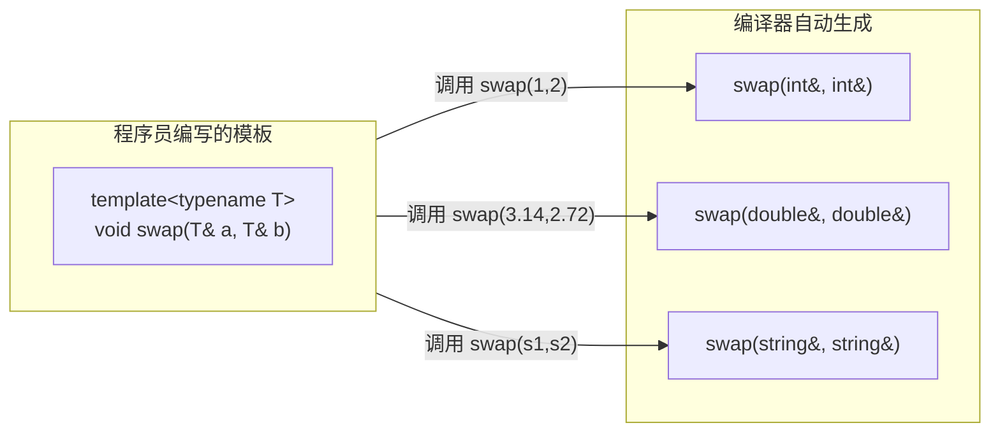

## 泛型编程概述

写一个"交换两个变量的值"的函数，`int` 版本写完了，`double` 版本也写完了，`char` 版本也写完了——三个函数的逻辑完全相同，唯一的区别只是类型名。**模板**（Template）正是为终结这种重复而生的：它把**类型本身参数化**，代码只写一份，编译器按调用现场自动补齐各个类型的版本。

模板要解决的问题可以用一句话概括：**同一套逻辑被不同类型重复实现**。三个交换函数的代码逐字相同，只有类型名不同；这种"复制粘贴改类型"的代价不限于多敲几行代码——逻辑里一旦藏着 bug，就要在每一份拷贝上各修一次，漏掉任何一份都会留下行为不一致的隐患。

这种编写**与类型无关**的通用代码的范式称为**泛型编程**（Generic Programming），它是 C++ 标准模板库的基石：`vector<int>` 是类模板的实例，`sort(arr, arr + n)` 是函数模板的实例，它们共用的就是这一章要讲的两套语法。



图中左侧只有一份模板，右侧是编译器根据三次具体调用各自生成的结果。要强调的是：**生成发生在编译期**，不是运行期——程序跑起来时并不存在"按类型选择函数"这一步，每种被用到的类型在编译结束后都已经各自拥有一份独立函数。这条"用到才生成"的性质，在类模板那里会细到成员函数的粒度，成为后面几节反复出现的关键。

## 函数模板

函数模板是模板机制最直接的应用：把函数涉及的类型抽成虚拟类型。它的语法只比普通函数多一行，但由此派生出三个必须弄清楚的问题——类型从哪里来、与同名普通函数谁优先、遇到不适用的类型怎么办。

### 基本语法

函数模板的改写动作只有一处：在普通函数定义前加一行 `template` 声明，再用虚拟类型名（惯例写 `T`）顶替具体类型。`T` 可以出现在任何需要写类型的位置——形参、返回值、函数体内的局部变量。

```cpp
template<typename T>          // 声明模板，T 是虚拟类型名
void mySwap(T& a, T& b) {     // T 可以用在任何需要类型的地方
    T temp = a;
    a = b;
    b = temp;
}
```

这四行里出现的新东西只有三个：

| 要素 | 说明 |
| :--- | :--- |
| `template` | 关键字，声明"接下来是一个模板" |
| `typename T` | 声明虚拟类型参数 `T`——`typename` 也可以写成 `class`，两者在模板参数列表里完全等价 |
| `T` | 虚拟类型名，惯例用大写字母。取 `Type`、`DataType` 等名字都可以，但 `T` 最短也最通用 |

> **易错点**：`typename` 与 `class` 在模板参数声明中**没有任何区别**，`template<typename T>` 和 `template<class T>` 完全等价。`typename` 是在 C++ 标准化的过程中引入的，它更准确地表达了"`T` 可以是任意类型，不一定是类"；而 `class` 只是模板诞生时还没有 `typename` 关键字所留下的写法。两种都能编译，选一种并在同一份代码里保持一致即可。

调用函数模板有两种方式，区别在于**类型由谁指定**。

#### 自动类型推导

不写 `<类型>`，由编译器从实参类型反推 `T`。`mySwap(x, y)` 中 `x`、`y` 都是 `int`，于是 `T` 被确定为 `int`，真正被调用的是一份 `mySwap(int&, int&)`。这是最常用的写法——模板用起来和普通函数没有任何区别，使用者甚至不需要知道它是模板。

#### 显式指定类型

在函数名后写 `<类型>`，直接告诉编译器 `T` 是什么：`mySwap<double>(m, n)` 用 `double` 去实例化模板。显式指定的意义不只是"写得清楚"——它允许实参类型与 `T` 不一致，此时编译器会对实参做隐式转换（这一条与普通函数的差别见下一小节）。

两种调用方式放进同一个程序：

```cpp
#include <iostream>
using namespace std;

template<typename T>
void mySwap(T& a, T& b) { T temp = a; a = b; b = temp; }

int main() {
    int x = 10, y = 20;
    double m = 3.14, n = 2.72;

    // 方式一：自动类型推导（编译器根据实参类型自动确定 T）
    mySwap(x, y);
    cout << x << " " << y << endl;         // 20 10

    // 方式二：显式指定类型
    mySwap<double>(m, n);
    cout << m << " " << n << endl;         // 2.72 3.14

    return 0;
}
```

程序输出两行 `20 10` 与 `2.72 3.14`：`mySwap(x, y)` 交换了两个 `int`，`mySwap<double>(m, n)` 交换了两个 `double`。同名的两次调用对应两份功能相同、类型不同的函数——**模板本身不是函数，实例化之后才是**。

> **易错点**：自动类型推导要求所有实参推出**同一个** `T`。`mySwap(10, 3.14)` 会直接编译失败——`T` 到底是 `int` 还是 `double`？编译器不会替你二选一。要让它通过，必须显式指定 `mySwap<double>(10, 3.14)`，把 `10` 隐式转换成 `double` 再传进去。

### 函数模板与普通函数的区别

同名的情况下，**普通函数优先于模板**；此外，自动推导阶段的模板**不做隐式类型转换**。这两条规则决定了每次调用的实际走向，也是模板与普通函数最容易混淆的地方。

| 维度 | 普通函数 | 函数模板 |
| :--- | :--- | :--- |
| **隐式类型转换** | 调用时可以发生（如 `int` → `double`） | 自动类型推导时**不**发生 |
| **显式指定类型** | — | 显式指定类型后**可以**发生隐式转换 |
| **调用优先级** | 同名时**优先调用** | 普通函数不匹配时才考虑模板 |

#### 隐式类型转换

普通函数调用时，实参与形参类型不一致会触发隐式转换——`add(a, c)` 里 `char` 类型的 `c`（ASCII 值 99）会被转成 `int`，与 `int` 形参匹配。模板不一样：自动推导要求 `T` 直接来自实参类型，`int` 与 `char` 会推出两个互相冲突的 `T`，编译器在推导这一步就停下，根本走不到类型转换。

#### 调用优先级

同时存在 `int add(int, int)` 与 `template<typename T> T add(T, T)` 时，`add(a, b)` 调用的是普通函数——它是完全匹配的最佳选择，模板连实例化的机会都没有。

> **易错点**：同名时编译器有一套固定的决策顺序：① 先找能**完全匹配的普通函数**；② 没有就找模板能否生成一个完全匹配的版本；③ 模板也不行，才考虑普通函数经过隐式类型转换后能否匹配。也就是说，模板的优先级**低于**完全匹配的普通函数，却**高于**需要隐式转换的普通函数——这一点常被记反。

#### 空尖括号强制模板

如果真的想用模板版本，写 `add<>(a, b)`。空的 `<>` 是一个显式信号：请用模板去推导 `T`，跳过普通函数的优先级。

把这三种调用放在一起对比：

```cpp
#include <iostream>
using namespace std;

// 普通函数——int 版本
int add(int a, int b) { return a + b; }

// 函数模板——通用版本
template<typename T>
T add(T a, T b) { return a + b; }

int main() {
    int a = 10, b = 20;
    char c = 'c';              // ASCII 99

    cout << add(a, b) << endl;        // 30 —— 优先调用普通函数（最佳匹配）
    cout << add<>(a, b) << endl;      // 30 —— 空 <> 强制使用模板

    cout << add(a, c) << endl;        // 109 —— 普通函数可以隐式将 char 转为 int
    // cout << add(a, c) << endl;     // 若没有普通函数，自动推导的模板会报错（T 不一致）
    cout << add<int>(a, c) << endl;   // 109 —— 显式指定 int，T 确定后允许隐式转换

    return 0;
}
```

四次输出的解释各不相同：`add(a, b)` 走普通函数；`add<>(a, b)` 用空尖括号强制走模板；`add(a, c)` 靠普通函数把 `char` 隐式转成 `int`；`add<int>(a, c)` 先定下 `T = int`，再让实参去适配。如果那个普通函数不存在，`add(a, c)` 会因为 `T` 推导冲突而报错。

> **建议**：既然写了模板，通常就不需要再为每种类型写一份普通版本。如果两者同时存在，尽量让函数名互不冲突，不要把"选谁"的负担留给调用者和编译器。

普通函数之间如何按参数匹配，属于函数重载的话题，细节见 C++程序设计基础-4 函数。

### 模板的局限性与具体化

模板是"一刀切"的通用方案：它对所有类型做同一件事。有些类型偏偏需要**特殊处理**，这时要用**具体化**——为某个具体类型单独写一份实现，让编译器在这个类型上不再使用通用模板。典型情形就是比较两个自定义类型的对象：`Person` 没有定义 `==`，通用模板里的 `a == b` 对它根本无从谈起。

```cpp
#include <iostream>
#include <string>
using namespace std;

class Person {
public:
    Person(string name, int age) : m_name(name), m_age(age) {}
    string m_name;
    int m_age;
};

// 普通模板——用 == 比较（对内置类型有效）
template<typename T>
bool isEqual(T& a, T& b) {
    return a == b;
}

// 具体化模板——专门处理 Person 的比较（优先级高于普通模板）
template<>
bool isEqual(Person& p1, Person& p2) {
    return p1.m_name == p2.m_name && p1.m_age == p2.m_age;
}

int main() {
    int x = 10, y = 10;
    cout << isEqual(x, y) << endl;               // 1——调用普通模板

    Person p1("张三", 18), p2("张三", 18);
    cout << isEqual(p1, p2) << endl;             // 1——调用具体化模板
    return 0;
}
```

两份 `isEqual` 的调用结果都是 `1`，但执行的是完全不同的代码：`int` 版走通用模板，`Person` 版走专用实现。

#### 显式具体化

具体化的语法是 `template<>`（空尖括号）加"函数名后跟 `<具体类型>`"。空尖括号的含义是"模板参数一个都不留，全部写死"。**具体化的优先级高于通用模板**：编译器发现 `Person` 有专用版本，就自动选它，而不会拿 `a == b` 去硬套。

> **易错点**：具体化最容易漏掉的就是 `template<>` 这一行前缀。写出来之后，具体化版本与通用模板长得几乎一样，回看代码时很容易把两者弄混——那一行空尖括号是"这是模板的特殊版本"的唯一标志。

#### 与函数重载的区别

> **易错点**：容易把具体化与函数重载混为一谈，其实两者完全无关。**具体化**针对的是模板——它告诉编译器"当 `T` 是某个具体类型时，不要用通用模板生成，改用这个专用版本"，必须带 `template<>` 前缀；**函数重载**是同名不同参的普通函数，与模板没有任何关系。两者可以共存，共存时具体化的优先级更高。

### 函数模板综合案例

把这一节的语法拼起来，写一个真正通用的小工具。

> **例 1（模板实现通用排序）** 用函数模板实现一个通用的选择排序，能对 `int` 数组和 `char` 数组进行降序排列。

**思路**：排序逻辑与类型无关——选择排序的核心是"找最值、交换"，这两件事都不关心元素是什么类型。把交换、排序、打印三个函数都写成模板，数组元素类型统一用 `T` 代替；调用时由编译器按数组类型自动生成对应版本。

**解**：

```cpp
#include <iostream>
using namespace std;

// 模板交换
template<typename T>
void mySwap(T& a, T& b) { T temp = a; a = b; b = temp; }

// 模板选择排序（降序）
template<typename T>
void mySort(T arr[], int len) {
    for (int i = 0; i < len; i++) {
        int maxIdx = i;
        for (int j = i + 1; j < len; j++) {
            if (arr[maxIdx] < arr[j]) maxIdx = j;
        }
        if (maxIdx != i) mySwap(arr[maxIdx], arr[i]);
    }
}

// 模板打印
template<typename T>
void printArray(T arr[], int len) {
    for (int i = 0; i < len; i++) cout << arr[i] << " ";
    cout << endl;
}

int main() {
    int iArr[] = {7, 5, 8, 1, 3, 9, 2, 4, 6};
    int iLen = sizeof(iArr) / sizeof(int);
    mySort(iArr, iLen);                       // 编译器自动生成 int 版本
    printArray(iArr, iLen);                   // 9 8 7 6 5 4 3 2 1

    char cArr[] = "bdcae";
    int cLen = sizeof(cArr) / sizeof(char) - 1;  // 减 1 排除末尾 '\0'
    mySort(cArr, cLen);                       // 编译器自动生成 char 版本
    printArray(cArr, cLen);                   // e d c b a
    return 0;
}
```

**评注**：`mySort` 与 `mySwap` 的逻辑本身并不新——它们就是曾经针对 `int` 写过的选择排序，模板做的事只是把类型抽走。一份代码同时覆盖了 `int` 与 `char` 两种数组，这正是 STL 的设计哲学：**算法与数据结构分离**，算法通过模板泛化成类型无关的通用工具，数据结构负责提供算法需要的操作。

代码里 `sizeof(cArr) / sizeof(char) - 1` 的那个减 1 不能省：以字符串字面量初始化的字符数组末尾还有一个 `'\0'`，它不该参与排序。

## 类模板

函数模板让函数能处理多种类型，**类模板**让类也能——类里的成员类型不再写死，而是由使用者在创建对象时指定。语法与函数模板同源，但有三处必须额外记住：模板参数要显式写出、成员函数按需生成、实现不能拆进 `.cpp`。

### 基本语法

类模板的写法是在 `class` 前加同一行 `template` 声明，虚拟类型可以用在成员变量与成员函数里。

#### 单个类型参数

最简单的类模板只有一个类型参数，成员变量的类型由它决定：

```cpp
#include <iostream>
#include <string>
using namespace std;

template<typename T>           // 声明类模板
class MyClass {
public:
    T m_data;                   // 成员变量的类型由模板参数决定
    MyClass(T data) : m_data(data) { }
    void show() { cout << m_data << endl; }
};

int main() {
    MyClass<int> obj1(10);             // T = int
    MyClass<string> obj2("Hello");     // T = string

    obj1.show();    // 10
    obj2.show();    // Hello
    return 0;
}
```

使用方式上有一点与函数模板不同：`MyClass<int>`、`MyClass<string>` 里的 `<类型>` 必须写出来。而且这两个写法是**两个完全独立的类型**，编译器为它们各生成一份代码，彼此之间不能互相赋值。

#### 多个类型参数

需要几个类型就声明几个参数，用逗号分隔。例如"键值对"容器需要两个类型：

```cpp
#include <iostream>
#include <string>
using namespace std;

template<typename KeyType, typename ValueType>
class Pair {
public:
    KeyType key;
    ValueType value;
    Pair(KeyType k, ValueType v) : key(k), value(v) { }
    void show() { cout << key << " : " << value << endl; }
};

int main() {
    Pair<string, int> score("张三", 95);     // Key = string, Value = int
    score.show();                              // 张三 : 95
    return 0;
}
```

#### 与函数模板的差异

类模板与函数模板的差别集中在两点：

| 维度 | 函数模板 | 类模板 |
| :--- | :--- | :--- |
| **类型推导** | 可以自动推导 | **不能**——必须显式指定 `<类型>` |
| **默认参数** | 无 | 模板参数列表中可以有默认类型 |

> **易错点**：类模板不能靠构造函数的参数反推出模板参数。`MyClass obj(10);` 里的 `10` 推不出 `T`，因为一个类可以有多个构造函数，参数类型并不等于模板参数类型——这一点与函数模板的自动推导完全不同。C++17 引入的**类模板实参推导**（CTAD）允许在构造函数参数足够推断时省略 `<类型>`，但显式写出 `<类型>` 可读性更好，也不受标准版本限制，本系列统一保留这种写法。

#### 默认类型参数

类模板的参数列表可以带默认类型——把最常用的类型设为默认值，使用时就能少写一个参数：

```cpp
#include <iostream>
#include <string>
using namespace std;

// 类模板可以有默认类型参数
template<typename NameType, typename AgeType = int>
class Person {
public:
    NameType m_name;
    AgeType m_age;
    Person(NameType name, AgeType age) : m_name(name), m_age(age) { }
};

int main() {
    Person<string> p1("张三", 18);            // AgeType 默认为 int
    Person<string, double> p2("李四", 20.5);  // 显式指定 double
    return 0;
}
```

`Person<string>` 省略了第二个参数，`AgeType` 取默认的 `int`；`Person<string, double>` 则显式覆盖为 `double`。模板参数一旦有了默认值，调用方就不必重复书写最常见的那种类型。

### 类模板成员函数的创建时机

普通类中的成员函数在**编译时**就被全部创建；类模板中的成员函数**只有在被调用时**才创建。这个"按需生成"的特性，决定了模板代码对类型的要求可以有多宽松。看下面这个刻意设计的例子：

```cpp
#include <iostream>
using namespace std;

class A { public: void showA() { cout << "A" << endl; } };
class B { public: void showB() { cout << "B" << endl; } };

template<typename T>
class MyClass {
public:
    T obj;
    void callShowA() { obj.showA(); }    // 依赖 T 有 showA()
    void callShowB() { obj.showB(); }    // 依赖 T 有 showB()
};

int main() {
    MyClass<A> ma;
    ma.callShowA();                       // ✅ A 有 showA()——编译通过
    // ma.callShowB();                    // ❌ A 没有 showB()——编译错误！但如果不调用就不会报错
    return 0;
}
```

#### 按需生成

`MyClass<A>` 只用到了 `callShowA()`，编译器就只生成这一个成员函数；`callShowB()` 没有被调用，即使它的函数体对 `A` 根本不成立，也不会产生任何报错。反过来，一旦真的写下 `ma.callShowB()`，编译器就会去实例化那个函数体，错误随之出现——**错误的出现位置取决于调用，而不是取决于定义**。

由此得到一条很实用的写法：写模板代码时不需要担心 `T` 是否具有某个成员函数，只要**实际用到的**类型有它，代码就能编译通过。这种"看行为不看声明"的灵活性被称为**鸭子类型**（Duck Typing），也是 C++ 模板与 Java 泛型的关键区别——约束不写在类型参数上，而是"用到才算数"。

### 类模板与继承

子类继承一个类模板时，**必须明确父类的模板参数**。原因很直接：编译器需要知道为父类那部分分配多少内存，而 `Base` 只是一个模具，`Base<int>` 才是一个有确定布局的类型。

最直接的写法是写死一个具体类型：`class Son1 : public Base<int> { };`。而不指定参数的 `class Son : public Base { };` 无法编译——编译器不知道 `Base` 有多大。

如果希望子类沿用父类的灵活性，就让子类自己也是模板，并用子类的模板参数去指定父类的：`template<typename T> class Son2 : public Base<T> { };`。此时 `Son2<int>` 的父类是 `Base<int>`，`Son2<string>` 的父类是 `Base<string>`，父子同型。

两种正确写法与那种错误写法放在一起看：

```cpp
template<typename T>
class Base {
public:
    T m_data;
};

// ❌ 错误：不指定 T 的类型，编译器不知道 Base 多大
// class Son : public Base { };

// ✅ 正确：明确指定父类的模板参数
class Son1 : public Base<int> { };

// ✅ 子类自己也可以是模板——用子类的模板参数来指定父类的
template<typename T>
class Son2 : public Base<T> { };
```

### 类模板分文件编写

类模板的声明与实现必须放在**同一个文件**里，通常约定扩展名为 `.hpp`。把成员函数的定义单独放进 `.cpp` 是行不通的——这条约束正是"成员函数按需生成"的直接后果。

#### 连接失败原因

编译 `main.cpp` 时，编译器看到 `Person<string, int>`，需要用 `T1 = string、T2 = int` 去实例化模板。如果成员函数的定义在另一个编译单元（`.cpp`）里，编译器在这一步看不到它，就生成不出 `Person<string, int>` 的成员函数，连接器随后只能报告 `undefined reference`。

> **易错点**：模板不是真正的代码，而是编译器用来**生成代码的模具**。所以"头文件放声明、`.cpp` 放实现"这条对普通类有效的规矩，套到类模板上会在连接阶段失败。解决办法只有一条：把声明和实现放在同一个头文件里。

#### 单文件方案

下面这个 `person.hpp` 里既有类定义，也有成员函数的**类外实现**——所谓类外实现只是把函数体移到类定义之外，语法上要多写一层模板参数列表和 `Person<T1, T2>::` 限定：

```cpp
// person.hpp
#pragma once
#include <iostream>
#include <string>
using namespace std;

template<typename T1, typename T2>
class Person {
public:
    Person(T1 name, T2 age);        // 声明
    void show();                    // 声明
    T1 m_name;
    T2 m_age;
};

// 类外实现——必须和声明在同一个文件中！
template<typename T1, typename T2>
Person<T1, T2>::Person(T1 name, T2 age) : m_name(name), m_age(age) { }

template<typename T1, typename T2>
void Person<T1, T2>::show() {
    cout << "姓名：" << m_name << " 年龄：" << m_age << endl;
}
```

使用它的 `main.cpp` 只需要包含这个头文件：

```cpp
// main.cpp
#include "person.hpp"

int main() {
    Person<string, int> p("张三", 18);   // 编译器需要看到完整定义才能生成这个版本
    p.show();
    return 0;
}
```

> **注意**：`.hpp` 是 `.h` 与 `.cpp` 的合体——既包含声明也包含实现。这不是编译器强制的（叫 `.h` 同样能用），但 `.hpp` 明确告诉阅读者"这是一个包含实现的头文件"，省掉了一次翻到文件末尾的确认。

## 小结

1. 模板的核心是**把类型参数化**：一份代码、按调用现场生成多个类型版本，这套写法称为泛型编程，也是 STL 的根基。
2. 函数模板用 `template<typename T>` 声明，调用时可以自动推导 `T`，也可以显式写成 `f<类型>(...)`；`typename` 与 `class` 在模板参数列表里完全等价。
3. 自动推导要求所有实参推出同一个 `T`，因此推导阶段不做隐式类型转换；只有显式指定类型之后，实参的隐式转换才被允许。
4. 同名时优先选完全匹配的普通函数，其次是模板生成的版本，最后才是需要隐式转换的普通函数；`f<>(...)` 的空尖括号可以强制走模板。
5. 具体化用 `template<>` 为某个具体类型提供专用实现，优先级高于通用模板；它与"同名不同参"的函数重载是两回事。
6. 类模板必须显式写出 `<类型>`、不能自动推导，模板参数可以带默认类型，成员函数则只在被调用时才生成，因此对类型的要求是"用到才算数"。
7. 类模板的声明与实现必须放在同一个文件（惯例 `.hpp`），否则编译 `main.cpp` 时无法生成所需的成员函数，连接阶段会报 `undefined reference`。
