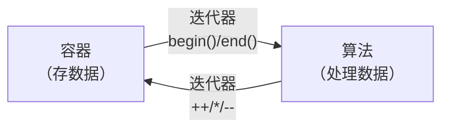

## STL 概述

STL（Standard Template Library，标准模板库）是 C++ 标准库里的一座“现成数据结构 + 现成算法”仓库：`vector`、`list`、`map`、`set` 这些容器，`sort`、`find`、`copy` 这些算法，标准库都已经实现好并经过充分测试，直接调用即可，不必每写一个程序就重造一次轮子。

用 STL 的难点从来不是记住函数名的拼写，而是**判断一个容器在哪些操作上快、在哪些操作上慢，再据此选型**——同样是“存一串 `int`”，选 `vector` 还是 `list`，决定了中间插入是 $O(1)$ 还是 $O(n)$。整篇的路线是“先看骨架，再认零件，最后学加工手段”：本节先讲清容器、算法、迭代器三者如何协作，这是所有容器共有的工作方式；随后按家族逐个展开容器——`string`、序列容器、关联容器、栈与队列；最后讲函数对象与泛型算法，它们决定“同一批容器还能被怎样加工”。

STL 整个体系建立在模板之上：容器是**类模板**（`vector<int>` 由 `vector<T>` 实例化而来），算法是**函数模板**（一份 `sort` 适用于所有可比较的类型）。如果看到 `vector<int>::iterator` 这样的类型名觉得吃力，建议先看 C++程序设计基础-10 模板。

#### STL 的六大组件

STL 从架构上分为六个部分，其中前三个是日常编码直接面对的，后三个是支撑机制。它们的分工可以概括成一句话：**容器存数据，算法处理数据，迭代器把两者连起来**。

| 组件 | 角色 | 举例 |
| :--- | :--- | :--- |
| **容器**（Container） | 存储数据的数据结构 | `vector`、`list`、`map`、`set`、`stack`、`queue` |
| **算法**（Algorithm） | 处理数据的功能函数 | `sort`、`find`、`for_each`、`copy` |
| **迭代器**（Iterator） | 容器与算法之间的粘合剂——像指针一样遍历容器 | `begin()`、`end()`、`++`、`*` |
| **仿函数**（Functor） | 行为类似函数的对象，可作为算法的策略参数 | C++程序设计基础-8 面向对象编程中重载了 `()` 的对象 |
| **适配器**（Adaptor） | 修饰容器、仿函数或迭代器的接口 | `stack`（底层默认用 `deque` 实现） |
| **空间配置器**（Allocator） | 负责内存的分配与管理 | 通常使用默认的即可 |

容器与算法之间没有直接依赖——算法只认识迭代器，不认识容器。这正是同一份 `sort` 既能处理 `vector`、又能处理普通数组的原因：只要数据能提供符合要求的迭代器就行。



#### 三大组件的协作

用一段最短的代码看清三者的配合：`vector` 负责存，迭代器负责走，`sort` 负责排。

```cpp
#include <iostream>
#include <vector>          // 容器
#include <algorithm>       // 算法
using namespace std;

int main() {
    vector<int> v;                   // 创建容器（像数组但可以动态扩容）
    v.push_back(30);                 // 向容器尾部添加数据
    v.push_back(10);
    v.push_back(50);
    v.push_back(20);
    v.push_back(40);

    sort(v.begin(), v.end());        // 用算法排序——从 begin() 到 end()

    // 用迭代器遍历——语法像指针
    for (vector<int>::iterator it = v.begin(); it != v.end(); it++) {
        cout << *it << " ";          // *it 解引用——拿到当前元素
    }
    // 输出：10 20 30 40 50
    return 0;
}
```

| 代码 | 角色 | 含义 |
| :--- | :--- | :--- |
| `vector<int>` | 容器 | 一个存储 `int` 的动态数组 |
| `v.push_back(40)` | 容器操作 | 在尾部添加元素 |
| `v.begin()` / `v.end()` | 迭代器 | 指向容器首元素 / 尾元素的下一个位置 |
| `sort(...)` | 算法 | 对 `[begin, end)` 区间内的元素排序 |
| `vector<int>::iterator` | 迭代器类型 | 类似 `int*`——可以 `++`、可以 `*` 解引用 |

注意 `sort(v.begin(), v.end())` 的两个参数不是容器本身，而是一对迭代器：算法从 `begin()` 出发，走到 `end()` 之前一个位置为止，这是 STL 通行的**左闭右开区间** `[begin, end)`。`*it` 与 `it++` 的写法与指针完全一致，所以迭代器常被描述为“泛化的指针”——它把“怎么走到下一个元素”这件事从算法里抽了出去，交给容器实现。

## 字符串与 string

`string` 常被当作“专门用来存文本的类型”，但它本质上是一个封装了字符序列的容器：`size()`、`empty()`、迭代器、`[]` 随机访问这些容器通用接口它都有。把它和后面的容器放在一起讲，是因为它的成员函数体系与容器完全同构——构造、拼接、查找、替换、取子串。

日常使用先记住三条：拼接优先用 `+=`；查找失败返回 `string::npos` 而不是抛异常，必须显式判断；取子串用 `substr(pos, n)`，它返回新串而不改变原串。

#### 构造与赋值

```cpp
#include <iostream>
#include <string>
using namespace std;

int main() {
    string s1;                          // 空字符串
    string s2("hello");                 // C 风格字符串初始化
    string s3(s2);                      // 拷贝构造
    string s4(5, 'a');                  // "aaaaa"——5 个字符 'a'

    s1 = "world";                       // 直接赋值
    s1.assign("C++", 2);                // 取前 2 个字符 → "C+"
    cout << s1 << endl;                 // C+
    return 0;
}
```

四种构造方式对应四种来源：默认构造得到空串；`s2("hello")` 用 C 风格字符串初始化；`s3(s2)` 是拷贝构造，内容相同但是两个互不影响的对象；`s4(5, 'a')` 走的是“重复 n 个字符”的规则。赋值除了 `=`，还有 `assign(str, n)`——它取 `str` 的前 `n` 个字符，所以 `s1.assign("C++", 2)` 得到 `"C+"`。`assign` 的价值在于能直接指定“取多少个字符”，这是 `=` 做不到的。

#### 拼接、查找与替换

```cpp
#include <iostream>
#include <string>
using namespace std;

int main() {
    string s = "Hello";

    // 拼接——+= 最简洁
    s += " World";
    cout << s << endl;                          // Hello World

    // 查找——find 返回第一次出现的下标，未找到返回 string::npos
    size_t pos = s.find("World");
    if (pos != string::npos) {
        cout << "找到，位置：" << pos << endl;   // 6
    }

    // 替换——从下标 6 开始，替换 5 个字符
    s.replace(6, 5, "C++");
    cout << s << endl;                          // Hello C++

    return 0;
}
```

`find` 返回的是**下标**，找不到时返回 `string::npos`。这里有一个必须留意的细节：`string::npos` 的类型是无符号的 `size_t`，值是这种类型能表示的最大值，不是 `int` 的 `-1`——所以判断只能写成 `pos != string::npos`，把它当负数去比较大小会得到错误结论。同理，接收 `find` 返回值的变量也应当声明为 `size_t`，而不是 `int`。

`replace(pos, n, str)` 的三个参数是**起始下标、要删除的字符个数、用来替换的新内容**：它先把 `"Hello World"` 中从下标 6 开始的 5 个字符 `"World"` 删掉，再在原位插入 `"C++"`。

#### 子串、比较与存取

```cpp
#include <iostream>
#include <string>
using namespace std;

int main() {
    string s = "abcdefg";

    // 子串——substr(起始索引, 长度)
    string sub = s.substr(1, 3);     // "bcd"

    // 比较——按字典序
    int cmp = s.compare("abc");      // >0 表示 s 更大
    cout << "比较结果：" << cmp << endl;

    // 字符存取——像数组一样用 []
    cout << s[0] << endl;            // 'a'
    s[0] = 'A';                      // 修改单个字符
    cout << s << endl;               // "Abcdefg"

    return 0;
}
```

`substr` 与 `compare` 都不改变原串：`substr` 返回一个新 `string`；`compare` 只回答大小关系，返回 0 表示相等、正数表示当前串更大、负数表示更小。`[]` 是随机存取，既可以读也可以写在原串上就地修改单个字符。

| 常用操作 | 函数 | 说明 |
| :--- | :--- | :--- |
| 拼接 | `+=` / `append()` | `+=` 最简洁 |
| 查找 | `find(str)` / `rfind(str)` | `find` 从左找，`rfind` 从右找，未找到返回 `string::npos` |
| 替换 | `replace(pos, n, str)` | 从 `pos` 开始删除 `n` 个字符，插入 `str` |
| 子串 | `substr(pos, n)` | 返回从 `pos` 开始、长 `n` 的子串 |
| 比较 | `compare(str)` | 返回 0（相等）、正（大于）、负（小于） |

## 序列容器

序列容器按**位置**组织元素：第 0 个、第 1 个……元素在逻辑上排成一条线，靠下标或迭代器访问。三种最常用的序列容器底层结构完全不同，所以“谁快谁慢”不是编码风格问题，而是结构决定的。

一句话给出结论：**没有特殊需求就用 `vector`，要在头部增删就用 `deque`，要在中间频繁增删且不需要下标访问就用 `list`。** 下面这张表说明的是为什么。

| 容器 | 底层结构 | 随机访问 | 头插/头删 | 尾插/尾删 | 中间插入 |
| :--- | :--- | :---: | :---: | :---: | :---: |
| `vector` | 连续数组 | ✅ $O(1)$ | ❌ 慢 | ✅ $O(1)$ | ❌ 慢 |
| `deque` | 分段连续数组 | ✅ $O(1)$ | ✅ $O(1)$ | ✅ $O(1)$ | ❌ 较慢 |
| `list` | 双向链表 | ❌ 不支持 `[]` | ✅ $O(1)$ | ✅ $O(1)$ | ✅ $O(1)$ |

> **选择原则**：默认用 `vector`（最常用、缓存友好）；需要头部操作时用 `deque`；需要频繁中间插入删除时用 `list`。

### vector：动态数组

`vector` 是使用最频繁的 STL 容器。它像数组一样支持 `[]` 随机访问，但**长度可以动态增长**——这正是普通数组做不到的。另一处差别在容量：C 数组的长度在编译期就定死（见 C++程序设计基础-5 数组），而 `vector` 会在需要时于堆上重新申请更大的空间。

```cpp
#include <iostream>
#include <vector>
using namespace std;

void print(const vector<int>& v) {
    for (int i = 0; i < v.size(); i++) cout << v[i] << " ";
    cout << endl;
}

int main() {
    vector<int> v;

    // 添加数据
    v.push_back(10);            // 尾插
    v.push_back(20);
    v.push_back(30);
    print(v);                   // 10 20 30

    v.pop_back();               // 尾删——删除 30
    print(v);                   // 10 20

    // 插入与删除
    v.insert(v.begin(), 100);   // 在开头插入 100
    v.erase(v.begin());         // 删除开头元素
    print(v);                   // 10 20

    // 大小相关
    cout << "size=" << v.size() << " capacity=" << v.capacity() << endl;

    v.clear();                  // 清空所有元素
    return 0;
}
```

这段代码演示了三类操作：`push_back` / `pop_back` 在尾部增删；`insert` / `erase` 接受的是**迭代器**而不是下标，`v.insert(v.begin(), 100)` 表示“在第一个元素之前插入”，`v.erase(v.begin())` 则删除第一个元素；`size` / `capacity` / `clear` 负责管理大小。`print` 的参数写成 `const vector<int>&`，它只按下标读取，不会改动容器。

| 常用操作 | 函数 | 说明 |
| :--- | :--- | :--- |
| 尾插 | `push_back(val)` | 在末尾添加 |
| 尾删 | `pop_back()` | 删除末尾元素 |
| 插入 | `insert(迭代器, val)` | 在指定位置前插入 |
| 删除 | `erase(迭代器)` | 删除指定位置元素 |
| 大小 | `size()` / `empty()` / `capacity()` | 元素个数 / 是否为空 / 当前容量 |
| 清空 | `clear()` | 删除所有元素 |
| 随机访问 | `v[i]` / `v.at(i)` / `front()` / `back()` | 和数组完全一样 |

> **易错点**：`capacity` 与 `size` 的区别——`size()` 是当前元素的个数，`capacity()` 是已分配内存能容纳的元素个数，两者在多次 `push_back` 之后会明显拉开差距。当 `push_back` 使 `size > capacity` 时，`vector` 会在内存中另找一块更大的连续空间、把数据整体搬迁过去。因此**预先知道大致规模时应当用 `reserve(n)` 一次性分配，避免反复搬迁**；`reserve` 只预留内存、不改变元素个数。

> **易错点**：迭代器失效——容器在插入或删除元素后，此前取得的迭代器可能不再指向有效内存。最典型的是 `vector` 因 `push_back` 触发重新分配后，指向原内存的迭代器**全部失效**；`vector` 与 `deque` 在中间插入或删除后，该位置及其之后的迭代器失效；`list` 的插入不会让已有迭代器失效，这是链表的天然优势。判断规则很简单：**凡是插入或删除之后，就不要再使用之前保存的迭代器**，需要位置就重新取一次 `begin()` 或 `find()`。

### deque：双端数组

`deque`（Double-Ended Queue，双端队列）与 `vector` 最大的区别是**支持头部的高效插入与删除**——`push_front` 和 `pop_front` 都是 $O(1)$，而 `vector` 在头部插入要先把所有元素整体后移。代价是它采用了分段连续的存储方式，因此**没有 `capacity()`**：既然不必为扩容而整体搬迁，也就没有“容量”这个概念。

```cpp
#include <iostream>
#include <deque>
using namespace std;

int main() {
    deque<int> d;

    d.push_back(20);            // 尾插
    d.push_front(10);           // 头插——vector 没有这个！
    d.push_back(30);

    // 遍历（和 vector 完全一样）
    for (int i = 0; i < d.size(); i++) {
        cout << d[i] << " ";   // 10 20 30
    }
    cout << endl;

    d.pop_front();              // 头删
    d.pop_back();               // 尾删
    cout << d[0] << endl;       // 20
    return 0;
}
```

`deque` 同样支持 `[]` 随机访问，遍历写法与 `vector` 一模一样，所以在“既要下标访问、又要两端增删”的场景里，它是唯一合适的选择。

### list：双向链表

`list` 是双向链表，每个结点都知道自己的前驱与后继。它的优势是**在任意位置插入删除都是 $O(1)$**——只要拿到位置，改动几个指针即可，不牵动其他元素；代价是**不支持 `[]` 随机访问**，想取第 5 个元素只能从头一个个走过去。

```cpp
#include <iostream>
#include <list>
using namespace std;

int main() {
    list<int> lst;

    lst.push_back(20);          // 尾插
    lst.push_front(10);         // 头插
    lst.push_back(30);

    // 必须用迭代器遍历——list 不支持 []
    for (list<int>::iterator it = lst.begin(); it != lst.end(); it++) {
        cout << *it << " ";    // 10 20 30
    }
    cout << endl;

    // list 独有的操作
    lst.reverse();              // 反转链表
    lst.sort();                 // 排序——list 有自己的 sort（不像 vector 用全局 sort）

    // 删除所有值为 20 的元素
    lst.remove(20);
    return 0;
}
```

`list` 独有 `reverse()`、`sort()`、`remove(val)` 三个成员函数：前两个就地反转与排序，`remove` 则删除所有等于给定值的元素。

> **易错点**：`list` 不能使用全局的 `sort()`，只能用成员 `sort()`——全局 `sort()` 要求**随机访问迭代器**（能 `it + n` 跳着访问），而 `list` 的迭代器只支持 `++` / `--`（双向迭代器），把它传进去编译就不通过。`list` 自己实现的成员 `sort()` 通常采用归并排序，正好适合链表这种无法随机定位的结构。

### 三种序列容器的选择

| 场景 | 推荐容器 | 原因 |
| :--- | :--- | :--- |
| 需要 `[]` 随机访问、主要在尾部增删 | **`vector`** | 数组结构，缓存友好，最常用 |
| 需要 `[]` 随机访问、头部和尾部都要操作 | `deque` | 双端高效操作 |
| 需要频繁在中间插入/删除、不需要 `[]` | `list` | 链表结构，插入删除 $O(1)$ |
| 不确定用哪个 | **`vector`** | 大多数场景够用，最简单 |

判断标准只有一条：**你最频繁的操作发生在容器的哪一端**。最后一行值得单独解释——不确定时选 `vector`，是因为大多数程序的瓶颈在“遍历和尾部追加”而不是“中间插入”，而 `vector` 连续存放元素，遍历时内存访问最规整。

## 关联容器

序列容器按位置组织数据，关联容器按**键**组织数据：每个元素带一个键（Key），查找、插入、删除都通过键完成。STL 提供四类关联容器，底层都是某种**自平衡二叉搜索树**（红黑树），所以元素始终保持有序，而不是像序列容器那样按插入顺序排列。

| 容器 | 键是否唯一 | 是否自动排序 | 典型用途 |
| :--- | :---: | :---: | :--- |
| `set` | ✅ 唯一 | ✅ 升序 | 去重集合 |
| `multiset` | ❌ 可重复 | ✅ 升序 | 可重复、需排序的集合 |
| `map` | ✅ 唯一 | ✅ 按键升序 | 字典/键值对 |
| `multimap` | ❌ 可重复 | ✅ 按键升序 | 可重复键的字典 |

四类容器的差别只有一点：**键是否允许重复**——它决定了该用 `set` 还是 `multiset`、`map` 还是 `multimap`；而“自动排序”是它们的共同特征，也是“遍历出来天然有序”的原因。

### set：集合

`set` 中的元素**自动排序且不允许重复**，插入重复值不会报错，只是被忽略。这两个特性合在一起，正好实现“去重 + 排序”。

```cpp
#include <iostream>
#include <set>
using namespace std;

int main() {
    set<int> s;

    s.insert(30);               // 插入——元素自动排序
    s.insert(10);
    s.insert(20);
    s.insert(10);               // 重复插入——被忽略

    // 遍历（自动按升序输出）
    for (set<int>::iterator it = s.begin(); it != s.end(); it++) {
        cout << *it << " ";    // 10 20 30
    }
    cout << endl;

    // 查找
    if (s.find(20) != s.end()) {
        cout << "找到了 20" << endl;
    }

    s.erase(20);                // 删除值为 20 的元素
    cout << "size=" << s.size() << endl;  // 2
    return 0;
}
```

| 操作 | 函数 | 说明 |
| :--- | :--- | :--- |
| 插入 | `insert(val)` | 自动排序，重复值被忽略 |
| 查找 | `find(val)` | 返回迭代器，未找到返回 `end()` |
| 删除 | `erase(val)` 或 `erase(迭代器)` | 按值或按位置删除 |
| 大小 | `size()` / `empty()` | — |

和 `string::find` 返回下标不同，`set::find` 返回的是**迭代器**：找到就指向该元素，找不到返回 `end()`，所以判断写法固定是 `s.find(x) != s.end()`。这个模式在关联容器里到处通用。

### pair：键值对的载体

`pair` 是把两个值捆在一起的简单模板结构，`map` 中的每个元素本质上就是一个 `pair<Key, Value>`。它只暴露两个成员：`.first` 与 `.second`。

```cpp
#include <iostream>
#include <utility>           // pair 所在头文件（通常已被其他 STL 头文件间接包含）
using namespace std;

int main() {
    // 创建 pair 的两种方式
    pair<string, int> p1("张三", 95);
    pair<string, int> p2 = make_pair("李四", 88);

    // 访问两个值
    cout << p1.first << "：" << p1.second << endl;   // 张三：95
    return 0;
}
```

| 操作 | 语法 | 说明 |
| :--- | :--- | :--- |
| 创建 | `pair<T1,T2>(val1, val2)` 或 `make_pair(val1, val2)` | `make_pair` 自动推导类型，更简洁 |
| 访问第一个值 | `.first` | — |
| 访问第二个值 | `.second` | — |

两种创建方式的效果相同，区别只在写法：第一种把类型写全，第二种让编译器从实参反推出类型，因此更短。

### map：字典

`map` 存储键值对——每个元素由一个键和一个值组成，按键自动排序。它最常用的操作是“用键取值”，而 `[]` 在这里有一个必须记住的副作用。

```cpp
#include <iostream>
#include <map>
using namespace std;

int main() {
    map<string, int> scores;     // 键=姓名(string)，值=成绩(int)

    // 插入键值对的三种方式
    scores["张三"] = 95;                    // 方式一：最直观
    scores.insert(pair<string, int>("李四", 88));  // 方式二
    scores.insert(make_pair("王五", 72));          // 方式三

    // 查找
    cout << "张三的成绩：" << scores["张三"] << endl;  // 95
    // 注意：scores["赵六"] 如果赵六不存在，会自动插入 0！

    // 安全查找
    map<string, int>::iterator it = scores.find("李四");
    if (it != scores.end()) {
        cout << it->first << " → " << it->second << endl;  // 李四 → 88
    }

    // 遍历——按键升序（按姓名拼音）
    for (map<string, int>::iterator iter = scores.begin(); iter != scores.end(); iter++) {
        cout << iter->first << "：" << iter->second << endl;
    }
    return 0;
}
```

插入有三种写法：`scores["张三"] = 95` 最直观；`scores.insert(pair<string, int>("李四", 88))` 把类型写全；`scores.insert(make_pair("王五", 72))` 让编译器推导类型。遍历时 `iter->first` 是键、`iter->second` 是值，用 `->` 是因为迭代器指向的正是那个 `pair` 对象。

> **易错点**：`map` 的 `[]` 与 `find()` 怎么选——`map[key]` 在 key 存在时返回对应 value 的引用，而**在 key 不存在时会自动插入一个 `{key, 默认值}`**，这是最容易被忽略的陷阱。所以：需要访问**已知存在**的键时用 `[]`，写法最简洁；需要**检查键是否存在**时必须用 `find()`，否则一次“查询”会顺手污染容器。竞赛代码有时故意利用这个副作用来简化词频统计（`count[word]++` 第一次访问就自动建好了条目），但工程代码应当用 `find()` 明确表达意图。

### multiset 与 multimap

这两类容器的用法与 `set` / `map` 几乎完全一样，唯一的区别是**允许键重复**：`multiset` 可以存多个相同元素，`multimap` 可以保留多个相同的键。凡是“同一个键要对应多条记录”的场合，就该换成它们。

```cpp
#include <iostream>
#include <set>
using namespace std;

int main() {
    multiset<int> ms;
    ms.insert(10);
    ms.insert(10);              // 允许重复——两个 10 都保留
    ms.insert(20);

    cout << "size=" << ms.size() << endl;  // 3
    for (multiset<int>::iterator it = ms.begin(); it != ms.end(); it++)
        cout << *it << " ";               // 10 10 20
    return 0;
}
```

## 栈与队列

栈和队列是两种**操作受限的线性结构**：栈只能在一端进出，于是后进先出；队列一端进、另一端出，于是先进先出。它们都不提供迭代器，也就不能遍历——这不是缺陷，而是“受限”这个词的全部含义：只暴露必要的接口，秩序才不会被破坏。

在 STL 里，`stack`、`queue`、`priority_queue` 并不是独立实现的数据结构，而是**容器适配器**：它们在底层容器（默认是 `deque`）之上重新包装出一套受限接口。这也解释了为什么它们的接口只有寥寥几个。

### stack

栈遵循后进先出（LIFO），像一摞盘子——最后放上去的最先拿下来。

```cpp
#include <iostream>
#include <stack>
using namespace std;

int main() {
    stack<int> stk;

    stk.push(10);               // 入栈
    stk.push(20);
    stk.push(30);

    cout << "栈顶：" << stk.top() << endl;   // 30
    cout << "大小：" << stk.size() << endl;  // 3

    // 出栈——必须逐个弹出
    while (!stk.empty()) {
        cout << stk.top() << " ";            // 30 20 10
        stk.pop();                           // 弹出栈顶
    }
    return 0;
}
```

| 操作 | 函数 |
| :--- | :--- |
| 入栈 | `push(val)` |
| 出栈 | `pop()`（注意：不返回值，只是删除） |
| 取栈顶 | `top()` |
| 判空/大小 | `empty()` / `size()` |

> **易错点**：`stack::pop()` 不返回被弹出的值——它只负责删除，取值要靠 `top()`。所以“取出并弹出”必须写成两步：先 `top()` 拿值，再 `pop()` 删除。这是标准库的刻意设计：把“取值”和“删除”分离，既避免了返回值时多一次拷贝，也避免了栈空时返回一个无从构造的“空值”。作为对照，Java 的 `pop()` 同时弹出并返回，两种设计各自自洽。

### queue

队列遵循先进先出（FIFO），像排队——先来的先服务。它比栈多一个访问接口：`front()` 取队头，`back()` 取队尾。

```cpp
#include <iostream>
#include <queue>
using namespace std;

int main() {
    queue<int> q;

    q.push(10);                 // 入队
    q.push(20);
    q.push(30);

    cout << "队头：" << q.front() << endl;  // 10
    cout << "队尾：" << q.back() << endl;   // 30

    while (!q.empty()) {
        cout << q.front() << " ";           // 10 20 30
        q.pop();                            // 出队
    }
    return 0;
}
```

| 操作 | 函数 |
| :--- | :--- |
| 入队 | `push(val)` |
| 出队 | `pop()` |
| 取队头/队尾 | `front()` / `back()` |
| 判空/大小 | `empty()` / `size()` |

两个循环的写法值得对照：栈是“看 `top()` 再 `pop()`”，队列是“看 `front()` 再 `pop()`”，都是先取值再删除。

### priority_queue

`priority_queue` 不按入队顺序出队，而是**谁优先级高谁先出**，默认是“最大值优先”（大顶堆）。

```cpp
#include <iostream>
#include <queue>            // priority_queue 也在这个头文件
using namespace std;

int main() {
    priority_queue<int> pq;

    pq.push(30);
    pq.push(10);
    pq.push(50);
    pq.push(20);

    // 弹出的顺序是 50 → 30 → 20 → 10（自动按从大到小）
    while (!pq.empty()) {
        cout << pq.top() << " ";            // 50 30 20 10
        pq.pop();
    }
    return 0;
}
```

> **改成小顶堆**：`priority_queue<int, vector<int>, greater<int>> pq;`——第二个模板参数指定底层容器，第三个指定比较规则；把默认的比较规则换成 `greater<int>`，出队顺序就从“最大优先”变成“最小优先”。

| 容器 | 进出规则 | 典型应用 |
| :--- | :--- | :--- |
| `stack` | LIFO（后进先出） | 函数调用栈、括号匹配、撤销操作 |
| `queue` | FIFO（先进先出） | 任务排队、BFS 广度优先搜索 |
| `priority_queue` | 最高优先级先出 | 任务调度、Dijkstra 算法、Top-K 问题 |

三者的接口几乎一样，区别只在“谁先出来”和“从哪一头看”。

## 函数对象

函数对象（**仿函数**）是重载了 `operator()` 的类对象，因此可以像函数一样用 `obj(args)` 的形式调用。它是 STL 算法的重要搭档：`sort`、`for_each`、`find_if` 等算法都能接受一个函数对象作为参数，用来**自定义操作规则**。关于 `operator()` 的重载写法，见 C++程序设计基础-8 面向对象编程。

#### 函数对象的概念

函数对象的本质是**重载了 `operator()` 的类对象**。它与普通函数最关键的差别是**可以携带状态**：状态保存在成员变量里，每个对象实例各有一份、互不干扰；普通函数没有自己的存储，想记住点东西只能借助 `static` 变量，而 `static` 变量是全局共享的。

```cpp
#include <iostream>
using namespace std;

// 普通函数——无状态，每次调用从零开始
void normalFunc() {
    static int count = 0;          // 勉强用 static 记住状态
    cout << "调用次数：" << ++count << endl;
}

// 函数对象——有状态，每个对象独立记录
class Counter {
public:
    void operator()() {
        cout << "调用次数：" << ++m_count << endl;
    }
    int getCount() const { return m_count; }
private:
    int m_count = 0;               // 每个 Counter 对象独立的状态
};

int main() {
    Counter c1, c2;
    c1(); c1(); c1();              // 调用次数：1 2 3
    c2(); c2();                    // 调用次数：1 2（独立计数）
    cout << "c1 总次数：" << c1.getCount() << endl;   // 3
    return 0;
}
```

| 维度 | 普通函数 | 函数对象 |
| :--- | :--- | :--- |
| **状态** | ❌ 无状态（除非用 `static`） | ✅ 成员变量保存状态 |
| **实例独立** | 全局唯一 | 每创建一个对象就有一个独立实例 |
| **内联优化** | 函数指针传参时难以内联 | 编译器知道具体类型，容易内联（效率更高） |

`c1` 和 `c2` 是两个独立对象，各自维护自己的 `m_count`，所以两次调用序列互不影响——这正是“有状态”的含义。表的第三行是性能考量：函数对象作为参数传递时，编译器知道它的具体类型，容易把调用内联展开；而通过函数指针调用时，目标地址要到运行期才确定，内联困难。

#### 预定义函数对象

STL 在 `<functional>` 头文件里预定义了一批对应常用运算符的函数对象，按用途分成三类。需要“把某个运算符当作参数传出去”时，直接取用这些现成的即可。

**算术函数对象**——实现算术运算：

| 函数对象 | 运算符 | 用途 |
| :--- | :---: | :--- |
| `plus<T>` | `+` | 两数相加 |
| `minus<T>` | `-` | 两数相减 |
| `multiplies<T>` | `*` | 两数相乘 |
| `divides<T>` | `/` | 两数相除 |
| `modulus<T>` | `%` | 取模 |
| `negate<T>` | `-`（单目） | 取相反数 |

**关系函数对象**——实现比较判断，最常用于排序和查找：

| 函数对象 | 运算符 | 用途 |
| :--- | :---: | :--- |
| `less<T>` | `<` | 升序排序（`sort` 默认） |
| `greater<T>` | `>` | 降序排序 |
| `less_equal<T>` | `<=` | — |
| `greater_equal<T>` | `>=` | — |
| `equal_to<T>` | `==` | 相等判断 |

**逻辑函数对象**——实现逻辑运算：

| 函数对象 | 运算符 | 用途 |
| :--- | :---: | :--- |
| `logical_and<T>` | `&&` | 逻辑与 |
| `logical_or<T>` | `\|\|` | 逻辑或 |
| `logical_not<T>` | `!` | 逻辑非 |

```cpp
#include <iostream>
#include <vector>
#include <algorithm>
#include <functional>
using namespace std;

int main() {
    vector<int> v = {30, 10, 50, 20, 40};

    // 关系函数对象：降序排序
    sort(v.begin(), v.end(), greater<int>());
    // v = {50, 40, 30, 20, 10}

    // 算术函数对象：两个同位置元素相加 → 存入结果
    vector<int> a = {1, 2, 3}, b = {4, 5, 6}, result(3);
    transform(a.begin(), a.end(), b.begin(), result.begin(), plus<int>());
    // result = {5, 7, 9}

    return 0;
}
```

`greater<int>()` 是“降序排序”最省事的写法，它本质上就是标准库内置的二元谓词；`plus<int>()` 配合 `transform`，则能把两个容器中同位置的元素相加后写入第三个容器。

> **为什么用 `greater<int>()` 而不用手写比较函数**：`sort(v.begin(), v.end(), greater<int>())` 与手写 `bool cmp(int a, int b) { return a > b; }` 的效果完全相同，但函数对象是一个具体类型，编译器能内联它的调用；函数指针则多一次间接跳转。

#### Lambda 表达式

C++11 引入的 Lambda 表达式是函数对象的**现代写法**：不必定义类、不必起名字，直接在调用处写出函数逻辑。它是 STL 算法里最常用的“策略参数”。

```cpp
#include <iostream>
#include <vector>
#include <algorithm>
using namespace std;

int main() {
    vector<int> v = {30, 10, 50, 20, 40};

    // Lambda 语法：[捕获列表](参数列表) -> 返回类型 { 函数体 }
    // 返回类型通常省略，编译器自动推导

    // 例1：Lambda 实现降序排序
    sort(v.begin(), v.end(), [](int a, int b) {
        return a > b;
    });
    // v = {50, 40, 30, 20, 10}

    // 例2：Lambda 实现只输出偶数
    vector<int> nums = {1, 2, 3, 4, 5};
    for_each(nums.begin(), nums.end(), [](int x) {
        if (x % 2 == 0) cout << x << " ";
    });
    // 输出：2 4

    return 0;
}
```

Lambda 由三部分组成：捕获列表、参数列表、函数体；返回类型通常省略，由编译器从 `return` 语句推导。

| Lambda 组成部分 | 说明 | 示例 |
| :--- | :--- | :--- |
| `[]` 捕获列表 | 决定 Lambda 内部能否访问外部变量。`[]`=不捕获，`[=]`=值捕获，`[&]`=引用捕获 | `[&]` |
| `()` 参数列表 | 和普通函数的参数列表一样 | `(int a, int b)` |
| `{}` 函数体 | Lambda 的执行代码 | `{ return a > b; }` |

捕获列表是 Lambda 与普通函数最本质的差别，也是它能“有状态”的原因——编译器会为 Lambda 生成一个函数对象类，被捕获的外部变量就是它的成员：

```cpp
#include <iostream>
#include <vector>
#include <algorithm>
using namespace std;

int main() {
    vector<int> v = {10, 20, 30, 40, 50};
    int threshold = 30;                       // 外部变量

    // [threshold] 按值捕获：Lambda 内部访问的是它的一份副本
    vector<int>::iterator it = find_if(v.begin(), v.end(), [threshold](int x) {
        return x > threshold;
    });
    if (it != v.end()) {
        cout << "第一个大于 " << threshold << " 的元素：" << *it << endl;   // 40
    }
    return 0;
}
```

> **三种写法怎么选**：规则简单（就是比大小）用预定义函数对象 `greater<int>()`；规则复杂但只在此处用一次，用 Lambda 就地写出（最常用）；同一套规则要在多处复用，才值得封装成具名函数或函数对象类。

#### 谓词

**谓词**（Predicate）是返回 `bool` 的函数对象——普通函数、函数对象、Lambda 都算。STL 算法用谓词来自定义判断条件：找哪些元素、数哪些元素、按什么规则排序。按参数个数分成两类：

| 类型 | 参数个数 | 常见用途 | 示例 |
| :--- | :---: | :--- | :--- |
| **一元谓词** | 1 个 | 条件查找、条件计数 | `find_if`、`count_if`——判断单个元素是否满足条件 |
| **二元谓词** | 2 个 | 自定义排序、自定义比较 | `sort` 的比较规则——判断两个元素的大小关系 |

一元谓词接受一个元素、回答“它满足条件吗”，天然对应 `find_if`、`count_if` 这类逐元素判断的算法：

```cpp
#include <iostream>
#include <vector>
#include <algorithm>
using namespace std;

// 一元谓词：判断是否大于 30
bool greaterThan30(int x) {
    return x > 30;
}

int main() {
    vector<int> v = {10, 20, 30, 40, 50};

    // find_if：在区间中查找第一个满足谓词条件的元素
    vector<int>::iterator it = find_if(v.begin(), v.end(), greaterThan30);
    if (it != v.end()) {
        cout << "第一个大于 30 的元素：" << *it << endl;  // 40
    }

    // 用 Lambda 写更简洁——Lambda 也是谓词
    it = find_if(v.begin(), v.end(), [](int x) { return x > 45; });
    cout << "第一个大于 45 的元素：" << *it << endl;       // 50

    return 0;
}
```

`greaterThan30` 只是一个普通函数，但因为它接受一个 `int` 并返回 `bool`，就同时是合法的谓词。同一个 `find_if` 也可以直接接受 Lambda——不必为了写一句 `x > 45` 单独定义一个函数。

二元谓词接受两个元素、回答“前者是否应该排在后者前面”，对应 `sort` 的比较规则：

```cpp
#include <iostream>
#include <vector>
#include <algorithm>
using namespace std;

// 二元谓词：比较两个元素，返回 a 是否应该排在 b 前面
bool myCompare(int a, int b) {
    return a > b;                // 降序
}

int main() {
    vector<int> v = {30, 10, 50, 20, 40};
    sort(v.begin(), v.end(), myCompare);   // 按降序排列
    // v = {50, 40, 30, 20, 10}
    return 0;
}
```

> **谓词的本质**：任何可调用对象——普通函数、函数对象、Lambda——只要接受指定个数的参数并返回 `bool`，就可以作为谓词传给 STL 算法。预定义函数对象（`greater<int>()`、`less<int>()`）不过是标准库内置的二元谓词。

## STL 常用算法

STL 在 `<algorithm>` 与 `<numeric>` 里提供了 100 多个现成算法。它们的接口有一个统一约定：**接收一对迭代器 `[begin, end)`，对区间内的元素进行操作**。因此同一个算法既能用于 `vector`、`deque`、`list`，也能用于普通数组——只要提供符合该算法要求的迭代器。理解这一点之后，下面十几个算法的差别就只剩“对区间做什么”了。

#### 遍历

`for_each` 对区间内每个元素执行一次给定操作，是“把函数传进算法”的入门示例：

```cpp
#include <iostream>
#include <vector>
#include <algorithm>
using namespace std;

void print(int x) { cout << x << " "; }

int main() {
    vector<int> v = {10, 20, 30, 40, 50};

    // 对 v 中的每个元素执行 print 函数
    for_each(v.begin(), v.end(), print);   // 10 20 30 40 50
    return 0;
}
```

这里的 `print` 按值接收元素，只负责输出，不会改动容器中的任何数据。

#### 查找

`find` 与 `binary_search` 都能回答“某个值在不在”，但对数据的要求和返回值都不同：

```cpp
#include <iostream>
#include <vector>
#include <algorithm>
using namespace std;

int main() {
    vector<int> v = {30, 10, 50, 20, 40};

    // find——线性查找，不要求有序
    vector<int>::iterator it = find(v.begin(), v.end(), 20);
    if (it != v.end()) cout << "找到了 20" << endl;

    // binary_search——二分查找，要求已排序
    sort(v.begin(), v.end());                      // 先排序
    bool found = binary_search(v.begin(), v.end(), 20);
    cout << (found ? "存在" : "不存在") << endl;   // 存在

    return 0;
}
```

`find` 是逐个比对的线性查找，不要求有序，返回**迭代器**，因此既能告诉你“在不在”，也能告诉你“在哪里”；`binary_search` 建立在二分之上，**要求区间已经有序**，只返回 `bool`——它回答的是“在不在”，不关心位置。用错排序前提，`binary_search` 会给出错误答案。

#### 排序与反转

```cpp
#include <iostream>
#include <vector>
#include <algorithm>
using namespace std;

int main() {
    vector<int> v = {30, 10, 50, 20, 40};

    sort(v.begin(), v.end());            // 升序
    // v = {10, 20, 30, 40, 50}

    reverse(v.begin(), v.end());         // 反转
    // v = {50, 40, 30, 20, 10}

    return 0;
}
```

`sort` 默认按升序排列；`reverse` 把区间首尾对调。两者都**原地修改**容器内容，不返回新容器。

#### 拷贝与填充

```cpp
#include <iostream>
#include <vector>
#include <algorithm>
using namespace std;

int main() {
    vector<int> src = {1, 2, 3, 4, 5};
    vector<int> dest(5);                       // 目标容器需预分配空间

    copy(src.begin(), src.end(), dest.begin()); // 拷贝
    // dest = {1, 2, 3, 4, 5}

    fill(dest.begin(), dest.end(), 99);         // 全部填充为 99
    // dest = {99, 99, 99, 99, 99}

    return 0;
}
```

`copy` 把源区间的元素逐个写入目标位置，因此目标容器**必须事先有足够的空间**——`vector<int> dest(5)` 里的 `5` 就是这个作用，写少了就会越界写入非法内存。`fill` 则把区间内所有元素统一改成同一个值。

#### 转换

`transform` 是“带输出的 `for_each`”：它对源区间每个元素求值，把结果写入另一个区间。

```cpp
#include <iostream>
#include <vector>
#include <algorithm>
using namespace std;

int square(int x) { return x * x; }

int main() {
    vector<int> src = {1, 2, 3, 4, 5};
    vector<int> dest(5);

    // transform：将 src 中每个元素平方后写入 dest
    transform(src.begin(), src.end(), dest.begin(), square);
    // dest = {1, 4, 9, 16, 25}

    for (int x : dest) cout << x << " ";
    return 0;
}
```

与 `copy` 一样，目标区间必须已经就位，`transform` 只负责写入，不负责扩容。

#### 条件查找与计数

`find_if` 与 `count_if` 是 `find` 与 `count` 的升级版——它们找的不是“等于某个值”的元素，而是“**满足某个条件**”的元素，条件由一元谓词给出：

```cpp
#include <iostream>
#include <vector>
#include <algorithm>
using namespace std;

int main() {
    vector<int> v = {10, 25, 30, 45, 50};

    // find_if：查找第一个偶数
    vector<int>::iterator it = find_if(v.begin(), v.end(), [](int x) { return x % 2 == 0; });
    cout << "第一个偶数：" << *it << endl;           // 10

    // count_if：统计大于 30 的元素个数
    int cnt = count_if(v.begin(), v.end(), [](int x) { return x > 30; });
    cout << "大于 30 的元素有 " << cnt << " 个" << endl;   // 3

    return 0;
}
```

两个谓词都用 Lambda 就地写出，这是最常见的做法：条件只用一次，单独定义一个函数反而增加阅读负担。

#### 合并

`merge` 把两个**已经有序**的区间合并成一个有序区间：

```cpp
#include <iostream>
#include <vector>
#include <algorithm>
using namespace std;

int main() {
    vector<int> a = {1, 3, 5, 7};
    vector<int> b = {2, 4, 6, 8};
    vector<int> result(8);

    merge(a.begin(), a.end(), b.begin(), b.end(), result.begin());
    // result = {1, 2, 3, 4, 5, 6, 7, 8}

    return 0;
}
```

两个输入区间都必须有序，否则合并结果一定是乱的——`merge` 只是按顺序“挑小的”，并不会替你先排序。它同样属于“写入目标区间”的算法，所以 `result` 要预先开好空间。

#### 替换、交换与乱序

```cpp
#include <iostream>
#include <vector>
#include <algorithm>
#include <ctime>
using namespace std;

int main() {
    vector<int> v = {10, 20, 30, 20, 50};

    // replace：将区间中所有 20 替换为 99
    replace(v.begin(), v.end(), 20, 99);
    // v = {10, 99, 30, 99, 50}

    // swap：交换两个同类型容器的内容（O(1) 高效操作）
    vector<int> v2 = {1, 2, 3};
    swap(v, v2);
    // v = {1, 2, 3}, v2 = {10, 99, 30, 99, 50}

    // random_shuffle：将元素随机打乱
    srand((unsigned)time(nullptr));
    random_shuffle(v.begin(), v.end());
    // v = {3, 1, 2}（结果每次运行不同）

    return 0;
}
```

`replace` 把区间内所有等于旧值的元素都改成新值，是一次遍历完成的原地修改；`swap` 交换两个同类型容器的内容，它是 $O(1)$ 的操作——交换的是容器内部的数据指针，而不是逐个搬运元素。

> **注意**：`random_shuffle` 在 C++14 中被标记为弃用，C++17 起建议改用 `shuffle` 配合 `<random>` 提供的随机数引擎。

#### 集合算法

STL 提供了四种集合运算算法，都要求操作的两个区间**已经有序**（通常先用 `sort` 排好）：

| 算法 | 用途 | 示例（A={1,2,3,5}，B={2,3,4,6}） |
| :--- | :--- | :--- |
| `set_union` | **并集**——属于 A **或** B 的所有元素 | {1,2,3,4,5,6} |
| `set_intersection` | **交集**——同时属于 A **且** B 的元素 | {2,3} |
| `set_difference` | **差集**——属于 A **但不**属于 B 的元素 | {1,5} |
| `set_symmetric_difference` | **对称差集**——属于 A 或 B 但**不同时**属于两者的元素 | {1,4,5,6} |

```cpp
#include <iostream>
#include <vector>
#include <algorithm>
using namespace std;

int main() {
    vector<int> A = {1, 2, 3, 5};
    vector<int> B = {2, 3, 4, 6};
    vector<int> result(10);                      // 目标容器需预分配足够空间

    // 交集——A ∩ B
    vector<int>::iterator it;

    it = set_intersection(A.begin(), A.end(), B.begin(), B.end(), result.begin());
    result.resize(it - result.begin());          // 截断多余空间
    for (int i = 0; i < result.size(); i++) cout << result[i] << " ";  // 2 3
    cout << endl;

    // 并集——A ∪ B
    result.resize(10);
    it = set_union(A.begin(), A.end(), B.begin(), B.end(), result.begin());
    result.resize(it - result.begin());
    for (int i = 0; i < result.size(); i++) cout << result[i] << " ";  // 1 2 3 4 5 6
    cout << endl;

    // 差集——A - B
    result.resize(10);
    it = set_difference(A.begin(), A.end(), B.begin(), B.end(), result.begin());
    result.resize(it - result.begin());
    for (int i = 0; i < result.size(); i++) cout << result[i] << " ";  // 1 5
    cout << endl;

    return 0;
}
```

> **集合算法的通用模式**：前四个参数指定两个输入区间，第五个参数指定输出位置的起点；返回值 `it` 指向“结果的末尾”。由于输出容器无法预知会写入多少个元素，只能先开足够大的空间（`result(10)`），算完再用 `result.resize(it - result.begin())` 把多余的部分截掉——这是所有“输出长度不定”的算法的通用处理手法。

#### 常用算法速查

| 算法 | 头文件 | 用途 | 示例 |
| :--- | :--- | :--- | :--- |
| `for_each` | `<algorithm>` | 遍历 | `for_each(b, e, func)` |
| `find` | `<algorithm>` | 查找 | `find(b, e, val)` |
| `sort` | `<algorithm>` | 排序 | `sort(b, e)` 升序 |
| `reverse` | `<algorithm>` | 反转 | `reverse(b, e)` |
| `copy` | `<algorithm>` | 拷贝 | `copy(b, e, dest)` |
| `fill` | `<algorithm>` | 填充 | `fill(b, e, val)` |
| `max_element` | `<algorithm>` | 最大值 | `*max_element(b, e)` |
| `min_element` | `<algorithm>` | 最小值 | `*min_element(b, e)` |
| `count` | `<algorithm>` | 计数 | `count(b, e, val)` |
| `accumulate` | `<numeric>` | 求和 | `accumulate(b, e, 0)` |
| `binary_search` | `<algorithm>` | 二分查找 | `binary_search(b, e, val)` |
| `next_permutation` | `<algorithm>` | 全排列 | `next_permutation(b, e)` |
| `set_union` | `<algorithm>` | 并集 | `set_union(b1,e1,b2,e2,out)` |
| `set_intersection` | `<algorithm>` | 交集 | `set_intersection(b1,e1,b2,e2,out)` |
| `set_difference` | `<algorithm>` | 差集 | `set_difference(b1,e1,b2,e2,out)` |

> **迭代器范围约定**：所有 STL 算法都遵循**左闭右开区间** `[begin, end)`——包含 `begin` 指向的元素，不包含 `end` 指向的元素。`end()` 表示“最后一个元素的下一个位置”，它可以参与比较，但不能解引用。这也解释了空容器为什么能用 `begin() == end()` 来判断为空。

## 小结

1. STL 由容器、算法、迭代器三大件加上仿函数、适配器、空间配置器组成，其中算法只认识迭代器而不认识容器，所以同一份算法能作用于多种容器和普通数组。
2. 所有 STL 算法都遵循 `[begin, end)` 左闭右开区间，理解这一条是读懂每一个算法参数的前提。
3. `string` 是封装了字符序列的容器：拼接首选 `+=`，`find` 找不到时返回 `string::npos`（无符号类型的最大值），必须显式比较，不能当 `-1` 使用。
4. 序列容器按“最频繁的操作发生在哪一端”选：默认 `vector`（连续内存、缓存友好），要头部增删用 `deque`，任意位置增删又不需下标就用 `list`；`list` 的排序只能用成员 `sort()`，因为全局 `sort()` 要求随机访问迭代器。
5. 关联容器按键组织数据且天然有序：`set` 与 `map` 的键唯一，`multiset` 与 `multimap` 允许重复；`map[key]` 在键不存在时会**自动插入默认值**，只做存在性检查必须用 `find()`。
6. `stack`、`queue`、`priority_queue` 是容器适配器，不提供迭代器，因此不能遍历；`stack::pop()` 与 `queue::pop()` 只删除不返回，取值要用 `top()` 或 `front()` 先取。
7. 函数对象是重载了 `operator()` 的类对象，相比普通函数的优势是能携带状态并便于内联；谓词就是返回 `bool` 的可调用对象，Lambda 是它的现代写法，也是 STL 算法最常用的策略参数。
