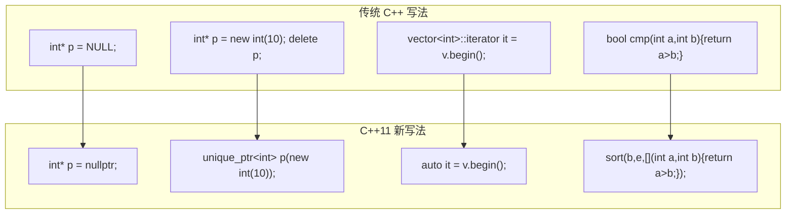

## 现代 C++ 的新写法

现代 C++ 的全部吸引力可以压成一句话：**过去必须由程序员手工完成的事，现在可以交给编译器**——类型不用抄、内存不用手动 `delete`、空指针不用靠一个宏来表示、虚函数有没有真的被重写也不用靠人眼去比对。2011 年的 **C++11** 标准是这条线上的分水岭，它一次引入了 `auto`、智能指针、范围 `for`、`nullptr`、统一初始化、`using` 类型别名、`override` 与 `final` 等一批特性，目标只有三个：代码更简洁、更安全、更高效。

这一节不打算讲语言设计原理，只回答一个问题：**每个新写法替换了哪一种旧写法，以及在什么场景下应该用它**。判断一个新语法值不值得用，标准也只有这一条——它是否真的在你关心的某个维度上更好。



图的左列是传统写法，右列是 C++11 之后的对应写法，四组箭头也正好是这一篇的四条主线：类型推导、智能指针、遍历写法、以及那些零散但同样重要的修正。三个目标分别落在哪些特性上，可以看得更具体一些。

**简洁**来自 `auto` 与范围 `for`：读者不需要重复阅读的类型名、不需要自己维护的下标变量，都可以删掉。**安全**来自 `nullptr`、智能指针与 `override`：`NULL` 是个整数所以会选错重载，`new` 配 `delete` 会漏写，重写虚函数时签名写错则完全静默——这三类错误分别被新的写法堵住。**高效**来自智能指针：`unique_ptr` 的大小与原始指针相同，自动释放的代价是零。

## 类型推导

手工书写类型名是 C++ 里一项典型的重复劳动：编译器已经从初始值知道了类型，程序员却必须再抄一遍，抄错还会导致编译失败。`auto` 与 `decltype` 把这件事交给编译器，两者的分工只有一条——**`auto` 从初始值推导类型，`decltype` 从一个表达式的类型推导，而且不求值**。关于类型本身的完整讨论见 C++程序设计基础-2 数据类型与运算符。

### auto

`auto` 让编译器根据初始化表达式自动推导变量的类型：程序员写 `auto`，编译器推出实际类型。它的价值在类型名越写越长时越明显——在 C++程序设计基础-11 STL标准模板库里，有些类型名长得令人窒息，比如 `map<string, vector<int>>::iterator`、`vector<int>::const_iterator`。这些名字不仅难写，而且它们**已经在初始值中隐含了**：编译器看到 `v.begin()` 就知道返回的是什么类型，没有理由要求程序员再抄一遍。

```cpp
#include <iostream>
#include <vector>
#include <map>
using namespace std;

int main() {
    // 传统写法：类型名重复出现（写起来烦，读起来占地方）
    vector<int> v;
    vector<int>::iterator it1 = v.begin();

    // C++11 写法：auto 自动推导为 vector<int>::iterator
    auto it2 = v.begin();               // 效果完全相同，代码短了一半

    // 类型再复杂也不怕
    map<string, vector<int>> m;
    auto it3 = m.begin();               // 不需要写 map<string, vector<int>>::iterator

    // 基本类型也可以（但不推荐——int 比 auto 更清晰）
    auto x = 10;                        // x 是 int
    auto y = 3.14;                      // y 是 double
    auto z = "hello";                   // z 是 const char*

    return 0;
}
```

`it1` 与 `it2` 的类型完全一致，区别只在于一个由程序员写出、另一个由编译器推导。最后三行值得多看一眼：`auto` 只做类型推导，不做任何转换，字面量 `"hello"` 的类型是 `const char*`，所以 `z` 也是 `const char*` 而不是 `string`。读不懂这句推导，就会写出"以为拿到了字符串对象、实际拿到的是指针"的代码。

| 场景 | 传统写法 | `auto` 写法 | 推荐？ |
| :--- | :--- | :--- | :---: |
| 迭代器 | `vector<int>::iterator it = v.begin();` | `auto it = v.begin();` | ✅ 强烈推荐 |
| 基本类型 | `int x = 10;` | `auto x = 10;` | ❌ 基本类型显式写更清晰 |
| Lambda | — | `auto f = [](int x){ return x*2; };` | ✅ Lambda 的类型无法手写 |
| 模板返回值 | `MyTemplate<T>::type var = ...;` | `auto var = ...;` | ✅ 模板嵌套类型极其繁琐 |

#### 迭代器与模板类型

`auto` 收益最大的地方，恰好是类型名最长的地方。迭代器类型随容器的实现而定（`vector<int>::iterator`、`map<string, vector<int>>::iterator`），写全了既占地方又容易写错；模板里的嵌套类型（`MyTemplate<T>::type`）更是繁琐到没人愿意手写。这些场合有一个共同点：**类型名冗长、重复，而读者本来也不关心它具体是什么**。写成 `auto it = v.begin()`，一眼就能看出 `it` 是个遍历容器用的迭代器，信息的损失是零。

#### 基本类型的取舍

反过来，基本类型不该用 `auto`。`int`、`double`、`string` 这些名字本身很短，而且它们携带信息：读到 `int x = 10;`，读者立刻知道 `x` 是整数；写成 `auto x = 10;`，就必须回头去看初始值才能确定类型。所以判断标准不是"能不能少打几个字"，而是**这个类型名是否冗长且重复**。

> **使用原则**：类型名**明显可读**（`int`、`double`、`string`）→ 显式写；类型名**冗长且重复**（迭代器、模板嵌套类型）→ 用 `auto`。

### decltype

`auto` 有一个前提：必须有初始值。如果只想抄一个变量或表达式的类型、又不打算执行那个表达式，就要用 `decltype`——它只取类型，不求值。

```cpp
int x = 10;
double y = 3.14;

decltype(x) a = 20;          // a 的类型是 int（从 x 抄来的）
decltype(x + y) b = 5.5;     // b 的类型是 double（从表达式结果抄来的）

// 常见用途：从模板函数返回值中推导类型
template<typename T1, typename T2>
auto add(T1 a, T2 b) -> decltype(a + b) {   // 返回值类型 = T1+T2 的结果类型
    return a + b;
}
```

前两行说明 `decltype` 可以作用在变量上（抄它的类型），也可以作用在表达式上（抄表达式结果的类型）；后三行才是它真正的用武之地。整个片段本身就是完整可编译的代码。

#### 只取类型不求值

`decltype(expr)` 的结果是 `expr` 的类型，而 `expr` 本身不会被计算——`decltype(x + y)` 只回答 `x + y` 是什么类型，不会真的去做这次加法，也不会改动 `x` 或 `y`。这一点在泛型代码里很关键：模板参数的具体类型在写代码时还不知道，只有 `decltype` 能在不执行任何计算的前提下把类型取出来。

#### 推导返回类型

有一种情况让返回类型没法事先写出来：结果类型由参数类型决定。`add(T1 a, T2 b)` 的返回值是什么类型，取决于 `T1` 与 `T2` 相加的结果，而这两个类型要到模板被实例化时才确定。`decltype` 与箭头语法配合正好解决这个问题——把返回类型写在参数表之后，用 `-> decltype(a + b)` 交给编译器推导。此时参数 `a`、`b` 已经声明，`decltype` 才有东西可抄。

> **现阶段了解即可**：`auto` 覆盖了 90% 的类型推导需求，`decltype` 主要用于模板元编程和泛型代码中。

## 智能指针

手动内存管理的致命弱点只有一句话：**程序员是人，人会忘记写 `delete`**，忘记一次就是一次内存泄漏。智能指针把这件事从人的记忆里拿走，交给语言规则：它利用对象的析构函数**自动回收**堆内存，你只管 `new`，不用管 `delete`。要看清它替掉了什么，需要先明白原始指针的手动管理代价，见 C++程序设计基础-6 指针。

### unique_ptr

`unique_ptr` 是最简单、开销最小的智能指针：一块堆内存**只有一个** `unique_ptr` 拥有它，当这个 `unique_ptr` 离开作用域（函数结束、花括号结束），它指向的堆内存自动释放。

```cpp
#include <iostream>
#include <memory>                  // 智能指针头文件
using namespace std;

int main() {
    // 传统写法：需要手动 delete，容易忘记
    int* p1 = new int(10);
    cout << *p1 << endl;
    delete p1;                     // ← 忘了写？内存泄漏！

    // 智能指针写法：离开作用域自动释放
    unique_ptr<int> p2(new int(20));
    cout << *p2 << endl;
    // 不需要 delete——p2 析构时自动释放堆内存
    return 0;
}
```

两段代码的差别不在语法长短，而在**责任归属**：`p1` 需要有人在正确的位置写下 `delete`，漏一处就是内存泄漏；`p2` 的释放时机由作用域决定，程序员既不需要记住它，也没有机会忘记它。解引用、取地址这些操作则完全一样，`*p2` 和 `*p1` 用法相同。

| 操作 | `unique_ptr` 写法 | 传统 `new`/`delete` 写法 |
| :--- | :--- | :--- |
| 创建 | `unique_ptr<int> p(new int(10));` | `int* p = new int(10);` |
| 解引用 | `*p`（和普通指针一样） | `*p` |
| 释放 | 自动（离开作用域） | `delete p;` |
| 转移所有权 | `p2 = move(p1);`（p1 变为空） | 手动管理 |
| 禁止拷贝 | `unique_ptr` 不能拷贝（`= delete`） | 普通指针可以任意拷贝 |

#### 禁止拷贝

`unique_ptr` 的拷贝构造与拷贝赋值被显式删除（`= delete`），因为它承诺了"同一时刻只有一个拥有者"。假如允许拷贝，两个 `unique_ptr` 就会指向同一块内存，各自在离开作用域时释放一次——同一块内存被 `delete` 两次，程序直接崩溃。既然无法保证拷贝之后谁该释放，编译器干脆在源头上堵死这条路：**独占所有权与禁止拷贝是同一条设计的两面**。

#### 所有权转移

既然不能拷贝，所有权就只能**转移**：`p2 = move(p1)` 把 `p1` 手里的堆内存交给 `p2`，同时把 `p1` 置空，此后 `p1` 不再拥有任何东西。这条规则保证"谁负责释放"始终只有一个答案。函数返回 `unique_ptr` 就是所有权转移最典型的用法——堆内存随返回值一起交给调用者，全程不需要一句 `delete`。

```cpp
#include <iostream>
#include <memory>
using namespace std;

// 函数返回 unique_ptr——堆内存的所有权随 unique_ptr 一起传递，安全！
unique_ptr<int> createValue() {
    unique_ptr<int> p(new int(100));
    return p;                        // 返回后所有权转移给调用者
}

int main() {
    unique_ptr<int> ptr = createValue();
    cout << *ptr << endl;            // 100
    // ptr 离开作用域 → 堆内存自动释放
    return 0;
}
```

这里最容易看错的是 `return p;`——它看起来像把 `p` 拷贝出去，实际发生的是所有权转移：函数内部的 `p` 在返回后不再拥有那块内存，`ptr` 成为唯一的拥有者。如果 `unique_ptr` 允许拷贝，这段代码就必须考虑"返回值与局部变量谁先析构"的问题；禁止拷贝反而让这件事没有歧义。

> **使用原则**：以前用 `new`/`delete` 的地方，一律改为 `unique_ptr`。它的运行时开销为零（大小和原始指针相同），安全性却高了一个层次。

### shared_ptr

当一块堆内存需要**被多个指针共同拥有**时（最后一个指针销毁时才释放内存），独占就不适用了，这时用 `shared_ptr`。

```cpp
#include <iostream>
#include <memory>
using namespace std;

int main() {
    shared_ptr<int> p1(new int(42));     // p1 拥有堆内存，引用计数 = 1
    {
        shared_ptr<int> p2 = p1;         // p2 和 p1 共享同一块内存，引用计数 = 2
        cout << *p2 << endl;             // 42
    }                                    // p2 离开作用域，引用计数 = 1（不释放）
    // p1 离开作用域，引用计数 = 0 → 释放堆内存
    return 0;
}
```

#### 引用计数

`shared_ptr` 内部维护一个计数器，记录有多少个 `shared_ptr` 指向同一块内存：每拷贝一个，计数 +1；每销毁一个，计数 -1；计数归零时自动释放内存。上面这段代码把整个过程写全了——`p2` 由 `p1` 拷贝而来，计数变成 2；`p2` 离开内层花括号时计数回到 1，内存不释放；直到 `p1` 也离开作用域、计数归零，堆内存才真正被回收。**多个拥有者共享同一块内存，但释放只发生一次**，这是引用计数要解决的全部问题。

#### 三种指针对比

| 维度 | 原始指针 `T*` | `unique_ptr<T>` | `shared_ptr<T>` |
| :--- | :--- | :--- | :--- |
| **所有权** | 不明确——谁负责释放？ | 独占——一个时刻只有一个拥有者 | 共享——多个拥有者，引用计数管理 |
| **释放** | 手动 `delete` | 自动（离开作用域） | 自动（引用计数归零） |
| **拷贝** | 可以（浅拷贝） | ❌ 禁止拷贝 | ✅ 可拷贝（引用计数 +1） |
| **开销** | 零 | 零（大小 = 一个原始指针） | 稍大（存储引用计数，通常 2 倍于原始指针） |
| **推荐场景** | 观察/访问——不负责释放 | **默认首选**，替代所有 `new`/`delete` | 需要多处共享同一块数据时 |

三者最关键的差别是**所有权是否明确**。原始指针不回答"谁负责释放"，所以它适合只观察、不拥有的场合；`unique_ptr` 把所有权写死在一个拥有者身上，且没有额外开销，因此是默认首选；`shared_ptr` 用引用计数换来多处共享，代价是计数本身的开销。**能用 `unique_ptr` 就不要用 `shared_ptr`**：共享意味着释放时机不再由某一段代码单独决定，追踪起来要困难得多。

## 基于范围的 for 循环

遍历一个数组或容器，最不容易出错的方式是让编译器去决定从哪里开始、到哪里结束。C++11 的**基于范围的 `for` 循环**（Range-based For）就是为这件事准备的——不需要下标，也不需要 `begin()`/`end()`。它并没有取消原来的两种写法，而是把"只读遍历"这个最常见的场景单独拎了出来。

### 三种遍历方式

用下标遍历数组和用范围 `for` 遍历数组，写出来的东西差别很大：前者要自己声明循环变量、自己写边界条件，后者只需要说明"把 `arr` 里的每个元素依次叫 `x`"。

```cpp
#include <iostream>
#include <vector>
using namespace std;

int main() {
    int arr[] = {1, 2, 3, 4, 5};
    vector<int> v = {10, 20, 30, 40, 50};

    // 传统写法：下标遍历
    for (int i = 0; i < 5; i++) {
        cout << arr[i] << " ";             // 1 2 3 4 5
    }
    cout << endl;

    // C++11 写法：范围 for——更简洁，不会越界
    for (int x : arr) {
        cout << x << " ";                  // 效果相同
    }
    cout << endl;

    // 遍历 vector——写法与遍历数组完全一样
    for (int x : v) {
        cout << x << " ";                  // 10 20 30 40 50
    }
    cout << endl;

    // 引用版本——可以修改容器中的元素
    for (int& x : v) {
        x *= 2;                            // 每个元素翻倍
    }
    // v = {20, 40, 60, 80, 100}

    return 0;
}
```

前两段循环输出的序列完全一致，但第二段没有下标、没有 `5` 这个写死的长度，也就没有"循环变量多走一步导致越界"的可能。最后一段用引用改写了 `v` 本身：`for (int& x : v)` 里的 `x` 是容器元素的别名，所以 `x *= 2` 改的是容器里的真实数据。循环变量的类型写成 `int` 或 `auto` 都可以，范围 `for` 并不要求你知道容器的具体类型。

| 遍历方式 | 语法 | 适用场景 |
| :--- | :--- | :--- |
| 下标 `for (int i=0; ...)` | `for (int i = 0; i < n; i++)` | 需要知道当前索引的场景 |
| 迭代器 | `for (it = v.begin(); it != v.end(); it++)` | 需要精确控制遍历位置 |
| 范围 `for` | `for (int x : container)` | **只读遍历——最简单、最安全** |

#### 值遍历

`for (int x : v)` 里的 `x` 是元素的**副本**（值传递）。副本带来的好处是不会误改容器，代价是每次循环都要复制一个元素——容器里存的是结构体这类大对象时，复制的开销会变得不可忽略。此时写成 `for (const Student& s : arr)` 就能既保持只读、又避免复制：`const` 保证改不动，`&` 保证不复制。

#### 引用遍历

需要修改容器里的元素时，把循环变量写成引用：`for (int& x : v)` 中的 `x` 直接绑定在容器元素上，`x *= 2` 改的就是容器里的数据。于是两种写法各有明确的适用面——**只读用值（大对象改用 `const&`），要改用 `&`**，二者的差别只在于循环变量是副本还是别名。

## 空指针、初始化与类型别名

下面三个改动看起来彼此无关，但它们指向同一个方向：**把旧语法里容易出错的地方，换成不会出错的地方**。`NULL` 是个整数，所以它在重载面前会选错函数；初始化有 `=`、`()`、`push_back` 好几套写法，规则还不一致；`typedef` 的语序把新名字藏在中间，越复杂的类型越难读。

### nullptr 与 NULL

`NULL` 的本质是宏 `#define NULL 0`——它就是一个整数。这带来一个隐蔽的问题：当函数重载同时接受 `int` 和 `char*` 时，传入 `NULL` 会匹配到 `int` 版本。

```cpp
#include <iostream>
using namespace std;

void func(int x)   { cout << "func(int) 被调用" << endl; }
void func(char* p) { cout << "func(char*) 被调用" << endl; }

int main() {
    func(0);              // 调用 func(int)——OK
    func(NULL);           // 传统编译器：可能调用 func(int)！因为 NULL 就是 0
    func(nullptr);        // C++11：一定调用 func(char*)——nullptr 只能匹配指针类型
    return 0;
}
```

三次调用的意图很清楚：第一行与第三行分别想指定整数版本与指针版本，中间那一行则是老代码里"想传一个空指针"的写法。`nullptr` 有自己独立的类型（`std::nullptr_t`），**只能隐式转换为任意指针类型**，所以永远不会误匹配整数版本。这就是它被称为"修正"的原因——它不增加任何功能，只堵住一个歧义。

### 统一初始化

C++11 引入了一种"万能初始化语法"——用花括号 `{}` 初始化一切。在此之前，同一种意图要按类型换写法：基本类型用 `=`，数组用 `= {}`，容器还得先构造再 `push_back` 逐个塞。

```cpp
#include <iostream>
#include <vector>
using namespace std;

int main() {
    // 传统方式——各种初始化语法不统一
    int a = 10;
    int arr1[] = {1, 2, 3};
    vector<int> v1;
    v1.push_back(1); v1.push_back(2);

    // C++11 {} 统一初始化
    int b{10};                         // 和 int b = 10 效果相同
    int arr2[]{1, 2, 3, 4};           // 数组（省略 = 号）
    vector<int> v2{1, 2, 3, 4};       // vector 可以直接用 {} 填充
    vector<int> v3 = {1, 2, 3, 4};    // 带 = 的等价写法

    return 0;
}
```

`int b{10}` 与 `int b = 10` 效果相同，`vector<int> v2{1, 2, 3, 4}` 则直接完成了过去需要三行 `push_back` 才能做到的事。统一的地方在于**写法一致**：不管被初始化的是基本类型、数组还是容器，花括号都能用。

#### 拒绝窄化转换

`{}` 比 `=` 更严格的地方，是它会拒绝**窄化转换**：`int x{3.14}` 直接编译报错，而 `int x = 3.14` 只会给一个警告。窄化指的是 `double` 到 `int` 这类会丢失信息的转换——大括号不喜欢悄悄丢精度，宁可让程序编不过去。这条规则让 `{}` 更适合用来表达"这个变量的类型是确定的"，代价是写起来多一点谨慎。

### using 类型别名

`using` 的语序和赋值语句一样：`新名字 = 原类型`。相比之下 `typedef` 把新名字写在最后（`typedef 原类型 新名字`），类型越复杂越难读，函数指针类型尤其明显。

```cpp
#include <vector>
using namespace std;

// 传统 typedef
typedef unsigned int uint;
typedef void (*FuncPtr)(int, double);

// C++11 using（更直观——等号左边是新名字，右边是原类型）
using uint = unsigned int;
using FuncPtr = void(*)(int, double);

// using 在模板中比 typedef 强得多
template<typename T>
using Vec = vector<T>;               // Vec<int> 等价于 vector<int>
```

前两行与后两行是同一件事的两种写法，读一遍就能感觉到语序上的差别：看 `typedef void (*FuncPtr)(int, double);` 要先找到藏在中间的 `FuncPtr` 才知道新名字是什么，而 `using FuncPtr = void(*)(int, double);` 从左往右读即可。

#### 模板中的别名

`typedef` 做不到的一件事是定义**模板别名**：`template<typename T> using Vec = vector<T>;` 让 `Vec<int>` 完全等价于 `vector<int>`。`typedef` 无法直接为模板定义别名，`using` 可以——这是它在泛型代码里取代 `typedef` 的根本原因。

## override 与 final

这两个关键字都不改变程序运行时的行为，它们只在**编译期**起作用：帮你确认某个函数真的构成了重写，以及某个函数或类不允许被继续改写。之所以需要它们，是因为多态最典型的错误恰好是静默的。

### 重写检查与继承封锁

重写虚函数时最容易出的一类 bug 是签名写错：本意是重写 `Base::func(int)`，手一滑写成了 `func(double)`。编译器**不会报错**——在派生类里它就是另一个函数，变成了一个新的重载而不是重写，于是多态静默失效，运行时调用的还是基类的版本。

```cpp
class Base {
public:
    virtual void func(int x) { }
    virtual void process() { }
};

class Derived : public Base {
public:
    // ❌ 本想重写 Base::func(int)，但不小心写错了参数类型——变成一个新的重载，而非重写！
    void func(double x) { }          // 编译器不会报错，但不再是虚函数重写！

    // ✅ 加了 override——编译器帮你检查：Base 中有没有 virtual void func(double)？
    void func(int x) override { }    // 正确重写

    // ❌ 下面这行会报错——Base 中没有 func(double) 的虚函数
    // void func(double x) override { }

    // final：禁止子类继续重写
    void process() final { }         // 子类不能再重写 process()
};
```

代码里的注释正好对应三种情况：写错签名的 `func(double)` 静默地变成了新函数；加上 `override` 的 `func(int)` 才是真正的重写；而被注释掉的那一行一旦放开，编译器会立刻报错——因为基类里根本没有签名匹配的虚函数供它重写。

#### override

`override` 的作用是**把你以为的重写变成编译器可以验证的断言**：写了 `override`，编译器就必须在基类里找到签名完全匹配的虚函数，找不到就报错。它不改变任何运行时行为，只是在原本静默出错的地方加了一道编译期检查。多态本身的机制见 C++程序设计基础-8 面向对象编程。

#### final

`final` 的作用相反：它**禁止继续重写**。写在虚函数上，子类再重写这个函数就会编译失败；写在类名后面，这个类就不能再被继承。用途是明确的——当某个行为已经到达设计的终点，`final` 能把"后续维护时不小心改掉它"从一次线上事故变成一条编译错误。

> **建议**：凡是重写虚函数就加上 `override`。把重写写成重载是 C++ 多态最常见的隐性 bug，而 `override` 能把它变成一条编译错误，代价是零。

## 新旧写法对照

把上面讲到的替换关系收进一张表，改造旧代码时按行对照即可。左列是 C++11 之前必须这么写的写法，右列是之后的推荐写法；其中只有 `final` 一行的左列是空的，因为"禁止继承"这件事在旧标准里没有对应语法。

| 场景 | 传统 C++ | C++11 推荐写法 |
| :--- | :--- | :--- |
| 空指针 | `int* p = NULL;` | `int* p = nullptr;` |
| 动态内存 | `int* p = new int(10); delete p;` | `unique_ptr<int> p(new int(10));` |
| 迭代器声明 | `vector<int>::iterator it = v.begin();` | `auto it = v.begin();` |
| 遍历容器 | `for (int i = 0; i < n; i++)` | `for (int x : v)` |
| 类型别名 | `typedef unsigned int uint;` | `using uint = unsigned int;` |
| 虚函数重写 | `void func() { }` | `void func() override { }` |
| 禁止继承/重写 | — | `final` |
| 初始化 | `int a = 10;` | `int a{10};`（更安全，拒绝窄化） |
| Lambda | 函数对象类（见 C++程序设计基础-8 面向对象编程） | `[](int x) { return x*2; }` |
| 函数返回值类型推导 | 必须显式写返回类型 | `auto add(T1 a, T2 b) -> decltype(a+b)` |

表里的替换有两种性质，值得分开理解。`auto`、范围 `for`、`using`、`{}` 属于**同义改写**：改完代码更短，行为完全不变。`nullptr`、智能指针、`override` 属于**消除隐患**：它们替换掉的旧写法本身就有歧义或泄漏风险，新写法把这些风险变成了不可能——这正是现代 C++ 提升代码质量的主要方式。

## 小结

1. `auto` 让编译器从初始值推导类型，最该用在类型名冗长且重复的地方（迭代器、模板嵌套类型）；基本类型显式写出更清晰。
2. `decltype` 只取表达式的类型而不求值，主要用在泛型代码中推导返回类型，日常代码里 `auto` 已经够用。
3. 智能指针用析构函数自动回收堆内存：`unique_ptr` 独占所有权、开销为零、是默认首选；`shared_ptr` 用引用计数支持多个拥有者。
4. `unique_ptr` 禁止拷贝、只能转移所有权，因为两个拥有者会对同一块内存各释放一次；函数返回 `unique_ptr` 就是所有权转移。
5. 范围 `for` 不需要下标就能遍历容器，循环变量是副本：只读用值（大对象用 `const&`），需要修改用 `&`。
6. `nullptr` 有独立类型，不会像本质是整数 `0` 的 `NULL` 那样误匹配整数重载；`{}` 初始化拒绝窄化转换；`using` 的语序比 `typedef` 直观，还能定义模板别名。
7. `override` 与 `final` 不改变运行时行为，只在编译期把签名写错的重写、以及不该发生的重写或继承变成编译错误。
