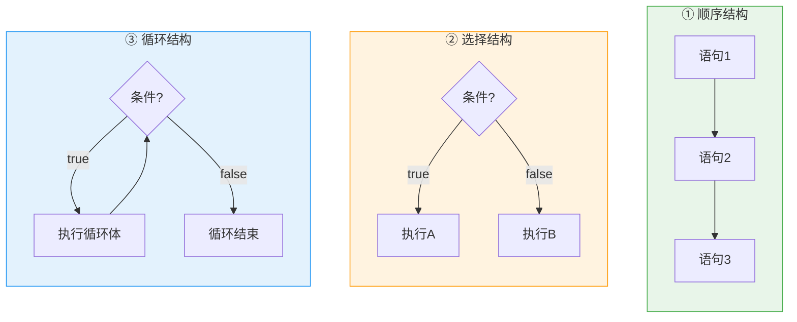
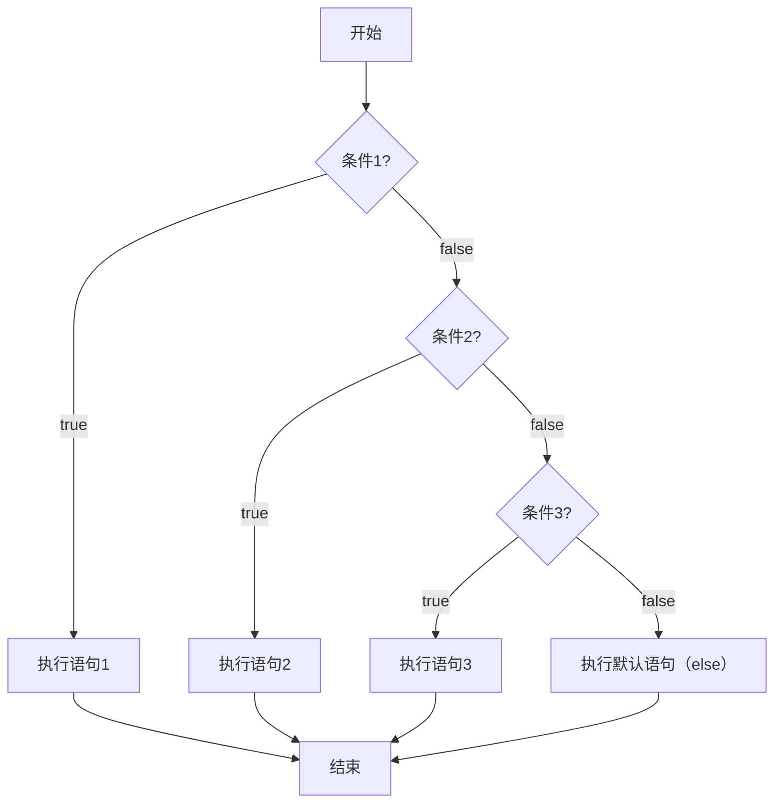
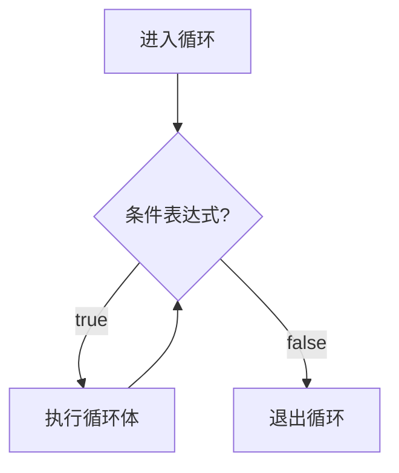
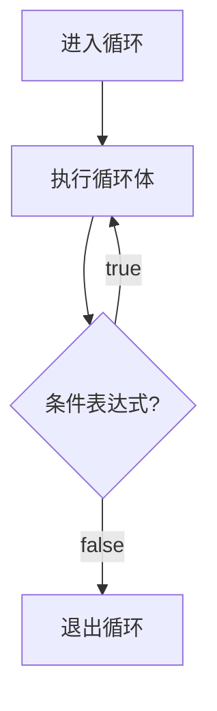
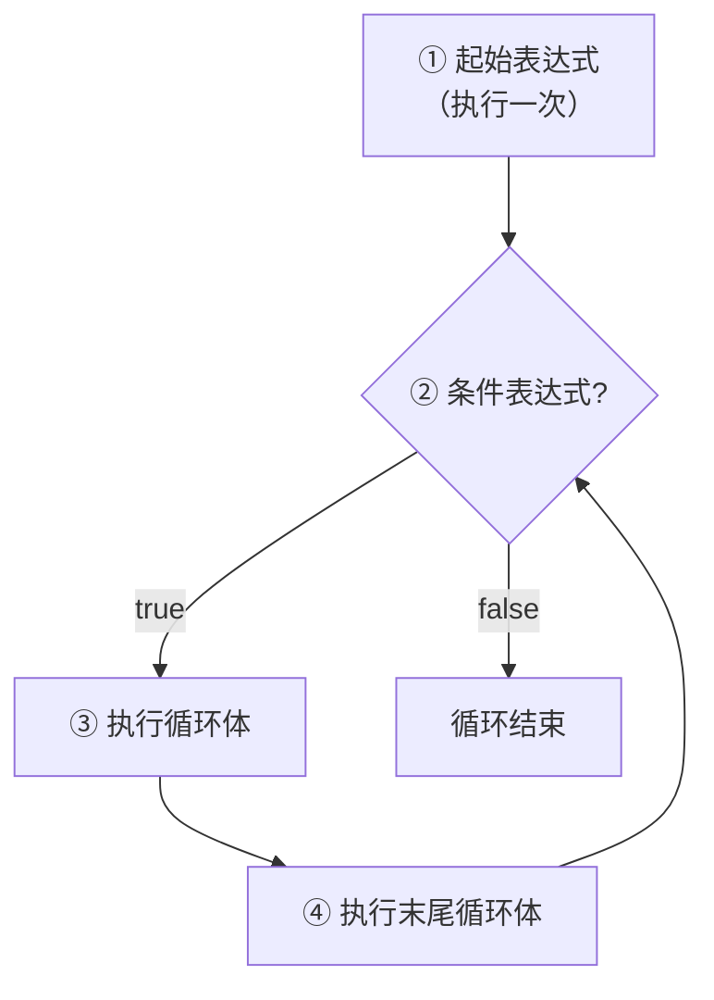
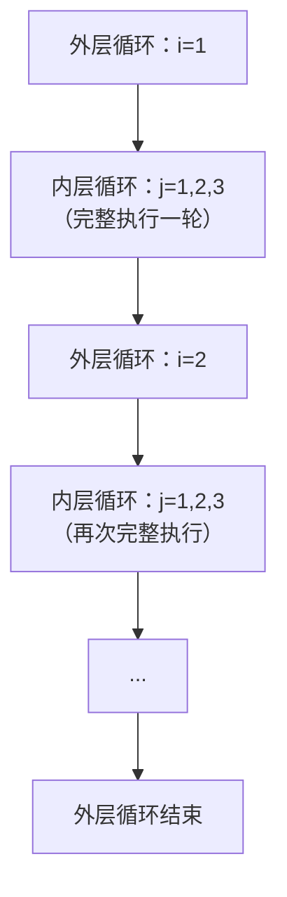

## 程序流程结构与选择结构

### 程序流程结构与程序块

三种基本结构是结构化编程理论的基石，也是理解后面所有代码组织方式的参照系。在展开它们之前，先要弄清 C++ 里最小的一块积木长什么样。

#### 语句与程序块

在 C++ 中，一个表达式后面加上分号 `;` 就构成一条**语句**（Statement）。分号的角色类似中文的句号——它告诉编译器"这句话说完了"。下面三条都是合法的语句：

```cpp
int a = 1;                          // 一条声明语句
cout << a << endl;                  // 一条输出语句
;                                   // 空语句（只有一个分号，什么也不做）
```

多行语句用花括号 `{}` 包起来，就构成一个**程序块**（Block），也叫**复合语句**（Compound Statement）。程序块在语法上等价于单条语句——任何能写一条语句的地方，都能写一个程序块：

```cpp
{                                   // 一个程序块
    int a = 1;
    cout << a << endl;
}
```

程序块还有一个更重要的作用：它划定了一个**作用域**（Scope）。在块内定义的变量，出了这个块就无法访问。**变量的声明位置决定了它的可见范围和生命周期**，这是 C++ 管理变量存在时间的基础机制，也是后面理解循环变量、函数参数作用域的前提。

#### 程序的三种基本结构

1966 年，计算机科学家 Böhm 和 Jacopini 证明了一个结论：**任何可计算问题的程序，都可以仅用三种控制结构来描述**。这个结论奠定了结构化编程的理论基础，也解释了为什么 C++ 的流程控制语句只有这几种：

```
顺序结构 —— 代码从上到下依次执行（默认方式）
选择结构 —— 根据条件决定走哪条分支（if / switch）
循环结构 —— 让一段代码重复执行多次（while / do-while / for）
```

三者的区别可以用一张图看清：



三者之间是递进关系：**顺序结构**是骨架，所有程序默认按顺序执行；**选择结构**给了程序判断能力，让它根据条件走不同的路径；**循环结构**给了程序重复能力，让计算机去做人不愿意做的反复劳动。

掌握了这三种结构，一门语言就具备了**图灵完备**（Turing Complete）的表达能力——理论上可以解决任何可计算问题。后面要学的数组、指针、面向对象，本质上都是在帮你更好地**组织**这三种结构，而不是引入新的控制逻辑。

### 选择结构

选择结构让程序具备了**判断能力**。C++ 提供了两套选择机制：`if-else` 系列适合**范围判断和复杂条件**，`switch` 适合**离散值的精确匹配**。下面逐个看它们的写法，最后再总结什么时候该用哪一个。

#### 单行 if 语句

最简单的选择结构是单行 `if`：条件满足就执行，不满足就跳过。

```cpp
if (条件表达式)
    条件满足时执行的语句;   // 只有一条语句时，花括号可以省略
```

```cpp
int a, b;
cin >> a >> b;
if (a > b)
    cout << a << endl;       // a > b 时才输出 a
```

> **注意**：当 `if` 下面只有一条语句时，花括号在语法上确实可以省略。但**强烈建议始终保留花括号**——无数 bug 都源于"后来加了一行代码，却忘记补上花括号"。养成写 `{}` 的习惯，比事后调试省心得多。

> **易错点**：`if (a = 3)` 是合法的，但它做的不是比较。`a = 3` 是一个**赋值表达式**，它的值是赋进去的 `3`；而 C++ 把任何非零值都当作 `true`，所以这个条件永远成立，`a` 还会被悄悄改成 `3`。这是 C++ 从 C 继承来的最危险的特性之一——Java 要求条件必须是 `boolean` 类型，写 `if (a = 3)` 会直接编译报错，C++ 不会。防御办法是把常量写在左边：写成 `if (3 == a)`，一旦手误打成 `if (3 = a)`，编译器会立刻报错（字面量不能被赋值），bug 在编译阶段就被拦住了。

#### 双分支 if-else

单行 `if` 可能什么都不执行，`if-else` 则保证**两条路径必走其一**：条件成立走第一支，不成立走第二支，不存在"都不走"的情况。

```cpp
if (条件表达式)
    条件满足时执行的语句;
else
    条件不满足时执行的语句;
```

```cpp
int money = 50;
if (money >= 100) {
    cout << "吃网红餐厅" << endl;
} else {
    cout << "吃沙县小吃" << endl;
}
```

#### 多分支 if-else if-else

选项超过两个时，用 `else if` 继续追加新的判断条件。执行时从上到下依次检查，**一旦某个条件成立就执行对应语句，并跳过后面所有分支**：

```cpp
if (条件表达式1) {
    满足条件1时执行的语句;
} else if (条件表达式2) {
    不满足1但满足2时执行的语句;
} else if (条件表达式3) {
    不满足1、2但满足3时执行的语句;
} else {
    不满足以上所有条件时执行的语句;   // 最终兜底
}
```



最后那个 `else` 是可选的，但**范围判断类的多分支里最好不要省**：没有它，条件全不满足时程序会什么都不做，出了问题也看不到任何提示。

> **例 1（成绩评级）** 输入一个 0~100 的分数，输出对应的等级：90~100 为"优秀"，80~89 为"良好"，70~79 为"中等"，60~69 为"及格"，0~59 为"不及格"，其他数字为"非法输入"。

**思路**：这是典型的范围判断问题，关键技巧是**利用 `else if` 已经排除掉前置条件这一事实**。走到第二个 `else if` 时，已经确定分数不满足第一个条件（即已经小于 90），所以第二个条件只需要写 `score >= 80`，不必再写 `score <= 89`。

**解**：

```cpp
#include <iostream>
using namespace std;

int main() {
    int score;
    cin >> score;

    if (score >= 90 && score <= 100) {
        cout << "优秀" << endl;
    } else if (score >= 80) {          // 走到这里时，score 一定 < 90
        cout << "良好" << endl;
    } else if (score >= 70) {
        cout << "中等" << endl;
    } else if (score >= 60) {
        cout << "及格" << endl;
    } else if (score >= 0) {
        cout << "不及格" << endl;
    } else {
        cout << "非法输入" << endl;
    }
    return 0;
}
```

**评注**：注意第一个条件的写法是完整的闭区间 `score >= 90 && score <= 100`，后面的条件却只写下界。这就是 `else if` 链的标准写法——**从最特殊的条件开始，逐步放宽，最后用 `else` 兜底**。如果把顺序反过来（先判断 `>= 0`，再判断 `>= 60`），逻辑虽然等价，但表述更啰嗦，也更容易漏掉区间边界。另外要警惕一种来自数学的写法：`90 <= score <= 100` 在数学上自然，在 C++ 里却**不合法**——编译器会先把 `90 <= score` 算成一个布尔值（`true` 就是 1，`false` 就是 0），再拿这个 0 或 1 去和 `100` 比较，结果永远为真，逻辑完全错掉。必须写成 `score >= 90 && score <= 100`。

#### switch 语句

当判断依据不是范围，而是**有限个离散值**（星期、月份、菜单编号）时，`switch` 比 `if-else if` 更清晰：

```cpp
switch (表达式) {
    case 常量值1:
        执行语句;
        break;          // 退出当前分支
    case 常量值2:
        执行语句;
        break;
    // ...
    default:
        所有 case 均不匹配时执行;
        break;
}
```

下面这段代码把星期几映射到当天的运动：

```cpp
int week;
cin >> week;
switch (week) {
    case 1: cout << "跑步" << endl; break;
    case 2: cout << "游泳" << endl; break;
    case 3: cout << "慢走" << endl; break;
    case 4: cout << "动感单车" << endl; break;
    case 5: cout << "拳击" << endl; break;
    case 6: cout << "爬山" << endl; break;
    case 7: cout << "好好吃一顿" << endl; break;
    default: cout << "输入错误" << endl; break;
}
```

**`switch` 的限制**：它只能匹配"能在编译期确定的整数值"，这条限制划出了它的能力边界。

| 支持的类型 | 不支持的类型 |
| :--- | :--- |
| 整型（`int`、`short`、`long long` 等） | `float`、`double`（浮点型） |
| 字符型（`char`） | `string`（C++ 中与 Java 不同！） |
| 枚举类型（`enum`） | 范围表达式（如 `case > 10:`） |

> **C++ vs Java**：Java 的 `switch` 从 JDK 7 开始支持 `String` 类型，但 **C++ 的 `switch` 不支持 `string`**。原因是 `switch` 在底层常被编译成**跳转表**（jump table）——一个以整数值为索引的数组，`case` 的值必须是编译期就能确定的整数；而字符串比较需要逐字符比对，做不成跳转表。在 C++ 里需要按字符串做多分支判断时，只能用 `if-else if` 链。

#### case 穿透

如果省略 `case` 后面的 `break`，程序不会自动退出 `switch`，而是**穿透到下一个 `case` 继续执行**，直到遇到 `break` 或 `switch` 结束。这不是 bug，而是一个可以利用的特性：当多个 `case` 需要执行同一段逻辑时，穿透比重复写代码更干净。

```cpp
int w;
cin >> w;
switch (w) {
    case 1:
    case 2:
    case 3:
    case 4:
    case 5:
        cout << "工作日" << endl;
        break;
    case 6:
    case 7:
        cout << "休息日" << endl;
        break;
    default:
        cout << "没有这个星期" << endl;
}
```

> **易错点**：穿透本身是中性的，危险的是**忘记写 `break` 造成的意外穿透**——那才是 bug。判断标准只有一条：穿透是**有意为之**，还是**漏写的结果**。有意穿透时，把连续的 `case` 摞在一起、只在最后一段写执行语句，读者一眼就能看出这是故意的；如果几个 `case` 各自有逻辑却忘了 `break`，程序会从匹配的那一支一路执行下去，结果往往莫名其妙。

#### 选择策略

两种选择结构在表达能力上并不完全重叠，选错了不是写不出来，而是写得更啰嗦、更容易错：

| 场景 | 推荐 | 原因 |
| :--- | :--- | :--- |
| 对**范围**进行判断（分数区间、年龄分段） | `if-else if` | `switch` 需要逐一列举所有值，范围判断时过于繁琐 |
| 对**有限个离散值**进行选择（星期、月份、菜单） | `switch` | 结构清晰，编译器可优化为跳转表，执行效率更高 |
| 判断条件涉及**多个变量**或**复杂逻辑表达式** | `if-else if` | `switch` 只能对一个表达式的结果做等值匹配 |

## 循环结构

选择结构解决的是"做不做"，循环结构解决的是"做多少次"。人类厌烦把同一个计算做上一百遍，计算机却对此毫无怨言——这就是循环的价值。C++ 提供了三种循环，它们在表达能力上可以互相替代，差别在于**条件什么时候被检查**、以及**代码读起来像不像你想表达的那句话**。

### while 循环

`while` 是最基本的循环：**先判断条件，条件为真就执行循环体，执行完再回到条件处判断**，如此反复，直到条件为假。

```cpp
while (条件表达式) {
    循环体语句;
}
```



`while` 最核心的特征是**先判断，后执行**——这意味着如果条件一开始就是 `false`，循环体一次都不会执行。

> **例 2（1~100 的累加和）** 计算 $S = 1 + 2 + \cdots + 100$ 的值。

**思路**：用一个变量 `sum` 在循环外初始化为 0，用另一个变量 `n` 从 1 开始递增。每轮把 `n` 累加到 `sum`，然后 `n++` 向终止条件逼近；当 `n > 100` 时循环结束，`sum` 就是答案。**累加器必须定义在循环外面**——如果放在循环体内部，每轮迭代都会把它重新清成 0。

**解**：

```cpp
#include <iostream>
using namespace std;

int main() {
    int sum = 0, n = 1;
    while (n <= 100) {
        sum += n;     // 累加当前值
        n++;          // 向结束条件逼近
    }
    cout << sum << endl;   // 输出：5050
    return 0;
}
```

程序输出：

```
5050
```

**评注**：这个模式——"循环外初始化累加器，循环内迭代累加，循环后使用结果"——是循环编程里最经典的范式。后面的求和、求积、计数、找最大值，本质上都是它的变体。要特别留意 `n++` 这一步：如果忘了写，`n` 永远等于 1，`n <= 100` 永远为真，程序就陷进了**死循环**。**循环体里必须有让条件趋向结束的语句**，这是写 `while` 时每次都要检查的事。

### do-while 循环

`do-while` 与 `while` 的唯一区别是**先执行一次循环体，再判断条件**。无论条件成立与否，循环体至少执行一次。

```cpp
do {
    循环体语句;
} while (条件表达式);   // 注意：这里有分号！
```



> **注意**：`while` 后面那个分号 **`;` 不能省**。它看起来像多余，其实是 `do-while` 语法结构的一部分；漏掉时编译器会报错，属于容易忘但不会静默出错的一类问题。

> **例 3（三位水仙花数）** 水仙花数是指一个三位数，其各位数字的立方和等于该数本身（如 $153 = 1^3 + 5^3 + 3^3$）。输出所有三位水仙花数。

**思路**：遍历 100~999 的每一个整数，把它拆成个位、十位、百位，再判断三个数字的立方和是否等于自身。拆位用的是取余与整除的组合（见 C++程序设计基础-2 数据类型与运算符）：个位 `num % 10`、十位 `num / 10 % 10`、百位 `num / 100`。这里用 `do-while`，是因为循环体至少要走一次（100 本来就是三位数），把判断放在末尾也更自然。

**解**：

```cpp
#include <iostream>
using namespace std;

int main() {
    int num = 100;
    int gw, sw, bw;                    // 个位、十位、百位
    do {
        gw = num % 10;                 // 个位
        sw = num / 10 % 10;            // 十位
        bw = num / 100;                // 百位
        if (gw*gw*gw + sw*sw*sw + bw*bw*bw == num) {
            cout << num << endl;
        }
        num++;
    } while (num < 1000);
    return 0;
}
// 输出：153, 370, 371, 407
```

程序输出：

```
153
370
371
407
```

**评注**：这个例子演示了循环、条件筛选与数值拆分的经典组合。`gw*gw*gw` 的写法值得留意——C++ 没有内置的立方运算符，`gw³` 这种上标也不是合法语法，只能连乘三次。而个位、十位、百位那三条拆分公式对任何整数都成立，是把一个数"拆开"看的标准手段，后面处理数字的题目会反复用到。

### for 循环

`for` 是三种循环里结构最紧凑的一种：初始化、条件判断、迭代控制全部写在同一对小括号里，一眼就能看清循环的边界。

```cpp
for (起始表达式; 条件表达式; 末尾循环体) {
    循环体语句;
}
```

| 成分 | 执行时机 | 说明 |
| :--- | :--- | :--- |
| **起始表达式** | 循环开始前**仅一次** | 初始化循环变量（如 `int i = 1`） |
| **条件表达式** | 每次迭代前判断 | `true` 继续，`false` 结束。**先判断后执行** |
| **循环体** | 条件为真时执行 | 被重复执行的代码 |
| **末尾循环体** | 每次循环体执行完毕后 | 控制循环变量向结束条件逼近（如 `i++`） |



书写时先想清三件事——**从哪开始、到哪结束、每次做什么变化**，它们分别对应初始化、条件判断和末尾循环体。下面两段代码分别演示重复固定次数和正向、反向遍历：

```cpp
// 打印 5 次 HelloWorld
for (int i = 1; i <= 5; i++) {
    cout << "HelloWorld" << endl;
}

// 输出 1~5 和 5~1
for (int i = 1; i <= 5; i++) { cout << i << " "; }   // 1 2 3 4 5
cout << endl;
for (int i = 5; i >= 1; i--) { cout << i << " "; }   // 5 4 3 2 1
```

#### 表达式的省略

`for` 小括号里的三个表达式**都可以省略**，但两个分号必须保留——它们是 `for` 语法结构的一部分，不是分隔符。三种省略各自对应一种写法：

省略起始表达式，通常是因为循环变量已经在外面声明了；省略条件表达式，意味着条件永远为真（`for (;;)` 等价于 `while (true)`），这时必须靠循环体里的 `break` 退出；省略末尾循环体，则迭代控制要自己写在循环体内部。

还有一条作用域规则要记住：在 `for` 循环头里声明的变量（`for (int i = 0; ...)`），**作用域仅限于循环内部**，循环结束后 `i` 就不再可用。这一点和 C99 之前的 C 语言不同，也是"变量声明位置决定可见范围"的又一个例子。

> **例 4（1~100 的偶数和）** 计算 1 到 100 中所有偶数的和。

**思路**：有两种等价写法。一是遍历所有数，用 `if (i % 2 == 0)` 过滤出偶数；二是让循环变量从 2 开始、步长为 2，直接跳过奇数。第二种方法的循环次数减半，效率更高。

**解**：

```cpp
#include <iostream>
using namespace std;

int main() {
    // 方法一：全量遍历 + 条件筛选
    int sum = 0;
    for (int i = 1; i <= 100; i++) {
        if (i % 2 == 0) {
            sum += i;
        }
    }
    cout << sum << endl;   // 输出：2550

    // 方法二：从 2 开始，步长 2（效率更高）
    sum = 0;
    for (int i = 2; i <= 100; i += 2) {
        sum += i;
    }
    cout << sum << endl;   // 输出：2550

    return 0;
}
```

程序输出：

```
2550
2550
```

**评注**：两种写法结果相同，但方法二体现了"**避免无效迭代**"的优化思维。数据量小的时候差别看不出来，可当循环次数达到百万、千万级时，少执行一半的循环体就是实打实的性能差距。养成"先想能不能缩小循环范围"的习惯，比事后再回头优化容易得多。

### 三种循环的对比

| 循环类型 | 执行顺序 | 至少执行一次？ | 适用场景 |
| :--- | :--- | :---: | :--- |
| `while` | 先判断，后执行 | ❌ 可能一次都不执行 | 未知循环次数，已知结束条件（如"读到文件末尾就停"） |
| `do-while` | 先执行，后判断 | ✅ 至少一次 | 至少需要执行一次（如"先显示菜单，再等用户选择"） |
| `for` | 先判断，后执行 | ❌ 可能一次都不执行 | **已知循环次数或范围**（最常用的循环形式） |

#### 选择原则

三种循环在理论上可以相互替代，所以选择的依据只有一条：**哪种写出来最贴近业务语义**。循环次数确定用 `for`；循环次数不确定、但结束条件明确用 `while`；必须先执行一次用 `do-while`。

从实际使用频率看，这个选择原则在真实代码里表现得很极端：八成以上的循环是 `for`（多数场景都已知循环范围），一成半左右是 `while`（读文件、等待网络这类次数不确定的场合），`do-while` 不到百分之五（只用在"至少要执行一次"的特定场景）。这个比例在其他语言里也大致成立。

### 循环嵌套

一个循环的循环体里包含另一个完整的循环结构，就叫**循环嵌套**。执行规则很简单：**外层循环每走一步，内层循环就完整地跑完一轮**。



> **例 5（阶乘之和）** 输入正整数 $n$，计算 $1! + 2! + 3! + \cdots + n!$。

**思路**：外层循环遍历 1 到 $n$（决定要加几个阶乘），内层循环算出当前 $i$ 的阶乘（$1 \times 2 \times \cdots \times i$），内层结束后把阶乘结果累加到总和。关键细节是累乘器 `t` **必须在每轮外层循环开始时重置为 1**，否则会继承上一轮的乘积。

**解**：

```cpp
#include <cstdio>
using namespace std;

int main() {
    int n, sum = 0;
    scanf("%d", &n);
    for (int i = 1; i <= n; i++) {
        int t = 1;                   // 每次外层循环重置阶乘累乘器
        for (int j = 1; j <= i; j++) {
            t *= j;                  // 内层循环求 i!
        }
        sum += t;                    // 累加当前阶乘
    }
    printf("%d\n", sum);
    return 0;
}
```

**评注**：这段代码的分工很清楚——外层控制"加到第几项"，内层负责"算出这一项"，两个变量各管一层。这种结构的两个高发错误（循环变量怎么命名、累乘器声明在哪一层）值得单独说明。

#### 循环变量的约定

嵌套循环里有一个通行约定：**外层用 `i`，内层用 `j`，再内层用 `k`**。这不是语法要求，但它让嵌套层次一眼可辨——读到 `j` 就知道它在内层，读到 `k` 就知道还有更深一层，不用回头确认某个变量属于哪一层。嵌套超过两层之后，变量名其实承担了"目录"的作用。

#### 变量的声明位置

例 5 里的 `int t = 1;` 写在**外层循环体内部、内层循环体外部**，这个位置不能随意挪动。写在外层循环**外面**，`t` 不会在每轮开始时重置，上一轮算出的乘积会一直乘下去，结果必错；写进**内层循环体内部**，每乘一次就被重新清成 1，等于白乘。

凡是需要"每轮重新开始"的变量——累加器、累乘器、标记变量——都有这个问题。**它该在哪一层重置，就声明在哪一层**：C++ 中变量的声明位置决定了它的生命周期，也就决定了它什么时候被重新初始化。

> **易错点**：嵌套层数在语法上没有限制，但**不建议超过三层**。三层以上的嵌套要求你在脑子里同时维护三层循环变量的状态，出错概率会急剧上升。如果发现自己写到了第四层，正确做法是把内层逻辑抽成一个函数，用 `return` 一次性退出嵌套——这是 C++程序设计基础-4 函数要解决的问题。

## 跳转语句

循环体里的控制流还有两个开关：`break` 让程序提前退出整个循环，`continue` 让程序跳过本轮剩余的语句、直接进入下一轮。它们对应的正是两种不同的需求——"不想再做了"和"这一轮不算"。至于 `goto`，它是 C 语言留下的遗产，能无条件跳到函数内的任意位置，但现代编码规范一致建议不要使用。

### break 语句

`break` 用在 `switch` 和循环里。执行到它时，程序**立即跳出当前整个循环**（或 `switch`），后续迭代全部放弃。

```cpp
// 输入为 0 时结束循环
while (true) {
    int a;
    cin >> a;
    if (a == 0) {
        break;          // 立即跳出 while 循环
    }
    cout << "你输入了：" << a << endl;
}
```

`while (true)` 加上内部的 `break`，是"一直做下去，直到某个条件出现再停"的标准写法；读取未知数量的输入、等待用户主动结束，都属于这类场景。

> **易错点**：在**嵌套循环**里，`break` 只能跳出**最近的那一层**，外层循环照常继续。C++ 没有 Java 那样的标签跳转（`break 标签;`），想从内层直接跳出多层，常用两个办法：设一个 `bool` 标志变量，内层 `break` 之后外层检查标志再 `break`；或者把嵌套循环抽成一个函数，用 `return` 一次性退出（最推荐，见 C++程序设计基础-4 函数）。用 `goto` 也能实现，但不值得。

### continue 语句

`continue` **只能用在循环里**。执行到它时，程序**跳过本次循环中剩余的语句**，直接进入下一次迭代。

```cpp
// 只输出 1~10 中的奇数
for (int i = 1; i <= 10; i++) {
    if (i % 2 == 0) {
        continue;       // 跳过本次循环的剩余部分（cout），直接 i++
    }
    cout << i << " ";   // 只有奇数才能走到这里
}
// 输出：1 3 5 7 9
```

#### break 与 continue

两个关键字长得像，作用却正好相反：

| 关键字 | 作用范围 | 效果 |
| :--- | :--- | :--- |
| `break` | `switch`、循环 | **终止**整个循环，后续迭代全部放弃 |
| `continue` | 仅循环 | **跳过**本次循环的剩余部分，继续下一次迭代 |

> **记忆方法**：把循环想象成吃包子。`break` 是"我吃饱了，不吃了"——直接离开餐桌；`continue` 是"这个包子有虫子，我不吃这个"——跳过它，接着吃下一个。

#### 两种循环的差异

`continue` 在 `while` 和 `for` 里的行为**并不一样**，这是它最容易埋雷的地方。在 `while` 中执行 `continue`，程序直接跳到条件判断处；在 `for` 中执行 `continue`，程序会**先执行末尾循环体（如 `i++`），再判断条件**。也就是说，`for` 里的 `continue` 不会跳过迭代变量的更新，而 `while` 里的 `continue` 会跳过写在它后面的**所有**语句——包括 `i++`：

```cpp
// 错误示例：while 中 continue 跳过了 i++，导致死循环
int i = 1;
while (i <= 10) {
    if (i % 2 == 0) continue;   // 跳过 i++！→ i 永远=2，死循环
    cout << i << " ";
    i++;
}

// for 中没有这个问题，因为 i++ 在末尾循环体中，continue 不会跳过它
for (int i = 1; i <= 10; i++) {
    if (i % 2 == 0) continue;   // i++ 仍然会执行
    cout << i << " ";
}
```

由此得到一条实用规则：**在 `while` 里用 `continue` 时，先确认迭代变量的更新语句排在 `continue` 前面**。如果不能确定，换成 `for` 更安全——它的末尾循环体保证了迭代一定会推进。

### goto 语句

`goto` 允许无条件跳转到函数内的任意标记位置。它是 C 语言的遗产：在 1960 年代结构化编程革命之前，`goto` 几乎是所有流程控制的基础。1968 年，Edsger Dijkstra 发表了著名的论文《Go To Statement Considered Harmful》，指出 `goto` 会让代码逻辑难以追踪（也就是所谓"意大利面条式代码"），结构化编程从此逐渐取代了它。

```cpp
goto 标记;
// ... 中间的代码被跳过 ...
标记:
    // 从这里继续执行
```

```cpp
#include <iostream>
using namespace std;

int main() {
    cout << "第1步" << endl;
    goto STEP3;                       // 跳转到 STEP3
    cout << "第2步" << endl;          // 这行被跳过，不会执行
STEP3:
    cout << "第3步" << endl;
    return 0;
}
```

程序输出：

```
第1步
第3步
```

> **强烈建议**：**不要使用 `goto`**。在 C++ 中，任何用 `goto` 能实现的逻辑，都可以用 `if-else`、循环、`break`、`continue` 的组合更清晰地写出来。它唯一还算合理的场景，是从深层嵌套的错误处理中统一跳转到清理代码——而这一点在 C++ 里已经被 RAII（资源获取即初始化）和异常处理机制取代了。现阶段只需要知道它的存在、能看懂别人写的 `goto` 就够了。

## 综合应用

把选择结构、循环结构和跳转语句组合起来，就能解决一些真正的问题。下面两个例子分别代表两类典型场景：**判断型**（先假设，再找反证）和**交互型**（不知道要循环多少次，由用户的输入决定）。

> **例 6（判断质数）** 输入一个大于 1 的正整数，判断它是否为质数（只能被 1 和自身整除）。

**思路**：用一个布尔标记 `isPrime` 先初始化为 `true`（无罪推定），再从 2 开始逐个尝试整除目标数。一旦找到能整除的因子，就把标记设为 `false` 并用 `break` 结束循环——此时结论已经确定，继续检查毫无意义。循环的上界还能进一步压缩：只需检查到 $\sqrt{n}$，因为如果 $n$ 有一个大于 $\sqrt{n}$ 的因子，就必定存在一个小于 $\sqrt{n}$ 的对偶因子，而它早就被发现了。

**解**：

```cpp
#include <iostream>
#include <cmath>       // sqrt 函数
using namespace std;

int main() {
    int n;
    cin >> n;
    bool isPrime = true;

    for (int i = 2; i <= sqrt(n); i++) {
        if (n % i == 0) {
            isPrime = false;
            break;              // 找到一个因子就确定不是质数，提前退出
        }
    }

    if (isPrime) {
        cout << n << " 是质数" << endl;
    } else {
        cout << n << " 不是质数" << endl;
    }
    return 0;
}
```

**评注**：布尔标记 `isPrime` 扮演的是"无罪推定"的角色——先假设是质数，找到反证再推翻。这种 **flag 变量**模式在判断类问题里非常常见，只要结论只有"是/否"两种，就值得考虑先立一个标记。`sqrt(n)` 的优化把循环次数从 $O(n)$ 降到 $O(\sqrt{n})$：$n=10^6$ 时检查次数从一百万降到一千。注意 `sqrt` 需要 `<cmath>` 头文件，返回的是 `double`，与 `int` 型的 `i` 比较时会自动转换。如果不想依赖浮点运算，等效写法是 `i * i <= n`——用乘法替代开方，在整数判断场景里更稳妥。

> **例 7（猜数字小游戏）** 程序预设一个 1~100 之间的秘密数字（先写死为 42），用户不断猜测，每次猜完给出"大了"或"小了"的提示，直到猜中为止。

**思路**：这是一个"不知道要循环多少次"的场景——循环次数完全由用户决定，所以用 `while (true)` 无限循环，每轮读入一次猜测并给出提示，猜中时用 `break` 退出。`while (true)` 配内部 `break`，正是这种"无限循环 + 条件退出"的标准模式。

**解**：

```cpp
#include <iostream>
using namespace std;

int main() {
    int secret = 42;             // 秘密数字
    int guess;

    cout << "猜一个 1~100 之间的数字：" << endl;
    while (true) {
        cin >> guess;
        if (guess > secret) {
            cout << "大了，再试试：";
        } else if (guess < secret) {
            cout << "小了，再试试：";
        } else {
            cout << "恭喜你，猜中了！" << endl;
            break;               // 猜中，退出循环
        }
    }
    return 0;
}
```

一次运行的输入与输出：

```
猜一个 1~100 之间的数字：
50
大了，再试试：25
小了，再试试：42
恭喜你，猜中了！
```

**评注**：这个案例是本章的集大成者——`while (true)` 无限循环、`if-else if` 多分支选择、`break` 终止循环和 `cin` 键盘输入，四样东西一起用上了。`while (true)` 表达的是"一直猜下去"这个语义，`break` 提供了唯一的出口。同样的模式在实际开发中随处可见：服务器主循环、游戏主循环、交互式菜单，都是"无限循环 + 某个条件退出"。目前秘密数字是写死的，每局游戏都一样，要让每局不同就需要真正的随机数——这正是下一节的内容（`rand()` 是标准库函数，函数本身的完整讨论见 C++程序设计基础-4 函数）。

### 生成随机数

C++ 标准库提供了 `rand()` 函数（需要 `<cstdlib>` 头文件），它返回 0 到 `RAND_MAX`（通常是 32767）之间的一个整数。用它替换掉猜数字里写死的 `secret`，每局的答案就都不一样了。

#### 设置随机种子

`rand()` 生成的是**伪随机**数。如果不先设置种子，它每次运行都会给出**完全相同**的序列——游戏第一局的答案会被第二局记住。`srand(time(0))` 用当前时间当作种子（需要 `<ctime>` 头文件），每次运行取到的时间不同，序列才真正不一样。

#### 生成指定范围

```cpp
#include <iostream>
#include <cstdlib>    // rand, srand
#include <ctime>      // time
using namespace std;

int main() {
    srand(time(0));                     // 用当前时间作为随机种子
    int secret = rand() % 100 + 1;      // 生成 [1, 100] 的随机数
    cout << secret << endl;
    return 0;
}
```

`rand() % 100` 先把它压到 0~99，`+ 1` 再平移成 1~100——两步合起来，落点正好覆盖猜数字要用的区间。

#### 随机数的质量

> **注意**：`rand()` 的随机质量并不高——周期短，低位不够随机，不适合密码学这类需要真随机的场景。C++11 引入了更现代的 `<random>` 库（`mt19937` 梅森旋转算法配合 `uniform_int_distribution`），在 C++程序设计基础-11 STL标准模板库会涉及。

## 小结

1. C++ 的全部流程控制都建立在**顺序、选择、循环**三种基本结构之上；程序块 `{}` 在语法上等价于一条语句，并划出一层新的作用域。
2. `if-else` 适合范围判断与复杂条件，`switch` 只适合整型、字符型、枚举型的离散值匹配，**不支持 `string`**，也不支持范围表达式。
3. `switch` 的 `case` 后省略 `break` 会穿透到下一个 `case`；这是可以使用的特性，但必须是**有意为之**，而不是漏写的结果。
4. `while` 与 `for` 先判断后执行（循环体可能一次都不执行），`do-while` 先执行后判断（至少执行一次），三者可以互相替代，选择依据是可读性。
5. `for` 的三个表达式都可以省略，但两个分号必须保留；循环头里声明的变量，作用域只限于循环内部。
6. `break` 只跳出最近的一层循环或 `switch`，`continue` 只跳过本次迭代；而 `continue` 在 `while` 中会跳过写在它后面的迭代更新语句，在 `for` 中不会。
7. 循环嵌套要保证"该在哪一层重置的变量就声明在哪一层"，跳出多层循环优先用函数加 `return`；`goto` 能不用就不用。
