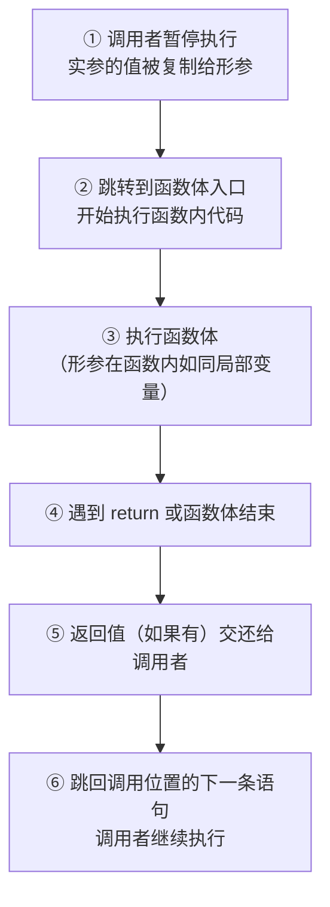
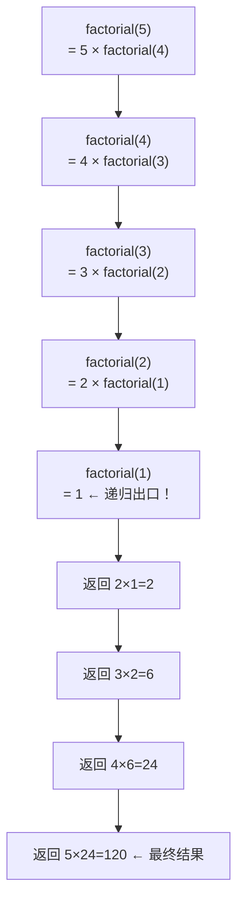
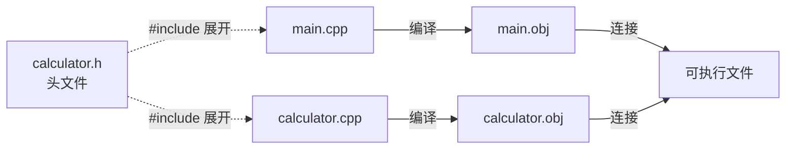

## 函数概述

函数是 C++ 里第一次真正意义上的"分而治之"。在此之前，所有代码都堆在 `main` 函数里从上到下一条线跑完；程序只有几十行时这完全可行，但代码量涨到几百行、几千行，`main` 就会变成一个巨大的代码垃圾场——想找到某段逻辑在哪、想修改一个在十处重复的计算、想复用一段之前写过的功能，每一样都痛苦无比。

**函数**（Function）解决的正是这个问题：它是程序中**最小的独立执行单元**，把一段完成特定任务的代码封装起来并起个名字，之后在任何需要这个功能的地方叫它的名字即可，不必重写一遍。它的价值集中在三点：**复用**（写一次、到处用，不必在十个地方复制粘贴同一段代码）、**抽象**（调用者只需要知道这个函数做什么，不需要知道它怎么做）、**组织**（把大程序拆成若干职责单一的小函数，每个函数只做一件事）。

这一节先把"函数怎么写"的语法一次立起来——定义、声明、调用机制、常见样式、默认参数与占位参数，再回答两个更高层的问题：函数分哪几类、怎样才算一个好函数。此后各节分别深入参数传递、作用域与生命周期、重载、递归和分文件编写。有了函数，程序就不再是一根筋走到底的"独白"，而是多个函数相互调用的"对话"。

### 函数的定义

在 C++ 中定义一个函数，需要同时指定五个要素：

```cpp
返回值类型 函数名(参数列表) {
    函数体;
    return 返回值;    // 如果返回值类型为 void，可省略
}
```

| 要素 | 说明 | 示例 |
| :--- | :--- | :--- |
| **返回值类型** | 函数返回给调用者的数据类型。如果不需要返回，写 `void` | `int`、`double`、`void` |
| **函数名** | 调用时使用的标识符，遵循小驼峰或下划线命名 | `getMax`、`printArray` |
| **参数列表** | 调用者传入的数据的类型和名字。没有参数时写空括号 `()` | `(int a, int b)`、`()` |
| **函数体** | 花括号内的执行代码——函数真正"做事情"的地方 | — |
| **return** | 将结果返回给调用者，同时结束函数的执行 | `return sum;`、`return;` |

五个要素里，返回值类型、函数名和参数列表合起来决定函数的**签名**（Signature），编译器靠它区分不同的函数；函数体则是这个函数具体的实现。

#### 最简单的函数

```cpp
#include <iostream>
using namespace std;

// 定义函数
void greet() {
    cout << "Hello, World!" << endl;
}

int main() {
    greet();   // 调用函数
    greet();   // 可以反复调用
    return 0;
}
```

`void` 表示"空"——这个函数不返回任何东西，也没有参数，调用它就是在执行被封装起来的那几行代码。注意 `greet()` 定义在 `main()` 的**前面**：如果函数定义写在调用之后，编译器读到 `greet()` 时还不认识它，会直接报错。这个问题由**函数声明**解决，见下一节。

#### 带参数的函数

```cpp
#include <iostream>
using namespace std;

// 定义：求两个整数的较大值
int getMax(int a, int b) {
    if (a > b) {
        return a;
    } else {
        return b;
    }
}

int main() {
    int result = getMax(10, 20);
    cout << "较大值：" << result << endl;   // 输出：较大值：20
    return 0;
}
```

- `int a` 和 `int b` 是**形参**（Parameter）——它们是占位符，说明"这个函数需要两个整数才能工作"。
- 调用时传入的 `10` 和 `20` 是**实参**（Argument）——真正被传入函数参与计算的数据。
- `return a;` 做了两件事：把 `a` 的值交还给调用者，同时立即结束函数——`return` 之后的任何代码都不会执行。

形参与实参的差别可以概括成一张表：

| | 形参（Parameter） | 实参（Argument） |
| :--- | :--- | :--- |
| **位置** | 函数定义的小括号内 | 函数调用的小括号内 |
| **角色** | 占位符，说明这个函数需要什么类型的数据 | 真正传入函数参与计算的实际数据 |
| **本质** | 函数内部的局部变量 | 常量、变量或表达式 |

设计一个函数的思路只有三步：先问"我要做什么"，它决定**函数体**；再问"需要什么数据才能完成"，它决定**参数列表**；最后问"调用处是否需要使用结果"，它决定**返回值类型**——需要就返回对应类型，不需要就写 `void`。下面这道例题就是这三步的直接应用。

> **例 1（计算圆的面积）** 定义函数 `getArea`，接收圆的半径，返回圆的面积。

**思路**：按三步走——要做的是计算圆面积（$\pi r^2$）；需要半径这个数据，所以参数是一个 `double`；调用者要拿面积值做后续计算或输出，所以返回 `double`。

**解**：

```cpp
#include <iostream>
using namespace std;

double getArea(double radius) {
    const double PI = 3.14159;
    return PI * radius * radius;
}

int main() {
    double r = 5.0;
    double area = getArea(r);   // 调用函数，传入半径，接收面积
    cout << "面积：" << area << endl;   // 输出：面积：78.5397
    return 0;
}
```

**评注**：`getArea` 把一个数学计算封装了起来——调用者只需要知道"传入半径就能得到面积"，不关心中间用了什么公式或常量。将来若要提高精度（改用更精确的 π 值），只需修改函数内部，所有调用处不受影响。这种"封装实现细节、暴露简洁接口"的设计，是函数最重要的价值。

### 函数的声明

**函数声明**（Function Declaration，也称函数原型 Function Prototype）的作用是提前告诉编译器"有这么一个函数，它的名字、参数和返回类型如下"，于是函数的定义可以出现在调用**之后**——甚至可以放在另一个源文件里。

默认规则是函数定义必须出现在调用之前，否则编译器读到调用时还不认识它。但把几十个函数的定义全部堆在 `main` 前面，会让程序入口埋在文件中部，阅读起来很别扭。声明解决的正是这个矛盾：

```cpp
#include <iostream>
using namespace std;

// 函数声明（告诉编译器这个函数存在）
int getMax(int a, int b);

int main() {
    int result = getMax(10, 20);    // 编译器已经认识了 getMax
    cout << result << endl;
    return 0;
}

// 函数定义（具体实现放在后面）
int getMax(int a, int b) {
    return (a > b) ? a : b;
}
```

声明和定义的差别是这一节最关键的一张表：

| | 声明（Declaration） | 定义（Definition） |
| :--- | :--- | :--- |
| **作用** | 告诉编译器函数的签名（名字 + 参数类型）与返回类型 | 给出函数的完整实现（函数体） |
| **是否分配内存** | 不分配 | 分配 |
| **可重复次数** | 可以多次声明 | **只能定义一次**（One Definition Rule） |
| **写法** | `int getMax(int a, int b);`（以分号结尾，没有函数体） | `int getMax(int a, int b) { ... }`（花括号内有函数体） |

> **注意**：声明中的参数名是可选的——`int getMax(int, int);` 也是合法的。但**保留参数名是强烈推荐的做法**：参数名是给读代码的人最重要的文档，它告诉调用者每个参数的含义。

声明的价值在于让调用不必关心实现的物理位置——实现可以放在文件末尾，也可以放在另一个文件里。分文件编写时，`.h` 里的声明是连接调用者与实现者的唯一桥梁。

### 函数的调用机制

调用一个函数时，程序在底层依次做了这些事：



这个过程称为**函数调用栈**（Call Stack）：每次调用函数，程序都会在内存的**栈区**压入一个**栈帧**（Stack Frame），用来保存函数的局部变量与返回地址；函数执行完毕后栈帧被弹出，程序回到调用位置继续执行。记住这个机制，后面理解递归为什么会"栈溢出"、指针为什么能改到函数外面的变量，都会直接用到它（指针部分见 C++程序设计基础-6 指针）。

### 函数的常见样式

从"有没有参数"和"有没有返回值"两个维度，函数自然分成四种组合。这不是人为的分类，而是函数定义语法自然导出的全部可能形式。

#### 无参无返

纯粹执行一段操作：不需要输入，也不产出结果。打印菜单、播放提示音都是这一类。

```cpp
#include <iostream>
using namespace std;

void sayHello() {
    cout << "Hello" << endl;
}
```

#### 有参无返

需要输入数据才能完成操作，但不产出结果——设置某个值、打印一段格式化内容都属于此列。

```cpp
void printNumber(int n) {
    cout << "数字是：" << n << endl;
}
```

#### 无参有返

不需要输入，但会产出计算结果：读取配置、获取当前时间都是这一类。

```cpp
int getCurrentYear() {
    return 2026;
}
```

#### 有参有返

最完整、也最常用的形式：输入数据 → 计算 → 返回结果。数学计算与数据转换几乎都落在这一类。

```cpp
int add(int a, int b) {
    return a + b;
}
```

四种样式对照如下：

| 样式 | 有参数？ | 有返回值？ | 典型用途 | 示例 |
| :--- | :---: | :---: | :--- | :--- |
| 无参无返 | ❌ | ❌（`void`） | 打印菜单、播放音效 | `void showMenu()` |
| 有参无返 | ✅ | ❌（`void`） | 设置某个值、打印格式化内容 | `void setScore(int s)` |
| 无参有返 | ❌ | ✅ | 读取配置、获取当前时间 | `int getCount()` |
| 有参有返 | ✅ | ✅ | **最常用**——数学计算、数据转换 | `double sqrt(double x)` |

这个分类的价值是帮你快速确定一个新函数的签名：动手写函数之前，先问自己"需要输入数据吗""需要返回结果吗"，两个答案直接决定参数列表和返回值类型。

### 函数的参数形式

参数列表里还有两种特殊写法：给参数一个默认值，或者只写类型不写名字。

#### 默认参数

C++ 允许为形参指定**默认值**——调用时没有提供对应的实参，就自动使用默认值。这个特性可以简化调用，减少不必要的重载版本：

```cpp
#include <iostream>
using namespace std;

// 后两个参数有默认值
int add(int a, int b = 10, int c = 20) {
    return a + b + c;
}

int main() {
    cout << add(1) << endl;          // 1 + 10 + 20 = 31
    cout << add(1, 2) << endl;       // 1 + 2 + 20 = 23
    cout << add(1, 2, 3) << endl;    // 1 + 2 + 3 = 6
    return 0;
}
```

默认参数有两条硬规则。第一条是**从右向左连续设置**——如果某个参数有默认值，它右边的所有参数都必须有默认值。下面的写法里只有前两种合法：

```cpp
void f1(int a, int b = 1, int c = 2);    // ✅ 合法：从右向左连续默认
void f2(int a, int b, int c = 2);        // ✅ 合法：只有最右边有默认值
// void f3(int a = 1, int b, int c);     // ❌ 错误：默认参数不连续
// void f4(int a, int b = 1, int c);     // ❌ 错误：c 没有默认值但 b 有
```

第二条是**声明和定义不能同时写默认参数**。如果函数有声明（比如放在头文件里），默认值只能写在声明处：

```cpp
// 头文件中的声明：只在这里写默认值
int func(int a = 10, int b = 20);

// 源文件中的定义：不能再写默认值
int func(int a, int b) {
    return a + b;
}
```

> **易错点**：默认参数只能从右往左连续设置，根源在于调用时实参是**从左到右依次匹配**的。假如允许 `void f(int a = 1, int b)`，写 `f(5)` 时编译器就无法判断 `5` 是传给 `a`（再给 `b` 补默认值）还是传给 `b`（再给 `a` 补默认值）。从右向左连续默认，保证了任何合法调用都有唯一解释。

> **注意**：默认参数带来便利，也带来两个隐患。一是它与函数重载同时出现时可能产生歧义（见下方"重载与默认参数"）；二是在团队协作中，改默认值会影响所有没显式传参的调用处，动手前要确认不会破坏原有逻辑。

#### 占位参数

**占位参数**（Placeholder Parameter）只写类型、不写参数名。它的主要作用是为向后兼容和运算符重载留位置，日常编程中极少使用：

```cpp
#include <iostream>
using namespace std;

// 第二个参数只有类型没有名字——占位参数
void func(int a, int) {
    cout << "a = " << a << endl;
}

int main() {
    func(10, 20);    // 占位参数也必须传值，尽管函数体里用不到它
    // func(10);     // 错误！占位参数不能省略
    return 0;
}
```

> **注意**：看到只有类型没有参数名的形参，知道它是占位参数即可。占位参数也可以带默认值（如 `void func(int a, int = 10)`），它真正的应用场景是在运算符重载里区分前置和后置 `++`（见 C++程序设计基础-8 面向对象编程）。

### 函数的分类

语法掌握之后，从更高的视角给函数分类，能在动手前帮你确定"这个函数属于哪一类、应该怎么写"。下面两个维度分别回答"函数做什么"和"函数从哪来"。

#### 按用途分类

按核心任务，函数分成三类。它们的差别不在返回值类型，而在对调用者做出的承诺。

| 类别 | 核心特征 | 命名惯例 | 典型示例 |
| :--- | :--- | :--- | :--- |
| **求值类函数** | 接收输入 → 计算 → **返回一个结果值**，不产生副作用（不修改外部状态、不输出） | 名词或 `get`/`calc` 前缀 | `sqrt(x)`、`getArea(r)`、`strlen(s)` |
| **判断类函数** | 接收输入 → 检验条件 → **返回 `bool` 值**（真/假） | `is`/`has`/`can` 前缀 | `isPrime(n)`、`isLeapYear(y)`、`hasNext()` |
| **操作类函数** | 执行一系列动作，**通常无返回值（`void`）** 或返回操作状态，可能修改外部状态或产生输出 | 动词开头 | `swap(a, b)`、`printArray(arr)`、`sort(arr)` |

```cpp
// 求值类：接收半径，返回面积
double getCircleArea(double r) {
    return 3.14159 * r * r;
}

// 判断类：接收年份，返回是否为闰年
bool isLeapYear(int year) {
    return (year % 4 == 0 && year % 100 != 0) || (year % 400 == 0);
}

// 操作类：接收数组和长度，在屏幕上打印
void printArray(int arr[], int len) {
    for (int i = 0; i < len; i++) {
        cout << arr[i] << " ";
    }
    cout << endl;
}
```

这个分类真正的用途是**写代码之前的自检**：如果一个函数既在计算返回值、又在修改全局变量、又在往屏幕上打印，它很可能做了太多事情，应该拆分；如果一个函数叫 `getScore()` 却返回 `void`，命名和分类不一致，调用者会被误导。

#### 按来源分类

| 类别 | 来源 | 特点 | 示例 |
| :--- | :--- | :--- | :--- |
| **标准库函数** | C++ 标准库（如 `<cmath>`、`<cstdio>`、`<string>`） | 编译器自带，无需自己实现；经过大量用户验证，稳定高效 | `sqrt()`、`printf()`、`strlen()` |
| **自定义函数** | 程序员根据业务需求自己编写 | 按需定制，灵活但需要自己保证正确性 | `getArea`、`isLeapYear` 等 |

写自定义函数之前，先问一句"标准库有没有提供这个功能"。有就优先用标准库——它比自己写的更高效、更可靠。例如需要排序时优先用 `<algorithm>` 中的 `sort()`，而不是自己手写冒泡排序（手写排序的价值在于理解算法原理，工程代码里直接调库即可）。

### 函数设计的基本原则

语法正确不代表函数写得好。下面五条原则来自工业界数十年的实践经验，它们不受编译器检查——违反任何一条都能编译通过——却决定了代码的可读性、可维护性和 bug 密度。

#### 规模要小

一个函数超过 50 行，就说明它在做太多事情：人脑很难一次性理解超过一屏的逻辑。当函数越来越长时，把其中可以独立描述的子任务**抽取为新的小函数**。短函数的好处很明确：更容易理解（一眼看完，不用翻页）、更容易测试（输入输出明确，断言清晰）、更容易复用（小功能组合出大功能）。

> **经验法则**：如果你需要为函数内部的一段代码写注释解释"这一段在做什么"，这段代码就应该被提取成一个独立的函数——函数名就是最好的注释。

#### 职责单一

一个函数只做一件事，并且把它做好。这是 UNIX 哲学在编程语言里的体现。

```cpp
// ❌ 坏设计：一个函数做了三件事——计算、判断、输出
void process(int x) {
    int result = x * x;             // 计算平方
    if (result > 100) {             // 判断大小
        cout << "大于100" << endl;  // 输出结果
    }
    // ...
}

// ✅ 好设计：三个独立的小函数，职责清晰
int square(int x) { return x * x; }
bool isGreaterThan100(int x) { return x > 100; }
void printResult(bool flag) { cout << (flag ? "大于100" : "不大于100") << endl; }
```

#### 单入口单出口

单入口指的是函数只能通过函数名调用进入，这一点由 C++ 语法自然保证——`goto` 不能跨函数跳转。单出口指的是函数只在**一处**结束并返回。

```cpp
// ❌ 多出口：return 散布在多处，修改时容易漏掉分支
int getScore(int x) {
    if (x < 0) return -1;
    if (x > 100) return -1;
    if (x == 0) return 0;
    return x * 2;
}

// ✅ 单出口：用一个变量承载结果，最后统一 return
int getScore(int x) {
    int result = -1;                // 默认值
    if (x >= 0 && x <= 100) {
        if (x == 0) {
            result = 0;
        } else {
            result = x * 2;
        }
    }
    return result;
}
```

> **例外**："单出口"是结构化编程的经典原则，现代 C++ 实践中有一个常见例外——**提前返回**（Early Return）在处理错误条件时比深层嵌套的 `if-else` 更清晰。初学者可以先养成单出口的习惯，借此培养对控制流的敏感度，之后再按实际场景灵活选择。

#### 不用全局变量

全局变量会让函数的行为变得不可预测：同一个函数，在全局变量取不同值时可能给出完全不同的结果。

```cpp
int multiplier = 2;                      // 全局变量

int scale(int x) {
    return x * multiplier;               // 结果依赖全局状态
}

// 更好的设计：通过参数显式传入
int scale(int x, int factor) {
    return x * factor;                   // 结果只依赖参数，可预测
}
```

函数应该通过**参数**接收所需的一切输入，通过**返回值**输出结果。这样的函数是"纯"的——相同输入永远产生相同输出，测试和调试都简单很多。

#### 分支都有返回值

有返回值的函数必须保证每个控制分支都有返回值。这是编译器**不会报错**、运行时却会引发**未定义行为**的陷阱：

```cpp
// ❌ 危险：当 x == 0 时，没有 return 语句被执行，返回值是随机垃圾
int divide(int a, int x) {
    if (x != 0) {
        return a / x;
    }
    // 漏掉了 x == 0 时的返回值！
}

// ✅ 安全：每个分支都有明确的返回值
int divide(int a, int x) {
    if (x != 0) {
        return a / x;
    } else {
        return 0;    // 或抛出异常、返回错误码——无论如何必须有 return
    }
}
```

> **自查方法**：写完一个带返回值的函数后，逐一检查每一条控制路径（`if` 分支、`else` 分支、`switch` 的每个 `case`、循环之后的语句），确认每条路径都以 `return` 结束。GCC 和 MSVC 的 `-Wall` / `/W4` 编译选项能查出部分漏返回的情况，但不保证覆盖所有路径——最终的责任仍在写代码的人。

## 参数传递

先给结论。C++ 提供了三种参数传递方式，它们的差别集中在两件事上：**函数能不能改到实参**，以及**传参要不要复制数据**。

| 传递方式 | 语法 | 能修改实参？ | 复制开销 | 适用场景 |
| :--- | :--- | :---: | :---: | :--- |
| **值传递** | `void f(int x)` | ❌ 不能 | 有（复制整个值） | 小体积的基本类型（`int`、`double`、`char` 等） |
| **指针传递** | `void f(int* p)` | ✅ 能 | 小（仅复制指针，4/8 字节） | 需要修改实参 / 传递大体积数据（数组、结构体） |
| **引用传递** | `void f(int& x)` | ✅ 能 | 无（别名，不复制） | **C++ 推荐方式**：需要修改实参且不涉及空指针 |

选错传递方式是 C++ 里最常见的隐性 bug 来源之一：函数要么改不动实参，要么白白复制一整份数据。下面逐个展开。

#### 值传递

**值传递**（Pass by Value）是 C++ 的**默认**传递方式：实参的值被**复制**一份赋给形参，函数内部对形参的任何修改都**不影响实参**。

```cpp
#include <iostream>
using namespace std;

void swap(int a, int b) {       // a 和 b 是实参的副本
    int temp = a;
    a = b;
    b = temp;
    cout << "函数内：a=" << a << ", b=" << b << endl;
}

int main() {
    int x = 10, y = 20;
    swap(x, y);                  // 传入的是 x 和 y 的副本
    cout << "函数外：x=" << x << ", y=" << y << endl;
    return 0;
}
```

程序输出：

```
函数内：a=20, b=10
函数外：x=10, y=20
```

函数外的 `x`、`y` 没有变，因为函数操作的是副本。值传递就像把一份文件复印后交给别人——别人在复印件上怎么涂改，原件毫发无伤。这是最安全的传输方式（函数不会意外修改你的数据），但对于大体积数据（比如包含 10000 个元素的数组），复制整份数据的开销也很大。

> **易错点**：初次写 `swap(a, b)` 却发现两个变量没有交换，原因几乎总是用了值传递——函数内部交换的只是副本，原变量毫发无伤。解决办法是把参数改成引用 `void swap(int& a, int& b)`，或者指针 `void swap(int* a, int* b)`。

#### 指针传递

**指针传递**（Pass by Pointer）用在两个场合：想让函数**能够修改实参**，或者要传递的数据体积很大、不想复制。做法是把数据的**地址**交给函数——形参声明为指针类型（`int*`），实参传入变量的地址（`&x`）：

```cpp
#include <iostream>
using namespace std;

void swap(int* a, int* b) {     // a 和 b 是指针，存储的是实参的地址
    int temp = *a;               // *a：解引用，取出 a 指向的值
    *a = *b;
    *b = temp;
}

int main() {
    int x = 10, y = 20;
    swap(&x, &y);                // &x：取地址，把 x 的地址传给函数
    cout << "x=" << x << ", y=" << y << endl;   // x=20, y=10  ← 交换成功！
    return 0;
}
```

指针传递就像把文件的"存放位置"告诉别人——别人按地址找到原件，做的是真实的修改。它只复制地址（4 或 8 字节），不复制整份数据，效率很高。代价是引入了两个新概念：`&`（取地址运算符）与 `*`（解引用运算符），这对初学者是不小的认知负担。指针的完整知识在 C++程序设计基础-6 指针里展开，这里只需要知道它的存在和基本用法。

#### 引用传递

**引用**（Reference）是 C++ 独有的特性：它为已有变量创建一个**别名**，对别名的操作就是对原变量的操作。引用传递因此同时拿到了指针的效率（不复制数据）和值传递的语法简洁（不需要 `*` 和 `&`）：

```cpp
#include <iostream>
using namespace std;

void swap(int& a, int& b) {     // & 在类型后面表示引用，不是取地址！
    int temp = a;                // 直接操作 a 和 b，就像操作实参本身
    a = b;
    b = temp;
}

int main() {
    int x = 10, y = 20;
    swap(x, y);                  // 调用语法和值传递完全一样，不需要 &
    cout << "x=" << x << ", y=" << y << endl;   // x=20, y=10
    return 0;
}
```

`int& a` 中的 `&` **不是取地址运算符**——它在类型声明里的含义是"引用类型"，可以理解为给传入的变量起了个小名（别名）。函数内部用 `a` 就像在用原始的 `x` 一样，不需要 `*a` 那样的解引用。引用在定义时必须初始化，而且一旦绑定就不能再指向别的变量，这两条安全保证是它比指针更受推荐的原因。

> **C++ 与 Java 的差别**：Java 中对象类型的参数语义接近引用传递（准确地说，传的是引用的副本），但 Java 的**基本数据类型**（`int`、`double` 等）永远是值传递，没有直接修改基本类型实参的机制，只能靠包装类或数组包装。C++ 的引用在这一点上明显更简洁。

#### 引用的本质

引用在语法上是"别名"，在 C++ 编译器内部的实现本质却是一个**指针常量**：编译器在编译阶段把所有对引用的操作自动翻译成指针解引用。理解这一点，引用的几条限制就都能解释：

```cpp
int a = 10;
int& ref = a;      // 编译器内部：int* const ref = &a;（指针常量——指向不可改）
ref = 20;          // 编译器内部：*ref = 20;（自动解引用）

// 这就是为什么：
// ① 引用必须在定义时初始化——指针常量必须在声明时赋值
// ② 引用一旦绑定不能更改指向——指针常量的指向不可改
// ③ 使用引用不需要 * 符号——编译器自动帮你解引用
```

引用与指针的区别可以列成一张表：

| 维度 | 引用 `int&` | 指针 `int*` |
| :--- | :--- | :--- |
| **本质** | 变量的别名 | 存储变量地址的独立变量 |
| **是否可为空** | 不能为空（必须绑定到一个变量） | 可以为 `nullptr` |
| **是否可变** | 一旦绑定不能更改指向 | 可以更改指向的地址 |
| **访问语法** | 直接用变量名 | 需要 `*` 解引用 |
| **安全性** | 较高（不受空指针困扰） | 较低（需判空） |

C++ 推荐用引用而不是指针，原因就是语法更简洁（不用 `&` 取址、不用 `*` 解引用）且安全性更高（不能为空、不能改变指向）。但引用能做的事指针都能做，只是在语法糖和安全性上引用胜出——在 C++程序设计基础-6 指针里，你会看到引用与指针在底层汇编代码中完全一致。

#### 引用做函数返回值

引用不仅可以作为参数传入，也可以作为返回值传出，但有一条**绝对安全规则**：不要返回局部变量的引用——原因和不要返回局部变量的地址完全相同。

```cpp
#include <iostream>
using namespace std;

// ❌ 危险：返回局部变量的引用——函数结束后局部变量已被销毁
int& dangerous() {
    int a = 10;
    return a;            // 返回的是已销毁变量的引用！
}

// ✅ 安全：返回静态局部变量的引用——变量在程序运行期间一直存在
int& safe() {
    static int a = 10;   // 静态变量存在全局区，不随函数返回销毁
    return a;
}

int main() {
    int& ref = safe();
    cout << ref << endl;     // 10
    ref = 20;                // 修改引用就是修改原静态变量
    cout << safe() << endl;  // 20（验证了通过引用修改了原变量）
    return 0;
}
```

返回引用还有一个强大用途：让函数调用出现在**赋值号的左边**（作为左值）。

```cpp
#include <iostream>
using namespace std;

int& safe() {
    static int a = 10;
    return a;
}

int main() {
    safe() = 100;          // 函数返回引用 → 可以作为左值被赋值
    cout << safe() << endl; // 100
    return 0;
}
```

#### 常量引用

用 `const` 修饰引用，能做到两件普通引用做不到的事：绑定字面量（临时值），以及保护实参不被修改。

```cpp
#include <iostream>
using namespace std;

void showValue(const int& v) {  // const 引用——承诺不修改，可以接受字面量
    // v = 100;                 // ❌ 错误！const 引用不可修改
    cout << v << endl;
}

int main() {
    // int& ref = 10;           // ❌ 错误！普通引用不能绑定字面量（10 是临时值）
    const int& ref = 10;        // ✅ const 引用可以——编译器临时创建一个变量存 10

    int a = 10;
    showValue(a);               // 传入变量——OK
    showValue(20);              // 传入字面量——OK（普通引用做不到！）
    return 0;
}
```

| 引用类型 | 可绑定变量 | 可绑定字面量 | 可修改原值 | 适用场景 |
| :--- | :---: | :---: | :---: | :--- |
| `int&` | ✅ | ❌ | ✅ | 需要修改实参 |
| `const int&` | ✅ | ✅ | ❌ | **只读参数的首选**——兼具效率与安全 |

函数的参数如果不需要修改，声明为 `const int&` 而不是 `int`，既避免了值传递的复制开销，又防止函数内部意外修改变量。`const int&` 是 C++ 中最常用的参数类型之一——在 C++程序设计基础-8 面向对象编程的拷贝构造函数里会反复看到它。

#### 三种传递方式对比

> **例 2（用三种方式实现"将参数加 1"）** 分别用值传递、指针传递、引用传递实现一个函数，把传入的整数加 1，观察三种方式对实参的影响。

**思路**：值传递改不了实参（它改的是副本），指针传递和引用传递能改实参（它们操作的都是原数据）。三种方式语法不同，函数内部的逻辑却是同一句 `n = n + 1`。

**解**：

```cpp
#include <iostream>
using namespace std;

// 方式一：值传递——修改不了实参
void add1_val(int n) {
    n = n + 1;      // 只改了副本，实参不变
}

// 方式二：指针传递——能修改实参
void add1_ptr(int* p) {
    *p = *p + 1;    // 通过解引用修改实参
}

// 方式三：引用传递——能修改实参，语法最简洁
void add1_ref(int& n) {
    n = n + 1;      // 直接修改实参，不需要 *
}

int main() {
    int a = 10, b = 10, c = 10;

    add1_val(a);
    add1_ptr(&b);       // 注意：需要传地址
    add1_ref(c);        // 注意：不需要任何特殊符号

    cout << "值传递后 a=" << a << endl;    // 10（没变）
    cout << "指针传递后 b=" << b << endl;  // 11（已修改）
    cout << "引用传递后 c=" << c << endl;  // 11（已修改）
    return 0;
}
```

程序输出：

```
值传递后 a=10
指针传递后 b=11
引用传递后 c=11
```

**评注**：实际开发中的选择原则很清楚——小体积基本类型且不需要修改，用值传递；需要修改实参，**优先用引用传递**（安全、简洁）；需要处理"可能为空"的情况，用指针传递（指针可以为 `nullptr`，引用不能为空）；传递大体积数据但不修改，用 `const` 引用（如 `const vector<int>& v`），兼顾效率与安全。

## 函数的作用域与生命周期

有些变量在花括号外面就"看不见了"——这就是**作用域**（Scope）在起作用。函数作为代码组织的基本单元，天然划定了作用域的边界。而变量除了"在哪能用"，还有"能活多久"的问题，后者叫**生命周期**（Lifetime）：作用域决定变量的可见范围，生命周期决定它什么时候创建、什么时候销毁。

### 局部变量

在函数（或程序块 `{}`）**内部**定义的变量称为**局部变量**（Local Variable），作用域仅限于包含它的那对花括号之内——出了这个范围，变量就"消失"了。

```cpp
#include <iostream>
using namespace std;

void test() {
    int a = 10;          // a 是 test() 的局部变量
    cout << "test内：" << a << endl;
}                        // 函数结束，a 被销毁

int main() {
    test();
    // cout << a << endl;  // 错误！a 在 main 中不可见
    return 0;
}
```

局部变量的生命周期是：**进入作用域时创建（分配内存），离开作用域时销毁（回收内存）**。这种自动管理让程序员不必手动释放局部变量的内存。另外，不同函数里可以定义同名的局部变量，它们互不影响——`main` 里的 `int x` 和 `test` 里的 `int x` 是两个完全独立的变量。

### 全局变量

定义在**所有函数之外**（通常在文件顶部、`#include` 下方）的变量称为**全局变量**（Global Variable），作用域覆盖整个文件——从定义处到文件末尾的所有函数都能访问它。

```cpp
#include <iostream>
using namespace std;

int globalCount = 0;     // 全局变量：所有函数都能访问

void increment() {
    globalCount++;        // 修改全局变量
}

int main() {
    cout << globalCount << endl;  // 0
    increment();
    increment();
    cout << globalCount << endl;  // 2
    return 0;
}
```

全局变量看似方便（不用传参、随处可用），却破坏了两条重要的编程原则：**封装性**（任何函数都能改它，出 bug 时难以定位是谁改的）和**可测试性**（函数不再独立，依赖外部的全局状态）。这与前面"不用全局变量"是同一条结论：需要的数据通过参数显式传入。

### 静态局部变量

在局部变量声明前加上 `static` 关键字，它就从"用完即焚"的局部变量变成了**静态局部变量**。

```cpp
#include <iostream>
using namespace std;

void countCalls() {
    static int count = 0;    // 静态局部变量：初始化只执行一次
    count++;
    cout << "我被调用了 " << count << " 次" << endl;
}

int main() {
    countCalls();   // 输出：我被调用了 1 次
    countCalls();   // 输出：我被调用了 2 次
    countCalls();   // 输出：我被调用了 3 次
    return 0;
}
```

普通局部变量每次进入函数都会"重生"（重新分配内存并初始化），静态局部变量的初始化却**只执行一次**：第一次进入函数时创建并初始化，之后每次进入都保留上一次的值。它的生命周期贯穿整个程序运行期间，作用域仍然是局部的——只能在定义它的函数里访问。

静态局部变量可以这样理解：**局部变量的作用域 + 全局变量的生命周期**。它在函数外面看不见（安全），但不会在函数结束时销毁（持久）。需要"跨函数调用记住状态"时它非常有用，比如统计一个函数被调用了多少次、把一次计算的结果缓存下来供后续调用复用。它和全局变量的差别在可见范围：全局变量任何函数都能改，静态局部变量只有包含它的那个函数能动——所以在需要跨调用保持状态时，优先选静态局部变量。

### 三种变量对比

| 维度 | 局部变量 | 全局变量 | 静态局部变量 |
| :--- | :--- | :--- | :--- |
| **定义位置** | 函数或 `{}` 内部 | 所有函数之外 | 函数内部，加 `static` |
| **作用域** | 定义它的 `{}` 内 | 整个文件（从定义处起） | 定义它的函数内 |
| **生命周期** | 进入 `{}` 创建，离开销毁 | 程序启动创建，程序结束销毁 | 第一次进入函数创建，程序结束销毁 |
| **初始化** | 每次进入作用域都初始化 | 程序启动时初始化一次 | 只初始化一次（第一次进入时） |
| **未初始化时的值** | 随机垃圾值 | 自动初始化为 0 | 自动初始化为 0 |
| **使用建议** | **默认首选**，最安全 | 谨慎使用，能不用则不用 | 需要跨调用保持状态时使用 |

> **例 3（用静态局部变量实现斐波那契缓存）** 多次调用一个函数来获取连续的斐波那契数（1, 1, 2, 3, 5, 8, …），每次调用返回下一个数，不需要传入任何参数。

**思路**：斐波那契数列的递推需要记住"前两个数"，这恰好是静态局部变量的用武之地。用 `static int a = 0, b = 1` 保存前两个数的状态，每次调用时算出下一个数、更新状态、返回结果。`static` 变量只在第一次调用时初始化为 `0` 和 `1`，之后保留每次更新后的值。

**解**：

```cpp
#include <iostream>
using namespace std;

int nextFib() {
    static int a = 0, b = 1;    // 只在第一次调用时初始化
    int next = a + b;
    a = b;
    b = next;
    return next;
}

int main() {
    for (int i = 0; i < 8; i++) {
        cout << nextFib() << " ";
    }
    return 0;
}
```

程序输出：

```
1 2 3 5 8 13 21 34
```

**评注**：这是静态局部变量最经典的用法——**在多次函数调用之间保持状态**。调用者不需要管理任何状态变量：不用传参，也不用在外部维护 `a` 和 `b`，状态全部被封装在函数内部。`static` 保存的 `a`、`b` 相当于数列的前两项，每次调用返回它们的和，所以连续调用 8 次得到的序列是 1 2 3 5 8 13 21 34。这种"有记忆的函数"是**函数对象**（Functor）的雏形，在 C++程序设计基础-8 面向对象编程里会看到更强大的状态封装方式。

## 函数的重载

假设你需要几个功能相同、参数类型不同的函数——比如求绝对值，可能要分别为 `int`、`double`、`float` 各写一个版本。如果每个版本都得起不同的名字（`absInt`、`absDouble`、`absFloat`…），调用方会非常痛苦："这个函数到底叫 `abs` 还是 `absDouble`？"

**函数重载**（Function Overloading）解决了这个问题：**同一个函数名**可以对应多个版本，编译器根据你传入的实参类型**自动匹配**最合适的那个。

#### 重载的规则

构成重载要满足两个条件：一是在**同一个作用域**中（同一个文件、同一个命名空间内）；二是**函数名相同，参数列表不同**——参数的类型、数量、顺序三者至少有一项不同。

```cpp
#include <iostream>
using namespace std;

// 重载版本 1：两个 int
int add(int a, int b) {
    return a + b;
}

// 重载版本 2：三个 int（参数数量不同）
int add(int a, int b, int c) {
    return a + b + c;
}

// 重载版本 3：两个 double（参数类型不同）
double add(double a, double b) {
    return a + b;
}

int main() {
    cout << add(1, 2) << endl;           // 调用版本 1 → 3
    cout << add(1, 2, 3) << endl;        // 调用版本 2 → 6
    cout << add(1.5, 2.5) << endl;       // 调用版本 3 → 4.0
    return 0;
}
```

编译器匹配的顺序是：在所有同名函数中依次检查**参数个数 → 参数类型 → 类型转换**，寻找**最精确匹配**或**唯一可行匹配**的版本。如果有多个版本都匹配且没有最优选择，编译报错——这就是**歧义调用**（ambiguous call）。

> **例 4（用重载实现多类型比较）** 设计一组名为 `isEqual` 的函数，分别接收 `int`、`double`、`char` 类型的两个参数，判断它们是否相等。对浮点类型，允许 0.0001 的误差。

**思路**：利用重载，三个版本共用同一个名字 `isEqual`。`int` 和 `char` 版本直接用 `==`，`double` 版本用 `fabs(a - b) < 0.0001` 判断是否"足够接近"。编译器会根据实参类型自动选择正确的版本。

**解**：

```cpp
#include <iostream>
#include <cmath>
using namespace std;

bool isEqual(int a, int b) {
    return a == b;
}

bool isEqual(double a, double b) {
    return fabs(a - b) < 0.0001;    // 允许万分之一误差
}

bool isEqual(char a, char b) {
    return a == b;
}

int main() {
    cout << isEqual(10, 10) << endl;         // int 版本 → 1 (true)
    cout << isEqual(3.1415, 3.1416) << endl; // double 版本 → 1 (误差内)
    cout << isEqual('A', 'a') << endl;       // char 版本 → 0 (false)
    return 0;
}
```

**评注**：重载的核心价值在于**对调用者屏蔽实现细节**——你不需要记住"`int` 版本叫 `isEqualInt`、`double` 版本叫 `isEqualDouble`"，统一写 `isEqual()`，由编译器分配。另外注意浮点比较的正确姿势：**永远不要对浮点数直接用 `==`**，要用 `fabs(a - b) < epsilon` 判断两个数是否落在误差范围内。

#### 重载的限制

重载只看参数列表，**与返回值类型无关**。下面两行不构成重载，编译器会直接报错：

```cpp
int  getValue();     // 版本 1
void getValue();     // 错误！参数列表相同，仅返回类型不同，不算重载
```

原因很简单：如果你写 `getValue();` 而不接收返回值，编译器无法判断你调用的到底是哪个版本——它不能根据"结果是否被使用"来选择函数。

#### 常量引用重载

一个不太常见但值得了解的重载场景：同名函数的一个版本接收普通引用，另一个接收 `const` 引用，编译器能根据实参是不是常量来区分该调用哪个版本。

```cpp
#include <iostream>
using namespace std;

// 版本 A：接收可修改的引用
void show(int& a) {
    cout << "show(int&) 调用，a = " << a << endl;
}

// 版本 B：接收 const 引用（可接受常量和字面量）
void show(const int& a) {
    cout << "show(const int&) 调用，a = " << a << endl;
}

int main() {
    int x = 10;
    show(x);         // x 是变量 → 调用版本 A
    show(20);        // 20 是字面量（常量）→ 调用版本 B
    return 0;
}
```

背后的逻辑是：字面量 `20` 是一个临时值，C++ 不允许把临时值绑定到非 `const` 引用（防止意外修改一个马上就会被销毁的对象），所以 `show(20)` 只能匹配 `const int&` 版本。这个特性在 STL 和运算符重载里会频繁出现。

#### 重载与默认参数

如果重载和默认参数同时出现，编译器可能无法确定该调用哪个版本——这是 C++ 中最隐蔽的歧义陷阱之一：

```cpp
#include <iostream>
using namespace std;

// 版本 1：两个参数，第二个有默认值
void func(int a, int b = 10) {
    cout << "func(int, int) 调用" << endl;
}

// 版本 2：只有一个参数
void func(int a) {
    cout << "func(int) 调用" << endl;
}

int main() {
    // func(10);  // ❌ 歧义！是 func(int, int) 用默认值 b=10，
                 //    还是 func(int)？编译器无法决定
    return 0;
}
```

> **避坑原则**：在已经使用重载的函数上，不要同时使用默认参数，两者选其一——需要"可选参数"的便利就用默认参数，需要处理不同类型的输入就用重载。这也是《C++ Coding Standards》（Sutter & Alexandrescu）的明确建议。

## 递归函数与递推函数

前面见到的函数都遵循"调用别人、自己不叫自己"的模式。但有一类问题，其最自然的解法恰恰是**让函数调用它自己**——这就是**递归**（Recursion）；与之相对，用循环逐步推进的解法叫**递推**（Iteration）。

"函数调用自己"在直觉上像是要陷入死循环，这是初学者最困惑的地方。但只要抓住递归的**两个核心条件**，它就不再神秘。递归的精髓可以浓缩成一句话：**把大问题不断分解为同类型的小问题，直到小到可以直接解决**。

#### 递归的核心条件

任何一个正确的递归函数都必须同时满足两个条件：

| 条件 | 说明 | 缺失的后果 |
| :--- | :--- | :--- |
| **递归出口**（Base Case） | 问题规模缩小到一定程度时直接返回结果，不再递归 | 没有出口 → 无限递归 → **栈溢出**（Stack Overflow） |
| **递归关系**（Recursive Step） | 把问题分解为规模更小的同类子问题，调用自身解决子问题 | 没有递进 → 每次调用规模不变 → 同样栈溢出 |

以阶乘为例：$n! = n \times (n-1)!$，且 $1! = 1$（递归出口）。把数学定义直接翻译成 C++ 代码：

```cpp
#include <iostream>
using namespace std;

int factorial(int n) {
    if (n == 1) {               // 递归出口：1! = 1
        return 1;
    }
    return n * factorial(n - 1); // 递归关系：n! = n × (n-1)!
}

int main() {
    cout << factorial(5) << endl;  // 输出：120
    return 0;
}
```

`factorial(5)` 的执行过程是一路压栈、再逐层返回：



递归的执行不是"同时进行"的：每次递归调用都会在**调用栈**上压入一个新的栈帧，保存当前函数的局部变量和返回位置。`factorial(5)` 调用 `factorial(4)` 时自己还没有结束（它在等 `factorial(4)` 的返回值），栈帧被保留；等到 `factorial(1)` 触发出口开始逐层返回，之前压入的栈帧才被逐层弹出。这也是"递归深度受限于栈空间"的原因——递归太深（通常超过几千到几万层），栈空间耗尽，程序崩溃，也就是 **Stack Overflow**。

#### 递归与递推

同样的阶乘问题，用**递推**（循环）解决的写法是：

```cpp
// 递推写法：for 循环逐次累乘
int factorial_iter(int n) {
    int result = 1;
    for (int i = 1; i <= n; i++) {
        result *= i;
    }
    return result;
}
```

| 维度 | 递归 | 递推（循环） |
| :--- | :--- | :--- |
| **思维方式** | 自顶向下（大问题 → 小问题） | 自底向上（从小积累到大） |
| **代码表现力** | 接近数学定义，代码简洁 | 需要手动管理循环变量 |
| **栈开销** | 每次调用压栈，递归太深可能栈溢出 | 无额外栈开销 |
| **效率** | 通常较低（函数调用开销 + 可能重复计算） | 通常较高 |
| **适用场景** | 问题天然是递归定义（树遍历、分治算法） | 简单的循环可解的线性问题 |

两者没有绝对的优劣，取决于问题本身。问题的数学定义本身就是递归的（树遍历、分治、回溯），递归代码更简洁、更贴近问题本质；只是简单的线性迭代（求和、求积、阶乘、斐波那契），递推效率更高且不会爆栈。一句话：**能用简单循环解决的，优先用循环；问题天然递归的，才用递归**。这个选择在 C++程序设计基础-5 数组的排序算法与 C++程序设计基础-11 STL标准模板库的算法设计里会反复出现。

#### 重复计算的陷阱

最经典的递归反例是直接用数学定义写斐波那契：

```cpp
// 危险的递归：大量重复计算，时间复杂度 O(2^n)
int fib(int n) {
    if (n <= 2) return 1;                  // 递归出口
    return fib(n - 1) + fib(n - 2);        // 递归关系
}
```

`fib(5)` 会调用 `fib(4)` 和 `fib(3)`，`fib(4)` 又调用 `fib(3)` 和 `fib(2)`——注意 `fib(3)` 被算了两次，`fib(2)` 被算了三次。随着 $n$ 增大，重复计算以指数级爆炸：$n=40$ 时 `fib(40)` 需要进行约 **3 亿次**递归调用，运行时间以分钟计。

解决方案有两个：用递推（循环）替代，或者使用**记忆化递归**（把已经算过的结果缓存起来）。

```cpp
// 递推实现斐波那契：O(n) 时间，O(1) 空间
int fib_iter(int n) {
    if (n <= 2) return 1;
    int a = 1, b = 1, c;
    for (int i = 3; i <= n; i++) {
        c = a + b;
        a = b;
        b = c;
    }
    return b;
}
```

> **选择原则**：能用简单循环解决的问题优先用递推，效率高、不爆栈；递归的用武之地是那些"问题本身按递归方式定义"的场景——树的遍历、分治算法、回溯搜索。这些场景用递推写会极其复杂，用递归写只有寥寥几行。

> **例 5（汉诺塔问题）** 有三根柱子 A、B、C，A 柱上有 $n$ 个大小不等的圆盘，大的在下、小的在上。要求把所有圆盘从 A 柱移动到 C 柱，每次只能移动一个圆盘，且任何时刻都不能把大盘放在小盘上面，输出移动步骤。

**思路**：移动 $n$ 个盘子可以分解成三步——① 把上面 $n-1$ 个盘子从 A 借助 C 移到 B（递归）；② 把最大的第 $n$ 个盘子从 A 直接移到 C；③ 把 $n-1$ 个盘子从 B 借助 A 移到 C（递归）。递归出口是 $n=1$，直接移动即可。

**解**：

```cpp
#include <iostream>
using namespace std;

void hanoi(int n, char from, char via, char to) {
    if (n == 1) {
        cout << from << " → " << to << endl;    // 递归出口
        return;
    }
    hanoi(n - 1, from, to, via);    // 第一步：n-1 个从 from 借 to 移到 via
    cout << from << " → " << to << endl;        // 第二步：最大的盘子
    hanoi(n - 1, via, from, to);    // 第三步：n-1 个从 via 借 from 移到 to
}

int main() {
    hanoi(3, 'A', 'B', 'C');
    return 0;
}
```

程序输出：

```
A → C
A → B
C → B
A → C
B → A
B → C
A → C
```

**评注**：这个例子展示了递归的两个核心优势——**代码高度简洁**（6 行解决了用递推可能要上百行的问题）和**思想直接映射**（递归逻辑几乎就是汉诺塔解法的直译）。$n$ 个盘子的汉诺塔需要 $2^n - 1$ 步：$n=3$ 时需要 7 步，$n=64$ 时需要约 5800 亿年，比宇宙年龄还长。这个指数级增长直观地说明了为什么有些问题理论上可解、实际上不可计算。

## 函数的分文件编写

到目前为止，所有代码都写在一个 `.cpp` 文件里。代码量只有几十行时这完全合理，但当程序包含几十个函数、几千行代码时，单文件就变得难以维护：想找某个函数的定义要反复翻页，多人协作时修改同一个文件会产生冲突，代码的模块边界也变得模糊不清。

**分文件编写**是 C++ 工程化的第一步——把函数声明放进头文件（`.h`），函数定义放进源文件（`.cpp`），`main` 函数单独一个 `.cpp`。这个分离模式是后续所有章节工程化实践的基础。

### 基本模式

以"四则运算计算器"为例，项目由三个文件组成：

```
├── main.cpp          ← 包含 main 函数（程序入口）
├── calculator.h      ← 头文件：函数声明 + 必要的 #include
└── calculator.cpp    ← 源文件：函数的完整定义（实现）
```

**`calculator.h`（头文件——声明接口）**

```cpp
// calculator.h
#pragma once                  // 防止头文件被重复包含

// 四个运算函数的声明
int add(int a, int b);
int subtract(int a, int b);
int multiply(int a, int b);
double divide(int a, int b);
```

**`calculator.cpp`（源文件——具体实现）**

```cpp
// calculator.cpp
#include "calculator.h"       // 包含自己的头文件，确保声明与定义一致

int add(int a, int b) {
    return a + b;
}

int subtract(int a, int b) {
    return a - b;
}

int multiply(int a, int b) {
    return a * b;
}

double divide(int a, int b) {
    if (b == 0) {
        return 0;             // 除数为 0 时返回 0（简化的错误处理）
    }
    return static_cast<double>(a) / b;
}
```

**`main.cpp`（入口文件——调用者）**

```cpp
// main.cpp
#include <iostream>
#include "calculator.h"       // 包含头文件即可使用声明的函数
using namespace std;

int main() {
    int x = 20, y = 6;
    cout << "加：" << add(x, y) << endl;       // 26
    cout << "减：" << subtract(x, y) << endl;  // 14
    cout << "乘：" << multiply(x, y) << endl;  // 120
    cout << "除：" << divide(x, y) << endl;    // 3.33333
    return 0;
}
```

### 关键机制解析

#### 编译流程

分文件之后，编译不再是"一个文件进去、一个可执行文件出来"：



关键点有四条：

- `main.cpp` 和 `calculator.cpp` **各自独立编译**——它们不知道对方的存在。
- `main.cpp` 通过 `#include "calculator.h"` 获得了函数的**声明**，编译器据此检查函数调用是否正确（参数类型、返回值类型是否匹配）。
- **连接阶段**（Link），连接器把 `main.obj` 和 `calculator.obj` 合并，找到 `add` 等函数的实际地址并建立跳转关系。
- 如果某个函数在头文件中声明了、却没有任何 `.cpp` 定义它，连接器会报 `undefined reference` 错误——这不是编译错误，而是**连接错误**。

> **易错点**：`undefined reference` 意味着编译器找到了函数的声明（通过头文件），连接器却找不到它的定义。常见原因有两个：只 `#include` 了头文件，却忘了把对应的 `.cpp` 文件加入编译；或者声明与定义的签名不匹配（声明写 `void f(int)`，定义写成 `void f(double)`）。

#### 头文件保护

头文件最常见的 bug 是**重复包含**：A 包含了 B 和 C，而 B 又包含了 C，导致 C 的内容被包含两次，编译器报告"重复定义"错误。

`#pragma once` 是一种现代而简洁的解决方案——放在头文件顶部，告诉编译器"这个文件只被包含一次"。它的功能等价于传统的 `#ifndef` / `#define` / `#endif` 守卫宏，但写法更简洁：

```cpp
// 现代写法（推荐）
#pragma once

// 传统写法（等价，但更啰嗦，C 语言时代遗留）
#ifndef CALCULATOR_H
#define CALCULATOR_H
// ... 头文件内容 ...
#endif
```

> **易错点**：自己写新代码时统一使用 `#pragma once`——它被所有主流编译器（GCC、MSVC、Clang）支持，简洁且不易出错。`#ifndef` 只在极少数边缘场景（符号链接、同一文件的多份拷贝）还有价值，这些场景日常几乎不会遇到；读开源项目或旧代码时会碰到 `#ifndef` 模式，能看懂即可。

#### 头文件搜索规则

`#include` 有两种写法，区别只在**搜索顺序**：尖括号 `< >` 先在系统目录里查找，用于标准库头文件；双引号 `" "` 先在当前源文件所在目录查找，再查系统目录，用于自定义头文件（这一条在 C++程序设计基础-1 C++基础操作里已经出现过）。

```cpp
#include <iostream>           // 标准库头文件，用尖括号
#include "calculator.h"       // 自定义头文件，用双引号
```

> **例 6（分文件编写判断闰年）** 创建一个 `date.h` / `date.cpp` 模块，提供 `isLeapYear(int year)` 函数，判断给定的年份是否为闰年，然后在 `main.cpp` 中调用。闰年规则：能被 4 整除但不能被 100 整除，或者能被 400 整除。

**思路**：按分文件模式走——头文件声明函数，源文件实现逻辑，`main.cpp` 负责调用。这是一个最小但完整的分文件示例，可以当作后续所有分文件编写的模板。

**解**：

**`date.h`：**

```cpp
#pragma once

// 判断是否闰年：是返回 true，否返回 false
bool isLeapYear(int year);
```

**`date.cpp`：**

```cpp
#include "date.h"

bool isLeapYear(int year) {
    if ((year % 4 == 0 && year % 100 != 0) || (year % 400 == 0)) {
        return true;
    }
    return false;
}
```

**`main.cpp`：**

```cpp
#include <iostream>
#include "date.h"
using namespace std;

int main() {
    int year;
    cout << "请输入年份：";
    cin >> year;

    if (isLeapYear(year)) {
        cout << year << " 是闰年" << endl;
    } else {
        cout << year << " 不是闰年" << endl;
    }
    return 0;
}
```

**评注**：这个例子展示了分文件编写的标准流程——头文件只放声明（接口），源文件放实现（逻辑），`main` 只管调用（使用）。编译时要把两个 `.cpp` 一起交给编译器：IDE 里把它们放进同一个项目即可自动处理，命令行则写 `g++ main.cpp date.cpp -o program`。分文件之后，想复用 `isLeapYear` 只需要把 `date.h` 和 `date.cpp` 复制到新项目，并在新项目的 `main.cpp` 里 `#include "date.h"`——这就是代码复用的工程化实现。

## 小结

1. 函数的五个要素是返回值类型、函数名、参数列表、函数体与 `return`；声明只告诉编译器"函数长什么样"，定义才分配内存，而且一个函数只能定义一次。
2. 值传递改不了实参，指针传递与引用传递能改；小体积只读参数用值传递或 `const` 引用，需要修改实参优先用引用，需要处理"可能为空"才用指针。
3. 引用的本质是指针常量：必须在定义时初始化、绑定后不能改指向，使用它不需要 `*`；返回引用时绝不能返回局部变量的引用。
4. 局部变量、全局变量、静态局部变量的差别在作用域与生命周期，静态局部变量等于"局部变量的作用域 + 全局变量的生命周期"，适合在多次调用之间保持状态。
5. 函数重载只看参数列表，与返回值类型无关；重载不要和默认参数同时使用，否则会产生歧义调用。
6. 递归必须同时具备递归出口与递归关系，代价是栈开销与可能的重复计算；问题天然递归时（树、分治、回溯）才用递归，线性迭代优先用循环。
7. 分文件编写把声明放进 `.h`、定义放进 `.cpp`；头文件用 `#pragma once` 防止重复包含，声明了却没有定义的函数会在连接阶段报 `undefined reference`。
