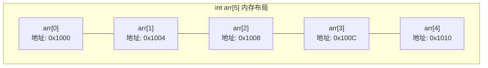
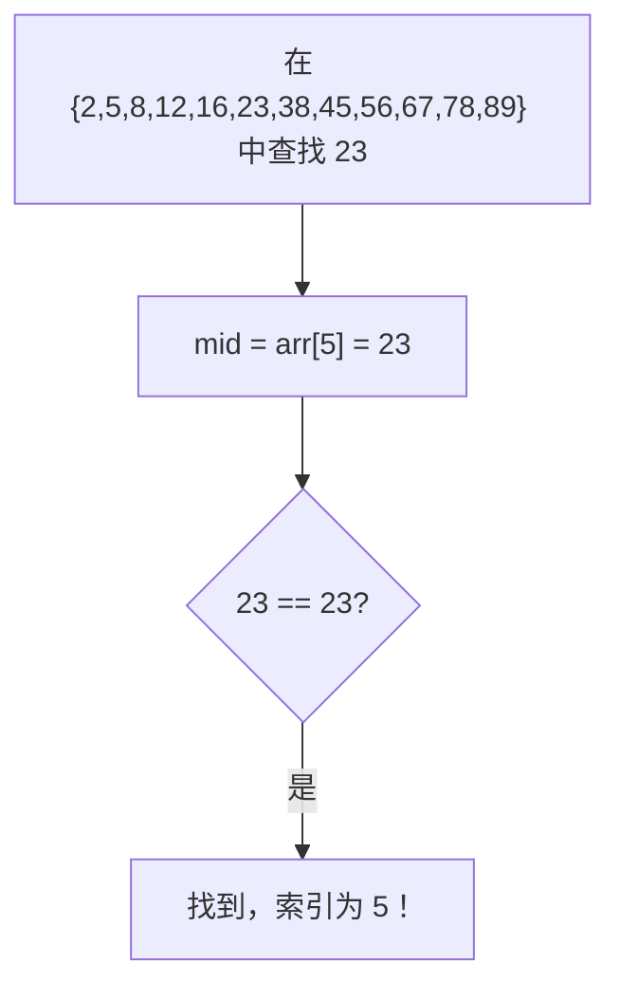
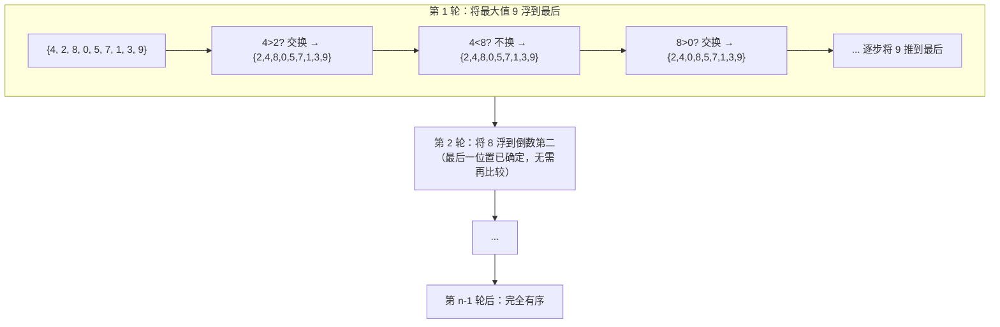

## 数组概述

前面用到的变量都是"单打独斗"的：一个 `int` 存一个数，一个 `double` 存一个小数。一个班级几十名学生的成绩、一个传感器每秒上百条读数，用这种办法都存不下来——给每条数据声明一个独立变量，光起名字就写不完了。数组解决的正是这个问题，同时它也是理解"内存连续"与"首地址加偏移量"这两件事的起点：后面的指针、字符串、标准库容器都建立在这套模型上。

这一篇的推进顺序是：先看数组在内存里长什么样、下标为什么从 0 开始（这一节），再看一维数组的定义、命名、遍历与传参，然后是同一套规则在表格形状上的展开（二维数组），最后是数组上最常写的两类操作——查找与排序。查找和排序的代码都不长，但真正值钱的是能照着代码把每一趟数据的变化写出来，这一点会在最后两节逐趟推演。

#### 数组的定义

**数组**（Array）是**用同一个名字管理一组同类型数据**的容器。可以把它类比成一排带编号的储物柜：柜子有一个统一的名字（数组名），每个格子靠**编号**（索引）区分，而所有格子里放的东西必须是同一类型。

C++ 数组有三个基本特征，它们共同定义了"什么样的数据结构能被称为数组"：

| 特征 | 含义 | 影响 |
| :--- | :--- | :--- |
| **有序性** | 元素按顺序排列，每个元素由它的位置编号唯一确定 | 可以用索引在任意位置快速存取，但不能跳过索引按值查找 |
| **同质性** | 所有元素必须是同一数据类型 | 不能在一个 `int` 数组里混入 `double` 或 `string`；编译器按统一类型分配内存 |
| **内存连续** | 所有元素在内存中一个紧挨一个地排列 | 靠首地址加偏移量就能定位任意元素；但增删元素代价高，需要整体移动 |

三条特征里最容易被低估的是**内存连续**：它既是数组能"用一个下标直接跳到目标元素"的物理基础，也是数组一旦定义就无法扩容的原因——后面没有预留的空间可以接上去。



每个 `int` 占 4 字节，所以相邻元素的地址差恰好是 4。由此得到数组的寻址公式：**第 i 个元素的地址 = 首地址 + i × 单个元素的字节数**。代入 i = 0，得到的就是首地址本身——这也解释了数组下标为什么从 0 开始：下标不是"第几个"的序号，而是**相对首地址的偏移量**。

#### 数组的分类

从维数和元素类型两个维度，可以把数组分成下面这些类别：

| 分类维度 | 类别 | 说明 | 示例 |
| :--- | :--- | :--- | :--- |
| **按维数** | 一维数组 | 元素排成一条线，通过一个下标访问 | `int arr[5];` |
| | 多维数组 | 元素排成表格或更高维结构，通过多个下标访问 | `int matrix[3][4];`（二维） |
| **按元素类型** | 数值数组 | 存储整型或浮点型数据 | `int scores[40];` `double prices[100];` |
| | 字符数组 | 存储 `char` 类型数据（可表示 C 风格字符串） | `char name[20];` |
| | 指针数组 | 存储指针类型 | `int* ptrArr[10];` |
| | 结构数组 | 存储结构体类型 | `Student students[50];` |

这一篇聚焦**数值数组**，也就是 `int`、`double` 类型的一维与二维数组。字符数组是指向 C 风格字符串的载体，指针数组与结构数组分别建立在指针和结构体之上，见 C++程序设计基础-6 指针与 C++程序设计基础-7 结构体。

## 一维数组

一维数组是数组最朴素的形式：元素排成一条线，一个下标唯一确定一个元素。这一节按实际写代码的顺序展开四件事——怎么定义和初始化、数组名在内存里代表什么、怎么遍历、以及数组传进函数之后会发生什么。四件事环环相扣：没弄清数组名到底是数组还是地址，就看不懂传参为什么能改到调用方的数据。

### 定义与初始化

定义一维数组有三种等价写法，区别只在"长度和初值分别由谁决定"：

```cpp
// 方式 1：指定长度，元素由后续赋值填入
数据类型 数组名[数组长度];
int score[10];                   // 10 个 int，值未定义（局部数组为随机垃圾值）

// 方式 2：指定长度并同时给出初始值
数据类型 数组名[数组长度] = {值1, 值2, ...};
int score2[10] = {100, 90, 80, 70, 60, 50, 40, 30, 20, 10};

// 方式 3：不指定长度，由初始值个数自动确定
数据类型 数组名[] = {值1, 值2, ...};
int score3[] = {100, 90, 80, 70, 60};  // 长度自动为 5
```

三种写法各自的适用场合与注意点：

| 方式 | 适用场景 | 注意事项 |
| :--- | :--- | :--- |
| 指定长度，不赋初值 | 数组大小已知，数据后续由输入或计算产生 | 局部数组的初始值是**随机垃圾**，使用前必须赋值 |
| 指定长度并赋初值 | 数据已知，但想预留更大空间 | `{1, 2, 3}` 只填充前三个位置，**剩余位置自动补 0** |
| 不指定长度 | 数据已知，且恰好需要这么大的空间 | 长度由 `{}` 内元素个数决定，定义后不可改变 |

三种写法在同一个程序里的效果：

```cpp
#include <iostream>
using namespace std;

int main() {
    // 方式 1：先占位置，后续填入
    int arr1[5];
    arr1[0] = 10;
    arr1[1] = 20;
    // arr1[2]~arr1[4] 此时是随机垃圾值！

    // 方式 2：长度大于初始值个数，多余位置补 0
    int arr2[5] = {1, 2, 3};
    // arr2 = {1, 2, 3, 0, 0}

    // 方式 3：自动推断长度（最常用）
    int arr3[] = {1, 2, 3, 4, 5};    // 长度自动为 5

    return 0;
}
```

> **注意**：数组一旦定义，**长度就不能再改变**。需要能自动扩容的容器时，用 C++程序设计基础-11 STL标准模板库里的 `vector`；数组适合"数据量固定且已知"的场景，比如存一个班 40 人的成绩、存一年的 12 个月份数据。

> **易错点**：函数内定义的局部数组不初始化时，元素是**随机垃圾值**，不是 0。全局数组和静态局部数组会被自动清零（变量的生命周期见 C++程序设计基础-4 函数），局部数组不会。稳妥的做法是定义时就给出初值，至少写 `int arr[10] = {0};` 把所有元素清零。

### 数组名与内存

数组名有两层含义，把这两层混在一起是后面指针部分大量 bug 的源头。结论先记住：**在 `sizeof` 里数组名代表整个数组，在其余表达式里它代表首元素地址。**

#### 代表整个数组

`sizeof` 作用于数组名时，返回的是**整个数组**占用的字节数：

```cpp
#include <iostream>
using namespace std;

int main() {
    int arr[10] = {1, 2, 3, 4, 5, 6, 7, 8, 9, 10};

    cout << "整个数组占内存：" << sizeof(arr) << " 字节" << endl;
    cout << "每个元素占内存：" << sizeof(arr[0]) << " 字节" << endl;
    cout << "数组元素个数：" << sizeof(arr) / sizeof(arr[0]) << endl;

    return 0;
}
```

程序输出：

```
整个数组占内存：40 字节
每个元素占内存：4 字节
数组元素个数：10
```

> **关键结论**：`sizeof(arr) / sizeof(arr[0])` 是计算数组长度的标准写法。它不依赖硬编码的数字，数组内容变化时遍历逻辑不需要跟着改。

#### 代表首元素地址

在绝大多数表达式中（`sizeof` 是例外），数组名会被隐式转换为指向首元素的指针：

```cpp
#include <iostream>
using namespace std;

int main() {
    int arr[5] = {10, 20, 30, 40, 50};

    // 64 位平台上指针是 8 字节，用 long long 才装得下；地址每次运行都不同
    cout << "数组首地址（十进制）：" << (long long)arr << endl;      // 例如 140734712345672
    cout << "第一个元素地址：" << (long long)&arr[0] << endl;        // 与上面完全相同
    cout << "第二个元素地址：" << (long long)&arr[1] << endl;        // 比首地址大 4
    return 0;
}
```

程序输出（地址每次运行都不一样，这里只关心三个数值之间的关系）：

```
数组首地址（十进制）：140734712345672
第一个元素地址：140734712345672
第二个元素地址：140734712345676
```

> **关键结论**：`arr` 和 `&arr[0]` 的值完全相同——它们指向同一块内存。但 `arr` 是一个**指针常量**：不能写 `arr = ...` 去改变它的指向。这个"数组名即地址"的特性，是理解数组与指针关系的钥匙，详细展开见 C++程序设计基础-6 指针。

### 索引与遍历

访问数组元素只有一条规则：**下标从 0 开始，连续不间断**。长度为 n 的数组，下标范围是 `0 ~ n-1`。遍历则是把这条规则交给 `for` 循环展开。

#### 索引访问

```cpp
#include <iostream>
using namespace std;

int main() {
    int arr[5] = {10, 20, 30, 40, 50};
    // 索引：       0    1    2    3    4

    cout << arr[0] << endl;    // 第一个元素：10
    cout << arr[3] << endl;    // 第四个元素：40

    arr[2] = 99;               // 修改第三个元素
    cout << arr[2] << endl;    // 99
    return 0;
}
```

程序输出：

```
10
40
99
```

> **易错点**：C++ **不会检查数组下标是否越界**。对一个只有 5 个元素的数组写 `arr[10]`，编译和运行都不会报错，程序会默默读写不属于这块数组的内存——结果不可预测：可能读到随机值、可能覆盖其他变量的值、也可能直接崩溃。这是从 C 继承来的设计取舍（省掉每次访问的边界检查），Java 在这里更安全，`arr[10]` 会抛出 `ArrayIndexOutOfBoundsException`。可靠的防范办法只有一条：让下标始终落在 `0 ~ len-1` 之内，并把循环边界写成 `sizeof(arr) / sizeof(arr[0])`，而不是硬编码的数字。

#### 遍历数组

遍历就是把数组里的每个元素依次取出来，标准写法是用 `for` 循环配合 `sizeof` 计算长度：

```cpp
#include <iostream>
using namespace std;

int main() {
    int arr[] = {10, 20, 30, 40, 50};
    int len = sizeof(arr) / sizeof(arr[0]);

    for (int i = 0; i < len; i++) {
        cout << "arr[" << i << "] = " << arr[i] << endl;
    }
    return 0;
}
```

程序输出：

```
arr[0] = 10
arr[1] = 20
arr[2] = 30
arr[3] = 40
arr[4] = 50
```

这是数组操作里出现频率最高的代码模式——后面的求和、找最值、统计、排序，本质上都是在这个遍历模板上增加一点处理逻辑。

> **技巧**：始终用 `sizeof(arr) / sizeof(arr[0])` 或变量 `len` 作为循环边界，而不是硬编码 `5`。这样数组内容变化时，遍历逻辑不需要修改。

### 一维数组的典型操作

下面四道例题覆盖一维数组复用率最高的四种模式：**打擂台求最值、累加求和、双指针逆置、条件计数**。它们的骨架都是同一个遍历，区别只在于一次遍历里多做的那一件事。

> **例 1（求数组最大值）** 找出数组 `{300, 350, 200, 400, 250}` 中的最大值。

**思路**：用一个变量当"擂主"，先让它等于 `arr[0]`，再从下标 1 开始逐个挑战，谁大谁当擂主，遍历结束后的擂主就是最大值。擂主的初值**必须是数组中的实际元素**，不能随手写成 `0`——如果数组里全是负数，初值 0 永远不会被替换，结果就错了。

**解**：

```cpp
#include <iostream>
using namespace std;

int main() {
    int arr[5] = {300, 350, 200, 400, 250};
    int len = sizeof(arr) / sizeof(arr[0]);

    int max = arr[0];                // 擂主初始化为第一个元素
    for (int i = 1; i < len; i++) {  // 从索引 1 开始，不必和自己比较
        if (arr[i] > max) {
            max = arr[i];
        }
    }
    cout << "最大值：" << max << endl;
    return 0;
}
```

程序输出：

```
最大值：400
```

**评注**：求最小值只需把 `>` 换成 `<`。"先设初值、再在遍历中条件更新"是数组最通用的模式，找最值的位置、求极差都是它的变体。

> **例 2（数组元素求和）** 计算数组 `{1, 2, 3, 4, 5, 6, 7, 8, 9, 10}` 中所有元素的总和。

**思路**：累加器 `sum` 必须在循环**外部**初始化为 0，循环里把 `arr[i]` 加进去。如果写在循环内部，每次迭代都会被重置为 0，最后只剩下最后一个元素的值。

**解**：

```cpp
#include <iostream>
using namespace std;

int main() {
    int arr[] = {1, 2, 3, 4, 5, 6, 7, 8, 9, 10};
    int len = sizeof(arr) / sizeof(arr[0]);

    int sum = 0;
    for (int i = 0; i < len; i++) {
        sum += arr[i];
    }
    cout << "总和：" << sum << endl;
    return 0;
}
```

程序输出：

```
总和：55
```

**评注**：求和模式可以衍生出求平均值、计数等变体。平均值如果要保留小数，必须做浮点除法：`double avg = (double)sum / len;`——两个整数相除会直接丢掉小数部分。

> **例 3（数组元素逆置）** 将数组 `{1, 3, 2, 5, 4}` 原地逆置为 `{4, 5, 2, 3, 1}`。

**思路**：双指针法——`i` 从左端向右移动，`j` 从右端向左移动，每次交换 `arr[i]` 与 `arr[j]`，两指针相遇即停。循环条件写成 `i < j` 而不是"走到中点"，因为越过中点继续交换，会把刚换好的元素又换回去。

**解**：

```cpp
#include <iostream>
using namespace std;

int main() {
    int arr[] = {1, 3, 2, 5, 4};
    int len = sizeof(arr) / sizeof(arr[0]);

    for (int i = 0, j = len - 1; i < j; i++, j--) {
        int temp = arr[i];
        arr[i] = arr[j];
        arr[j] = temp;
    }

    for (int i = 0; i < len; i++) {
        cout << arr[i] << " ";
    }
    return 0;
}
```

程序输出：

```
4 5 2 3 1
```

**评注**：`for` 循环头里同时声明并推进两个变量（`i++, j--`），用的是逗号运算符，语法见 C++程序设计基础-3 程序流程结构。"首尾向中间逼近"这个手法在判断回文、反转字符串时会反复出现。

> **例 4（统计符合条件的元素个数）** 统计数组 `{11, 22, 33, 44, 55, 66, 77}` 中能被 11 整除的元素个数。

**思路**：在遍历的基础上加一层条件筛选——计数器 `count` 在循环外初始化为 0，循环里用 `arr[i] % 11 == 0` 判断，满足就让 `count` 加一。

**解**：

```cpp
#include <iostream>
using namespace std;

int main() {
    int arr[] = {11, 22, 33, 44, 55, 66, 77};
    int len = sizeof(arr) / sizeof(arr[0]);

    int count = 0;
    for (int i = 0; i < len; i++) {
        if (arr[i] % 11 == 0) {
            count++;
        }
    }
    cout << "能被11整除的元素有 " << count << " 个" << endl;
    return 0;
}
```

程序输出：

```
能被11整除的元素有 7 个
```

**评注**：这个模式的框架是固定的——**循环外初始化计数器、循环内判断并累加、循环后使用结果**。判断条件可以随题目任意变化，框架不变。

### 数组作为函数参数

把数组交给函数时，C++ 不复制数组，只传**首地址**。这一条决定了三件事：函数里改数组会直接改到调用方的数据、函数里 `sizeof(arr)` 拿不到数组长度、形参与实参的数组名一个是地址变量一个是地址常量。前面讲过值传递、指针传递、引用传递三种参数传递方式（见 C++程序设计基础-4 函数），数组传参是其中规则最特殊的一种。

#### 传递机制

数组作为实参传入函数时，C++ **不会复制整个数组**——上万元素的复制代价太高——而是把实参数组的**首地址**交给形参。由此有两条结论。

第一条：**形参数组与实参数组共用同一段内存**。在函数内部修改形参数组的元素，改的就是实参数组的那块数据，因为两者根本是同一块内存。

第二条：两者在性质上的唯一区别是——**形参数组的数组名是一个地址变量**（可以重新赋值，让它指向别的数组），**实参数组的数组名是一个地址常量**（不能写 `arr = ...`）。这个差别的底层原因在 C++程序设计基础-6 指针里展开。

```cpp
#include <iostream>
using namespace std;

// arr 是形参数组名（地址变量），len 是数组长度
void modifyArray(int arr[], int len) {
    arr[0] = 999;          // 修改形参数组 → 实参也被修改
}

int main() {
    int a[] = {1, 2, 3, 4, 5};
    modifyArray(a, 5);
    cout << a[0] << endl;
    return 0;
}
```

程序输出：

```
999
```

#### 关键规则

数组传参有几条必须记住的规则：

| 规则 | 说明 | 示例 |
| :--- | :--- | :--- |
| **长度必须单独传递** | 函数内部 `sizeof(arr)` 只能拿到指针大小（4 或 8 字节），拿不到数组真实长度，所以长度必须作为单独的参数传入 | `void f(int arr[], int len)` |
| **类型必须一致** | 形参数组与实参数组的元素类型必须相同，否则编译报错 | 不能把 `double[]` 传给 `int[]` 形参 |
| **第一维可不指定大小** | 形参数组声明时可以省略第一维的大小，`int arr[]` 等价于 `int* arr`；如果是多维数组，第二维起必须指定 | `void f(int arr[][3], int rows)` 合法；`void f(int arr[][], int rows)` 非法 |
| **形参是地址变量，实参是地址常量** | 函数内部可以写 `arr = anotherArray;` 让形参改指别处，实参数组名不可以 | 底层原因见 C++程序设计基础-6 指针 |

> **易错点**：`sizeof(arr)` 在函数内外结果不同。在 `main` 里 `arr` 是数组，`sizeof(arr)` 是整个数组的字节数；一旦传进函数，`arr` 退化成指针，`sizeof(arr)` 只剩 4 或 8 字节。所以**数组长度必须在调用处算好、随数组一起传进去**——这是数组传参最经典的坑，下面的例题会再演示一遍。

> **例 5（封装求数组最大值）** 定义函数 `getMax(int arr[], int len)`，接收一个数组及其长度，返回数组中的最大值，并在 `main` 中调用验证。

**思路**：把例 1 的擂主法搬进函数。按上面的规则，形参写成 `int arr[]`（不写长度），真正需要的信息——长度——作为第二个参数传进来。

**解**：

```cpp
#include <iostream>
using namespace std;

int getMax(int arr[], int len) {
    int max = arr[0];
    for (int i = 1; i < len; i++) {
        if (arr[i] > max) {
            max = arr[i];
        }
    }
    return max;
}

int main() {
    int arr[] = {12, 45, 98, 73, 60};
    int len = sizeof(arr) / sizeof(arr[0]);
    int max = getMax(arr, len);
    cout << "最大值：" << max << endl;
    return 0;
}
```

程序输出：

```
最大值：98
```

**评注**：注意长度是在 `main` 里用 `sizeof(arr) / sizeof(arr[0])` 算出来的，不是函数内部算的——`arr` 一进函数就退化成指针，函数内部算不出元素个数。**数组长度在调用处计算、随数组一起传入**，是 C++ 数组编程的铁律。

> **例 6（数组元素循环左移）** 将数组 `{1, 2, 3, 4, 5}` 循环左移 2 位，结果应为 `{3, 4, 5, 1, 2}`。

**思路**：循环左移 k 位等于**三次反转**——先反转前 k 个元素，再反转剩余 n−k 个元素，最后把整个数组反转一次。以 `{1, 2, 3, 4, 5}` 左移 2 位为例：反转前 2 个得 `{2, 1, 3, 4, 5}`，反转后 3 个得 `{2, 1, 5, 4, 3}`，整体反转得 `{3, 4, 5, 1, 2}`。

**解**：

```cpp
#include <iostream>
using namespace std;

// 反转数组的区间 [start, end]
void reverse(int arr[], int start, int end) {
    while (start < end) {
        int temp = arr[start];
        arr[start] = arr[end];
        arr[end] = temp;
        start++;
        end--;
    }
}

int main() {
    int arr[] = {1, 2, 3, 4, 5};
    int len = sizeof(arr) / sizeof(arr[0]);
    int k = 2;

    reverse(arr, 0, k - 1);         // 反转前 k 个
    reverse(arr, k, len - 1);       // 反转剩余部分
    reverse(arr, 0, len - 1);       // 反转全部

    for (int i = 0; i < len; i++) {
        cout << arr[i] << " ";
    }
    return 0;
}
```

程序输出：

```
3 4 5 1 2
```

**评注**：三步反转把"循环位移"这个新问题拆成了三次已经会写的反转——例 3 里的首尾交换就是它的零件。这种"用已知解决未知"的分解，是算法学习里最核心的能力。

## 二维数组

一维数组是一条线，二维数组是一张表，适合表示矩阵、成绩表、棋盘这类天然带行列结构的数据。C++ 里二维数组的本质是"**数组的数组**"：外层数组的每个元素本身又是一个一维数组。把这句话记住，`sizeof` 的行列公式、`arr[i][j]` 的两层下标、以及"列数不能省略"就都成了常识。

#### 定义与初始化

定义二维数组有四种写法，按可读性从高到低排列：

```cpp
// 方式 1（可读性最好）：逐行指定
int arr1[2][3] = {
    {1, 2, 3},
    {4, 5, 6}
};

// 方式 2：线性排列，按行填充
int arr2[2][3] = {1, 2, 3, 4, 5, 6};

// 方式 3：指定列数，省略第一维
int arr3[][3] = {1, 2, 3, 4, 5, 6};   // 行数自动推断为 2

// 方式 4：只指定行列，不赋初值（元素值为随机垃圾）
int arr4[2][3];                         // 后续逐个赋值
```

| 方式 | 可读性 | 适用场景 |
| :--- | :---: | :--- |
| 逐行指定 `{{...}, {...}}` | ⭐⭐⭐ 最好 | **推荐首选**，行列结构一目了然 |
| 线性排列 `{1,2,3,4,5,6}` | ⭐⭐ 一般 | 数据量大、不在意行列视觉区分时 |
| 省略第一维 `[][3]` | ⭐⭐ 一般 | 不想手动数行数时，由编译自动推算 |
| 只指定行列 `[2][3]` | ⭐ 差 | 数据后续才产生时 |

逐行指定在代码里长这样：

```cpp
#include <iostream>
using namespace std;

int main() {
    // 逐行赋值——行列关系最清晰
    int scores[3][3] = {
        {100, 100, 100},   // 第 0 行：张三
        {90,  50,  100},   // 第 1 行：李四
        {60,  70,  80 }    // 第 2 行：王五
    };

    return 0;
}
```

> **建议**：实际编码时优先用方式 1（逐行指定）。它让数据在代码里的排列与逻辑上的行列结构完全对应，能减少"哪个数是哪行哪列"的混淆。

> **易错点**：定义二维数组时可以省略**行数**（第一维），但**不能省略列数**（第二维）。`int arr[][3] = {1, 2, 3, 4, 5, 6};` 合法——编译器按每行 3 列切分，算出行数为 2；`int arr[2][] = {...};` 非法。原因是编译器必须知道每行有多少列，才能算出一行占多少字节、下一行从哪里开始。

#### 数组名与内存

和一维数组一样，二维数组名也有"代表整个数组"和"代表首地址"两重含义，`sizeof` 在这里还能顺手把行列数算出来：

```cpp
#include <iostream>
using namespace std;

int main() {
    int arr[2][3] = {
        {1, 2, 3},
        {4, 5, 6}
    };

    // sizeof 统计各层大小
    cout << "二维数组总大小：" << sizeof(arr) << " 字节" << endl;
    cout << "一行的大小：" << sizeof(arr[0]) << " 字节" << endl;
    cout << "一个元素大小：" << sizeof(arr[0][0]) << " 字节" << endl;

    // 由大小反推行列数
    int rows = sizeof(arr) / sizeof(arr[0]);           // 总大小 ÷ 一行大小 = 行数
    int cols = sizeof(arr[0]) / sizeof(arr[0][0]);     // 一行大小 ÷ 元素大小 = 列数
    cout << "行数：" << rows << "，列数：" << cols << endl;

    return 0;
}
```

程序输出：

```
二维数组总大小：24 字节
一行的大小：12 字节
一个元素大小：4 字节
行数：2，列数：3
```

地址层面，三层写法指向的是同一块内存：

```cpp
#include <iostream>
using namespace std;

int main() {
    int arr[2][3] = {
        {1, 2, 3},
        {4, 5, 6}
    };

    cout << "二维数组首地址：" << arr << endl;          // 和第 0 行地址相同
    cout << "第0行首地址：" << arr[0] << endl;          // 和 &arr[0][0] 相同
    cout << "第1行首地址：" << arr[1] << endl;          // 偏移 12 字节（一行 3 个 int）

    cout << "arr[0][0] 地址：" << &arr[0][0] << endl;   // 和 arr、arr[0] 相同
    cout << "arr[0][1] 地址：" << &arr[0][1] << endl;   // 偏移 4 字节
    return 0;
}
```

> **关键结论**：`arr`、`arr[0]`、`&arr[0][0]` 三者的值完全相同（都指向同一块内存的起始位置），但**类型**不同——`arr` 是"指向长度为 3 的 int 数组的指针"，`arr[0]` 和 `&arr[0][0]` 都是"指向 int 的指针"。类型差异决定了指针运算时一次走多远：`arr[1]` 相比 `arr[0]` 偏移 12 字节，而 `&arr[0][1]` 只偏移 4 字节。详细原理见 C++程序设计基础-6 指针。

#### 遍历

二维数组的遍历需要**双层循环**：外层控制行，内层控制这一行里的每一列。

```cpp
#include <iostream>
using namespace std;

int main() {
    int arr[2][3] = {
        {1, 2, 3},
        {4, 5, 6}
    };
    int rows = sizeof(arr) / sizeof(arr[0]);
    int cols = sizeof(arr[0]) / sizeof(arr[0][0]);

    for (int i = 0; i < rows; i++) {          // 外层：遍历行
        for (int j = 0; j < cols; j++) {      // 内层：遍历该行的每一列
            cout << arr[i][j] << " ";
        }
        cout << endl;                          // 每行输出完换行
    }
    return 0;
}
```

程序输出：

```
1 2 3
4 5 6
```

> **命名惯例**：外层循环变量用 `i`，内层用 `j`，更深的嵌套用 `k`。这套约定在几乎所有语言里通用，读到 `arr[i][j]` 时一眼就能分辨行与列。

遍历模板加上一个累加器，就能解决一个完整的小问题——算每名学生的总分。

> **例 7（计算学生总分）** 三名学生（张三、李四、王五）的语数英成绩如下表，分别输出每名学生的总成绩。

| 学生 | 语文 | 数学 | 英语 |
| :--- | :---: | :---: | :---: |
| 张三 | 100 | 100 | 100 |
| 李四 | 90 | 50 | 100 |
| 王五 | 60 | 70 | 80 |

**思路**：成绩天然是二维的——行是学生、列是科目。用二维数组存储成绩，外层循环遍历学生，内层循环累加这名学生的三科成绩，内层循环结束后输出总分。

**解**：

```cpp
#include <iostream>
#include <string>
using namespace std;

int main() {
    int scores[3][3] = {
        {100, 100, 100},
        {90,  50,  100},
        {60,  70,  80 }
    };
    string names[3] = {"张三", "李四", "王五"};

    int rows = sizeof(scores) / sizeof(scores[0]);
    int cols = sizeof(scores[0]) / sizeof(scores[0][0]);

    for (int i = 0; i < rows; i++) {
        int sum = 0;
        for (int j = 0; j < cols; j++) {
            sum += scores[i][j];
        }
        cout << names[i] << " 总成绩：" << sum << endl;
    }
    return 0;
}
```

程序输出：

```
张三 总成绩：300
李四 总成绩：240
王五 总成绩：210
```

**评注**：关键是 `int sum = 0;` 的**位置**——在外层循环内部、内层循环外部。写在外层循环外面，`sum` 会把前面学生的分数一起累进来（张三 300 → 李四 540 → 王五 750，全错）；写在内层循环里面，每加一科就被清零。变量的声明位置决定了它的生命周期与重置时机，与循环嵌套的规则一致（见 C++程序设计基础-3 程序流程结构）。

## 基础查找算法

查找要回答的问题是"这个值在不在数组里、在第几个位置"。最常用的两种策略是线性查找与二分查找，代码都只有几行，差别却在于**数据要不要有序**——这个前提决定了它们各自适用的规模。更完整的查找算法与效率分析见 数据结构与算法-7 查找。

#### 线性查找

**线性查找**（顺序查找）的思路最直接：从第一个元素开始逐个与目标比较，相等就返回下标，全部比完仍未命中就返回 -1，作为"未找到"的信号值。

```cpp
#include <iostream>
using namespace std;

// 返回目标值在数组中的索引，未找到返回 -1
int linearSearch(int arr[], int len, int target) {
    for (int i = 0; i < len; i++) {
        if (arr[i] == target) {
            return i;          // 找到，立即返回索引
        }
    }
    return -1;                 // 遍历完仍未找到
}

int main() {
    int arr[] = {35, 78, 12, 49, 63, 27};
    int len = sizeof(arr) / sizeof(arr[0]);

    int idx = linearSearch(arr, len, 49);
    if (idx != -1) {
        cout << "找到了，索引为 " << idx << endl;
    } else {
        cout << "未找到" << endl;
    }
    return 0;
}
```

程序输出：

```
找到了，索引为 3
```

它最大的优点不是快，而是**不挑数据**：

| 维度 | 说明 |
| :--- | :--- |
| **适用条件** | **不要求数组有序**——这是它相对二分查找的最大优势 |
| **适用场景** | 小规模数据（几百个以内）、无序数据、只查一次 |

#### 二分查找

**二分查找**（折半查找）的前提是数组**已经有序**。结论先说清楚：每一步取当前区间的中间元素与目标比较，目标更小就去左半区，更大就去右半区，一次比较砍掉一半的搜索空间，直到命中或区间为空。

为什么必须有序？因为二分查找的正确性完全建立在"中间值比目标小，则目标一定在右半区"这个推断上。数组无序时这个推断不成立——目标可能躲在左半区的任何位置，被排除掉的那一半里也可能有它。有序不是风格要求，是算法的立足点。



图上这一趟把"折半"的威力说清楚了：12 个元素里找 23，初始区间是 `left = 0`、`right = 11`，第一次取中间位置 `mid = 5`，恰好命中，一次比较就结束。如果找的是并不存在的 99，区间会不断折半直到 `left > right`（区间为空），函数返回 -1。返回 -1 而不是 0，是为了让"没找到"和"找到了下标 0"不会混淆。

```cpp
#include <iostream>
using namespace std;

// 二分查找：数组必须已升序排列，返回索引，未找到返回 -1
int binarySearch(int arr[], int len, int target) {
    int left = 0;
    int right = len - 1;

    while (left <= right) {
        int mid = left + (right - left) / 2;   // 防溢出写法

        if (arr[mid] == target) {
            return mid;          // 找到目标
        } else if (arr[mid] < target) {
            left = mid + 1;      // 目标在右半区
        } else {
            right = mid - 1;     // 目标在左半区
        }
    }
    return -1;                   // 搜索区间为空，未找到
}

int main() {
    int arr[] = {2, 5, 8, 12, 16, 23, 38, 45, 56, 67, 78, 89};
    int len = sizeof(arr) / sizeof(arr[0]);

    int idx = binarySearch(arr, len, 23);
    cout << "23 的索引为：" << idx << endl;

    idx = binarySearch(arr, len, 99);
    cout << "99 的索引为：" << idx << endl;
    return 0;
}
```

程序输出：

```
23 的索引为：5
99 的索引为：-1
```

| 维度 | 说明 |
| :--- | :--- |
| **适用条件** | **数组必须已排序**——这是二分查找的前提 |
| **适用场景** | 大规模有序数据、需要反复查找的场景 |

> **注意**：计算 `mid` 时用 `left + (right - left) / 2` 而不是 `(left + right) / 2`，是为了防止 `left + right` 溢出——两个都接近 `INT_MAX` 的下标相加会超出 `int` 的范围，得到负数再除以 2 就取到了非法下标。这一篇的数据规模下两种写法结果相同，但防溢出的写法在任何规模下都安全。

两种查找该怎么选，看这张表：

| 维度 | 线性查找 | 二分查找 |
| :--- | :--- | :--- |
| 要求有序？ | ❌ 不要求 | ✅ 必须有序 |
| 代码复杂度 | 简单 | 稍复杂 |
| 小数据量 | 够用 | 杀鸡用牛刀 |
| 大数据量 | 太慢 | **显著优势** |

> **选择原则**：数据量小（几百个以内）且只查一次，用线性查找；数据量大或需要反复查找，先排序再用二分查找。排序是一次性开销，之后每次查找都很快，批量查找的总成本远低于反复做线性扫描。

## 基础排序算法

排序是数组上最值得逐趟推演的算法。三种基础排序的思想——**相邻交换、选择最值、插入移位**——是快速排序、归并排序、堆排序这些高级排序算法的思维基石。这一节的重点不是背下代码，而是能照着代码把**每一趟数组的变化**写出来：这个过程做熟了，代码和结论才真的对得上。关于比较次数、移动次数与稳定性的完整分析，见 数据结构与算法-8 排序。

#### 冒泡排序

**冒泡排序**（Bubble Sort）重复地遍历数组，比较相邻的两个元素，顺序不对就交换。每一轮都会把当前未排序部分中的**最大值浮到最后面**（就像气泡浮出水面），经过 n−1 轮后数组完全有序。



图上就是第一轮的真实推演：从 `{4, 2, 8, 0, 5, 7, 1, 3, 9}` 出发，`4 > 2` 交换得 `{2, 4, 8, ...}`，`4 < 8` 不动，`8 > 0` 交换得 `{2, 4, 0, 8, ...}`……一轮走完，9 被一路换到最后一个位置。第二轮只需处理前 8 个元素，把 8 送到倒数第二位，依此类推，第 n−1 轮结束后完全有序。

```cpp
#include <iostream>
using namespace std;

void bubbleSort(int arr[], int len) {
    for (int i = 0; i < len - 1; i++) {              // 外层：共 n-1 轮
        for (int j = 0; j < len - 1 - i; j++) {      // 内层：每轮比较范围缩小
            if (arr[j] > arr[j + 1]) {               // 相邻比较，升序
                int temp = arr[j];
                arr[j] = arr[j + 1];
                arr[j + 1] = temp;
            }
        }
    }
}

int main() {
    int arr[] = {4, 2, 8, 0, 5, 7, 1, 3, 9};
    int len = sizeof(arr) / sizeof(arr[0]);

    bubbleSort(arr, len);

    for (int i = 0; i < len; i++) {
        cout << arr[i] << " ";
    }
    return 0;
}
```

程序输出：

```
0 1 2 3 4 5 7 8 9
```

| 维度 | 说明 |
| :--- | :--- |
| **核心操作** | 相邻元素比较并交换，每轮将当前最大值"浮"到最后 |
| **适用场景** | 入门练习、小数据量 |

> **注意**：内层循环写成 `j < len - 1 - i` 而不是 `j < len - 1`，是因为每轮结束后末尾的 i 个位置已经就位，不必再参与比较。这也是冒泡排序唯一的优化点：少写 `- i` 结果也对，只是多做了无意义的比较。

#### 选择排序

**选择排序**（Selection Sort）每一轮从**未排序部分**里找到最小值，把它交换到**已排序部分的末尾**。它与冒泡的区别在交换的用法：冒泡靠不断交换相邻元素一步步"搬运"最大值，选择排序每轮最多只交换一次——找到最小值之后直接放到正确位置。

```cpp
#include <iostream>
using namespace std;

void selectionSort(int arr[], int len) {
    for (int i = 0; i < len - 1; i++) {              // 外层：i 是"已排序末尾"
        int minIdx = i;                               // 假设当前位置就是最小值
        for (int j = i + 1; j < len; j++) {           // 内层：在未排序部分找真正的最小值
            if (arr[j] < arr[minIdx]) {
                minIdx = j;
            }
        }
        if (minIdx != i) {                            // 找到了更小的，交换一次
            int temp = arr[i];
            arr[i] = arr[minIdx];
            arr[minIdx] = temp;
        }
    }
}

int main() {
    int arr[] = {7, 5, 8, 1, 3, 9, 2, 4, 6};
    int len = sizeof(arr) / sizeof(arr[0]);

    selectionSort(arr, len);

    for (int i = 0; i < len; i++) {
        cout << arr[i] << " ";
    }
    return 0;
}
```

程序输出：

```
1 2 3 4 5 6 7 8 9
```

| 维度 | 说明 |
| :--- | :--- |
| **核心操作** | 在未排序部分找最值，放入已排序末尾 |
| **交换次数** | 每轮最多 1 次，共 n-1 次（比冒泡少得多） |
| **对比冒泡** | 交换次数远少于冒泡，比较次数相同；元素体积大（如结构体）而比较开销小时，选择排序的交换优势明显 |

#### 插入排序

**插入排序**（Insertion Sort）把数组分成"已排序"和"未排序"两段：每次从未排序部分取出第一个元素，在已排序部分里**从后往前**找到它应该插入的位置，比它大的元素依次向后移一位，腾出空位后插入。

这个过程的直觉类比是**打扑克牌时的理牌**：从左到右逐张拿起牌，每拿一张就把它插进手中已经排好序的牌列里的正确位置。

```cpp
#include <iostream>
using namespace std;

void insertionSort(int arr[], int len) {
    for (int i = 1; i < len; i++) {                  // i 指向"未排序的第一个"
        int key = arr[i];                             // 取出待插入的元素
        int j = i - 1;
        while (j >= 0 && arr[j] > key) {             // 在已排序部分中找插入位置
            arr[j + 1] = arr[j];                     // 比 key 大的元素后移
            j--;
        }
        arr[j + 1] = key;                            // 插入到正确位置
    }
}

int main() {
    int arr[] = {7, 5, 8, 1, 3, 9, 2, 4, 6};
    int len = sizeof(arr) / sizeof(arr[0]);

    insertionSort(arr, len);

    for (int i = 0; i < len; i++) {
        cout << arr[i] << " ";
    }
    return 0;
}
```

程序输出：

```
1 2 3 4 5 6 7 8 9
```

| 维度 | 说明 |
| :--- | :--- |
| **核心操作** | 从后往前找插入位置，比 key 大的元素后移腾位 |
| **独特优势** | 对**基本有序**的数据表现极好，是三种基础排序中在这种场景下最快的 |

三种排序的差别可以用一张表说清：

| 维度 | 冒泡排序 | 选择排序 | 插入排序 |
| :--- | :--- | :--- | :--- |
| **核心操作** | 相邻元素比较并交换 | 在未排序部分找最值，放到已排序末尾 | 从后往前找插入位置，元素后移腾位 |
| **交换/移动次数** | 最多 n² 次交换 | **n 次交换**（最少） | n² 次移动 |
| **类比** | 气泡上浮 | 排队选人 | 理扑克牌 |

> **选择建议**：数据基本有序时**插入排序**最快；**选择排序**每轮最多交换一次，当元素体积大（如结构体）而比较开销小时有明显优势；冒泡排序思路最直观，适合作为理解交换类排序的起点。数据量小时三者没有实质差异；数据量非常大时应该直接使用 C++程序设计基础-11 STL标准模板库里的 `sort()`，或者参考 数据结构与算法-8 排序里的快速排序与归并排序。

## 小结

1. 数组是**用同一个名字管理一组同类型数据**的容器，三个基本特征是元素有序、类型相同、内存连续。
2. 下标从 0 开始，是因为下标本质上是相对首地址的偏移量：第 i 个元素的地址等于首地址加 i 乘单个元素的字节数。
3. 数组名有两层含义——在 `sizeof` 里代表整个数组，在其余表达式里代表首元素地址，而且它本身是**指针常量**，不能被重新赋值。
4. C++ 不检查下标越界，越界读写的结果不可预测；循环边界应当写成 `sizeof(arr) / sizeof(arr[0])`，而局部数组不初始化时元素是垃圾值，"初值少于长度"的写法会把剩余元素补 0。
5. 数组传参传的是首地址，函数内改元素会改到调用方的数据；而 `sizeof(arr)` 在函数内只剩指针大小，所以**长度必须由调用方算好再传进来**。
6. 二维数组是"数组的数组"，可以省略第一维、不能省略第二维；遍历用双层循环，累加器必须声明在外层循环内部。
7. 二分查找要求数组有序，线性查找不要求；三种基础排序里选择排序交换次数最少，插入排序对基本有序的数据最快。
