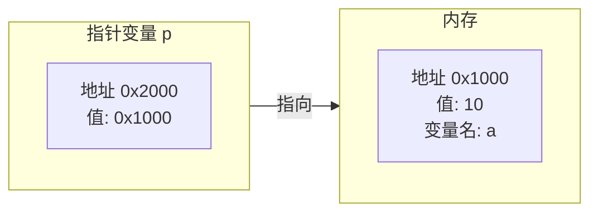
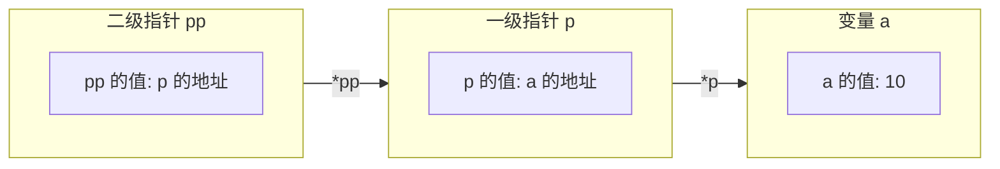
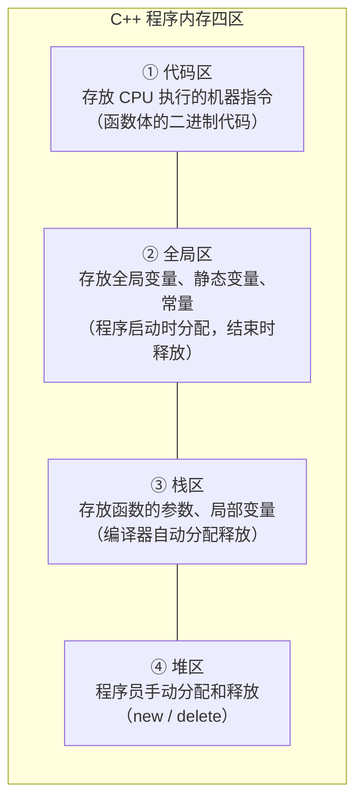
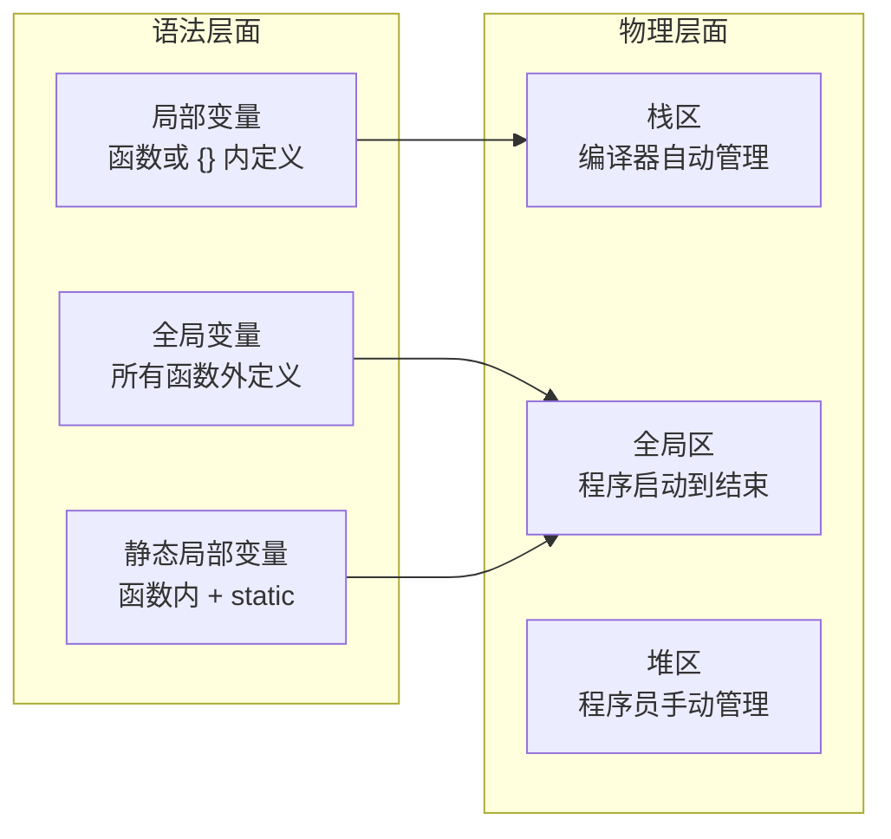

## 指针的基本知识

**指针是一个变量，它存放的不是普通数据，而是另一个变量的内存地址。**。指针是 C++ 最强大的能力：直接操控内存、高效传递大块数据、在运行时动态创建对象。代价是 C++ 最危险的陷阱：野指针、内存泄漏、越界访问——这些错误通常不报编译错误，只在运行时以崩溃或静默的数据损坏的形式出现。指针也是 C++ 区别于 Java、Python 等托管语言的核心特征，后面的 `this` 指针、虚函数表这些底层机制都建立在它之上。

理解指针的关键是先建立一个**内存的视觉模型**：把内存想象成一排带编号的储物格，指针就是一张写着格子编号的纸条



> **注意**：`p` 本身也是一个变量（32 位平台上占 4 字节，64 位平台上占 8 字节），只不过它存储的不是普通数据，而是另一个变量的**地址**。这就是指针最本质的定义：**指针是一个变量，其值为另一个变量的内存地址**。

### 定义与初始化

定义指针的语法很简单：**在类型名后加一个 `*`**。

```
数据类型 * 指针变量名;
```

声明和赋值可以分成两步，也可以在声明时一步完成：

```cpp
int a = 10;
int* p;          // 声明一个指向 int 的指针变量
p = &a;          // 将 a 的地址赋给 p

// 声明同时初始化（推荐）
int* q = &a;     // q 也指向 a
```

分成两行时更容易看清一件事：**指针变量里存的始终是一个地址**，`&a` 只是把这个地址取出来交给它。推荐一步完成初始化，是因为未初始化的指针会导致野指针的出现

> **易错点**：`int* p`、`int *p`、`int * p` 三种写法在语法上完全等价，编译器只关心 `*` 出现在类型和变量名之间。它们的区别只在强调重点——`int* p` 读作"`p` 是一个 `int*`"，强调的是类型；`int *p` 读作"`*p` 是一个 `int`"，强调的是解引用。选一种风格并保持一致即可，本系列示例统一使用 `int* p`。

指针的初始化还有一条硬规则：**指针只能指向同类型的变量**。`int*` 只能指向 `int` 变量，`double*` 只能指向 `double` 变量。

```cpp
int a = 10;
double b = 3.14;

int* p1 = &a;        // ✅ int* 指向 int
double* p2 = &b;     // ✅ double* 指向 double
// int* p3 = &b;     // ❌ 类型不匹配，编译报错
```

这不是编译器在挑剔。指针解引用时必须知道两件事：从这块内存读几个字节、这串字节该按什么类型解释。这些信息全部由指针的类型决定——`int*` 读 4 字节按整数解释，`double*` 读 8 字节按浮点解释

### 取址与解引用

指针的日常操作几乎全部围绕 `&` 与 `*` 两个运算符展开，而它们恰好是这门语言里最容易被看错的一对符号：

| 运算符 | 名称 | 位置 | 作用 | 示例 |
| :--- | :--- | :--- | :--- | :--- |
| `&` | 取地址 | 表达式中的变量前 | 获取变量的内存地址 | `p = &a;` |
| `*` | 解引用 | 指针变量前 | 访问指针指向的那块内存中的值 | `*p = 20;` |

#### 取地址

`&a` 返回变量 `a` 在内存中的地址，它是把"变量名"换成"门牌号"的唯一正当途径。之所以强调"正当"，是因为指针必须有东西可指——随手写一个地址值来初始化指针就是野指针的成因之一

#### 解引用

`*p` 的含义是"沿着 `p` 上写的门牌号走过去，打开那间房，看里面的东西"。它既可以是读取，也可以放在赋值号左边成为写入：`*p = 20` 改的不是 `p`，而是 `p` 指向的那块内存，也就是 `a` 本身——这正是指针能"隔着函数改到实参"的物理基础。

```cpp
#include <iostream>
using namespace std;

int main() {
    int a = 10;
    int* p = &a;           // & 取地址：p 现在存着 a 的地址

    cout << "a 的值：" << a << endl;        // 10
    cout << "a 的地址：" << &a << endl;     // 例如 0x5ffe8c
    cout << "p 的值：" << p << endl;        // 同上（p 存的就是地址）
    cout << "p 指向的值：" << *p << endl;   // * 解引用 → 10

    *p = 20;               // 通过指针修改 a 的值
    cout << "修改后 a：" << a << endl;      // 20
    return 0;
}
```

`p` 和 `&a` 是**地址值**，`*p` 和 `a` 是**地址里的内容**——抓住这个区分，指针的读法就不会乱。

> **易错点**：`*` 在声明语句里和在表达式里含义完全不同，这是初学者最常见的混淆点。
>
> ```cpp
> int* p = &a;    // 这里的 * 是声明的一部分，表示 p 是指针类型
> *p = 20;        // 这里的 * 是解引用运算符，访问 p 指向的内存
> ```
>
> 判断方法很简单：看 `*` 前面是不是一个类型名。是类型名（`int`、`double`），它就是声明的一部分；是变量名（`p`），它就是解引用。

### 指针所占内存空间

**所有指针类型在同一个平台下大小都一样：32 位系统 4 字节，64 位系统 8 字节**，与它指向什么类型无关。原因不复杂——地址本质上就是一个整数编号，不管这个编号指向的房间有多大（`int` 占 4 字节还是 `double` 占 8 字节），编号本身只需要固定位数来存储。

```cpp
#include <iostream>
using namespace std;

int main() {
    int a = 10;
    int* p = &a;

    cout << "sizeof(int*) = " << sizeof(int*) << endl;       // 4（32位）或 8（64位）
    cout << "sizeof(char*) = " << sizeof(char*) << endl;     // 同上
    cout << "sizeof(double*) = " << sizeof(double*) << endl; // 同上
    cout << "sizeof(p) = " << sizeof(p) << endl;             // 同上

    return 0;
}
```

> **易错点**：要分清"指针本身占的内存"和"指针指向的内存"，这是两回事。指针本身也是一份数据，它存放在哪里取决于它是怎么定义的：作为局部变量时就和其他局部变量一起待在**栈区**；定义成全局变量或加了 `static` 就在**全局区**；由 `new` 分配出来的指针变量则在**堆区**（这种写法要到二级指针和动态数组里才会遇到，见后文「内存分区模型」一节）。

### 空指针与野指针

指针忘记初始化，后果比普通变量严重得多：普通变量没初始化只是值不对，指针没初始化却可能指向任意一块内存——往那里写一个值，程序可能立刻崩溃，也可能悄悄改坏别的数据。这一节讲清两种**必须分开对待**的状态。

#### 空指针

**空指针**是明确指向地址 0 的指针，用来表示"这个指针目前不指向任何有效数据"。它是一个**有意的、合法的**状态，不是错误。

```cpp
int* p = NULL;       // C 语言风格
int* q = nullptr;    // C++11 风格（推荐）
```

| 写法 | 本质 | 推荐程度 |
| :--- | :--- | :--- |
| `NULL` | 宏定义，通常是 `0` 或 `(void*)0` | 旧代码中常见，C++ 中不够安全 |
| `nullptr` | C++11 引入的关键字，类型为 `std::nullptr_t` | **推荐使用**，类型安全 |

空指针指向的 0 号地址（及其附近）是操作系统保留的区域，用户程序不允许访问。对空指针解引用会直接导致程序崩溃

```cpp
int* p = nullptr;
// cout << *p << endl;    // ❌ 崩溃！空指针不能解引用
```

#### 野指针

**野指针**是值不为 `nullptr`、却指向非法内存区域的指针——它指向的地址要么不属于当前程序，要么那块内存已经失效。野指针没有任何"一眼可辨"的特征，这正是它比空指针危险的地方。

```cpp
int main() {
    int* p;                  // 未初始化，p 的值是随机垃圾——它指向哪完全不可知
    // *p = 10;              // ❌ 危险！可能破坏其他变量的值或导致崩溃

    int* q = (int*)0x1100;   // 强制指向一个随意写的地址
    // *q = 10;              // ❌ 同样危险！
    return 0;
}
```

> **防范原则**：① 定义指针时立即初始化（指向有效变量或设为 `nullptr`）；② 释放动态内存后立刻把指针置为 `nullptr`；③ 永远不要把硬编码的地址值赋给指针。

### const 修饰指针

`const` 修饰指针时会出现三种语义，全部取决于 `const` 写在 `*` 的哪一侧。区分方法只有一句：**看 `const` 后面紧跟着的是什么**——跟的是类型，被锁住的就是"指向的值"；跟的是指针名，被锁住的就是"指针的指向"。

| 写法 | 名称 | `const` 后面是什么？ | 指针指向可以改？ | 指向的值可以改？ |
| :--- | :--- | :--- | :---: | :---: |
| `const int* p` | 常量指针 | `int`（指向的值） | ✅ 可以 | ❌ 不可以 |
| `int* const p` | 指针常量 | `p`（指针本身） | ❌ 不可以 | ✅ 可以 |
| `const int* const p` | 常量指针常量 | 两者 | ❌ 不可以 | ❌ 不可以 |

#### 常量指针

`const int* p` 里 `const` 修饰的是 `int`，所以**不能通过 `p` 修改它指向的值**，但 `p` 自己可以改指向别的变量。这种写法最常见的用途是把数据交给一个函数，同时保证函数不会改动原数据。

#### 指针常量

`int* const p` 里 `const` 修饰的是 `p` 本身，所以**`p` 一旦初始化就不能再改指向**，但它指向的那块内存里的值可以随便改。它相当于一个"永远指向同一个对象的指针"。

#### 常量指针常量

`const int* const p` 中 `const` 同时锁住了 `int` 和 `p`，于是指向和值都不能改。它一般出现在函数参数里，表示"既不换对象、也不改内容"。

```cpp
#include <iostream>
using namespace std;

int main() {
    int a = 10, b = 20;

    // 1. 常量指针：指向的值不可改，指针指向可以改
    const int* p1 = &a;
    // *p1 = 30;          // ❌ 错误！不能通过 p1 修改 a 的值
    p1 = &b;               // ✅ 可以改为指向 b
    cout << *p1 << endl;   // 输出：20

    // 2. 指针常量：指针指向不可改，指向的值可以改
    int* const p2 = &a;
    *p2 = 30;              // ✅ 可以修改 a 的值
    // p2 = &b;            // ❌ 错误！p2 不能改为指向别的变量
    cout << a << endl;     // 输出：30

    // 3. 两者都不可改
    const int* const p3 = &a;
    // *p3 = 40;           // ❌ 错误
    // p3 = &b;            // ❌ 错误

    return 0;
}
```

> **易错点**：`常量指针`和`指针常量`这两个名字最容易记反。一个可靠的记法是先把 `const` 读作"常量"、把 `*` 读作"指针"，然后从右往左读：`const int* p` 是"常量整型的指针"，被锁住的是指向的值；`int* const p` 是"整型指针常量"，被锁住的是指针本身。英文助记更直接：`const int* p` 是 "pointer to const int"，`int* const p` 是 "const pointer to int"。

### 二级指针

**二级指针就是指向指针的指针。** 既然指针本身也是一个存放在某个地址上的变量，就自然可以再定义一个指针来存它的地址。理论上可以无限嵌套（三级、四级），但实际开发中二级指针是最常见的多级指针形式。

```cpp
#include <iostream>
using namespace std;

int main() {
    int a = 10;
    int* p = &a;          // 一级指针：存 a 的地址
    int** pp = &p;        // 二级指针：存 p 的地址

    cout << "a = " << a << endl;          // 10
    cout << "*p = " << *p << endl;        // 10（p 解引用一次 → a）
    cout << "**pp = " << **pp << endl;    // 10（pp 解引用两次 → p → a）

    // 通过二级指针修改 a
    **pp = 20;
    cout << "修改后 a = " << a << endl;   // 20

    return 0;
}
```



> **解引用层级**：`pp` 是 `p` 的地址；对 `pp` 解引用一次，得到 `p` 的值（也就是 `a` 的地址），它等价于 `p`；解引用两次，得到的是 `a` 的值，它等价于 `*p`，也等价于 `a`。每多一次 `*`，就多剥掉一层间接。

二级指针主要有三类用途，下面逐一说明。

#### 修改外部指针

"函数改到指针指向的值"和"函数改到指针本身的指向"是两件事。传一级指针进函数，函数能用 `*p = ...` 改到外面的数据，但**没法让外面的指针改指别处**——因为它手上的只是那个指针的副本。要让函数改到外部的指针变量，就必须把指针的地址传进去，也就是传二级指针：

```cpp
#include <iostream>
using namespace std;

// 场景：函数需要修改外部指针的指向
void redirect(int** pp) {
    static int value = 999;   // static：函数返回后这块内存依然有效
    *pp = &value;             // 修改外部指针 p 的指向
}

int main() {
    int a = 10;
    int* p = &a;
    redirect(&p);             // 传入 p 的地址（二级指针）
    cout << *p << endl;       // 输出：999（p 已指向 value）
    return 0;
}
```

这里 `value` 必须声明为 `static`，否则函数返回后它就是一块失效的栈内存，`p` 立刻变成悬空指针——原因见后文「函数返回指针」一节。

#### 动态二维数组

需要用二级指针管理一个"指针数组"：先用 `new` 分配一排 `int*`，再让每个 `int*` 各自指向一行独立分配的一维数组。每个元素都是指针，所以数组名退化后正好是一个二级指针。

#### 命令行参数

`main` 函数的 `char* argv[]` 本质上就是一个二级指针，指向一个字符指针数组。这条等价关系在后文「main 函数的命令行参数」一节会展开。

## 指针与函数

指针与函数结合只有三种形式，每一种都在解决一个具体问题：**参数**决定函数能不能改到外面的数据，**返回值**决定函数能不能把内部数据交出去，**函数指针**决定函数能不能像数据一样被传来传去。三种形式的共同点是它们都在处理生命周期与归属——谁创建、谁修改、谁释放。理清这三件事，指针参数导致的崩溃和内存泄漏就基本可以避免了。

### 指针作为函数参数

**用指针做参数，唯一的目的就是让函数改到实参。** 值传递时函数拿到的是实参的副本，怎么改都影响不到外面；把地址传进去，函数就能顺着地址找到真正的实参并改写它。

#### 值传递

值传递把实参的值**复制**一份给形参。函数内部改的是那份副本，函数一返回副本就随栈帧消失，实参毫发无损。这是 C++ 默认的传参方式，也是绝大多数情况下应该用的方式——它没有副作用。

#### 地址传递

地址传递传的仍然是"值"，只不过这个值是**地址**。函数手上多了一份地址的副本，但两份副本指向的是同一块内存，所以 `*a` 解引用就直接落到了实参身上，写进去的改动会保留下来。

> **例 1（交换两个整数）** 写两个交换函数：一个按值传递、一个按地址传递，在 `main` 里分别调用，观察 `x`、`y` 是否真的被交换。

**思路**：交换需要三步（暂存、覆盖、回填）。关键不在这三步，而在函数能不能碰到 `main` 里的 `x` 和 `y`——按值传递只能碰到它们的副本，按地址传递才能碰到它们本人。所以两个函数各自演示一种传参方式，才能看清差别。

**解**：

```cpp
#include <iostream>
using namespace std;

// 值传递：改不了实参
void swapByValue(int a, int b) {
    int temp = a; a = b; b = temp;
}

// 地址传递：能改实参
void swapByPointer(int* a, int* b) {
    int temp = *a; *a = *b; *b = temp;
}

int main() {
    int x = 10, y = 20;
    swapByValue(x, y);
    cout << x << ", " << y << endl;        // 10, 20（未变）

    swapByPointer(&x, &y);
    cout << x << ", " << y << endl;        // 20, 10（已交换）
    return 0;
}
```

程序输出：

```
10, 20
20, 10
```

**评注**：两个函数的函数体看着几乎一样，区别只在 `int a` 与 `int* a`——`swapByValue` 交换的是函数自己的两个局部变量，`swapByPointer` 交换的是 `x`、`y` 本身。这个例子说明了一条通用结论：**能不能改到实参，取决于函数手里拿的是值还是地址**。另外要注意调用形式也跟着变了，`swapByPointer(&x, &y)` 必须显式取地址，漏掉 `&` 编译不过——这是指针参数无法完全隐藏的代价。

> **选择原则**：需要修改实参 → 用指针传递，或更简洁的引用传递；传递大体积数据但不需要修改 → 用 `const` 指针（如 `const int* arr`），既避免复制开销又保护原数据不被修改。

> **易错点**：指针和引用都能让函数改到实参，但它们不是一回事，不能凭感觉互换。
>
> | 维度 | 指针 `int*` | 引用 `int&` |
> | :--- | :--- | :--- |
> | **是否可为空** | 可以为 `nullptr` | 不能（必须绑定到有效变量） |
> | **能否改变指向** | 可以 | 不可以（一旦绑定无法更改） |
> | **语法复杂度** | 需要 `&` 取址、`*` 解引用 | 直接用变量名 |
> | **适用场景** | "可能没有"或"需要换指向" | 确定存在且指向不变的别名 |
>
> 默认用引用（更简洁也更安全），只在需要"可以为空"或"需要改变指向"时才用指针。引用的本质、引用做返回值、常量引用等内容见 C++程序设计基础-4 函数。

### 函数返回指针

函数返回指针本身没有任何问题，但有**一条绝对不能碰的红线：不要返回局部变量的地址**。判断标准很直接——这块内存在函数返回后还活着吗？

#### 悬空指针

局部变量存在**栈区**，函数返回时它的栈帧被销毁，那块内存被标记为可回收。之后任何一次新的函数调用都可能覆盖它。返回它的地址，等于把一块随时会被改写的内存交给调用者，这样得到的指针叫**悬空指针**（Dangling Pointer）。最阴险的地方在于它不是必错：第一次访问可能侥幸读到正确的值（栈还没被覆盖），第二次访问就变成乱码——这种"时对时错"的表现，比稳定崩溃难查得多。

```cpp
#include <iostream>
using namespace std;

// ❌ 错误示范：返回局部变量的地址
int* dangerousFunc() {
    int local = 10;
    return &local;           // 函数结束，local 被销毁，返回的地址指向已释放的内存！
}

// ✅ 正确示范：返回静态局部变量的地址
int* safeFunc() {
    static int value = 10;   // 静态变量在程序运行期间一直存在
    return &value;
}

int main() {
    int* p1 = dangerousFunc();
    cout << *p1 << endl;     // 可能输出 10（运气好，栈还没被覆盖）
    cout << *p1 << endl;     // 可能输出随机值（栈已被其他操作覆盖）

    int* p2 = safeFunc();
    cout << *p2 << endl;     // 始终输出 10（安全）
    return 0;
}
```

#### 安全返回场景

只有下面四种情况可以放心返回指针，它们的共同点是**指针指向的内存在函数返回后依然有效**：

1. 返回静态局部变量的地址（存在全局区，与程序同寿）；
2. 返回全局变量的地址（同样存在全局区）；
3. 返回堆区动态分配的内存地址（由 `new` 分配，只有 `delete` 能收回）；
4. 返回调用者通过参数传进来的数组或指针（内存本来就归调用者所有）。

第四种情况最容易被忽略：指针不是函数创建的，所以释放也不该由函数负责——**谁分配，谁释放**这条规则在后面讲内存泄漏时还会出现。

### 函数指针

编译后的函数体存放在**代码区**，而**函数名本身就是它在代码区中的起始地址**。既然函数有地址，就能把地址存进指针变量，这就是**函数指针**（Function Pointer）。它让函数从"被调用的一段代码"变成"可以被传递的一份数据"。

#### 声明与调用

```cpp
#include <iostream>
using namespace std;

int add(int a, int b) { return a + b; }
int subtract(int a, int b) { return a - b; }

int main() {
    // 声明函数指针：返回值类型 (*指针名)(参数类型列表)
    int (*funcPtr)(int, int);

    funcPtr = add;                           // funcPtr 指向 add 函数
    cout << funcPtr(10, 5) << endl;          // 通过函数指针调用 add → 15

    funcPtr = subtract;                      // 改为指向 subtract
    cout << funcPtr(10, 5) << endl;          // 通过函数指针调用 subtract → 5

    return 0;
}
```

声明函数指针的格式可以抽象成：

```
返回值类型 (*指针变量名)(参数类型1, 参数类型2, ...);
```

几个具体的例子：

```cpp
int (*fp)(int, int);        // 指向"两个 int 参数、返回 int"的函数
void (*fp)();               // 指向"无参数、无返回值"的函数
double (*fp)(double, int);  // 指向"double 和 int 参数、返回 double"的函数
```

> **易错点**：声明里的括号不能省。`int (*fp)(int, int)` 和 `int* fp(int, int)` 完全不同——前者 `fp` 是函数指针，后者 `fp` 是一个**返回 `int*` 的普通函数**的声明。`*` 周围的这对括号决定了 `*` 是和 `fp` 结合（形成指针），还是和 `int` 结合（形成返回类型）。

#### 回调机制

函数指针最有价值的用途是作为另一个函数的参数，让调用者**自定义行为**——这就是**回调**（Callback）的基本形式。框架负责流程，调用者负责策略。

```cpp
#include <iostream>
using namespace std;

// 对数组中每个元素执行指定的操作
void forEach(int arr[], int len, void (*action)(int&)) {
    for (int i = 0; i < len; i++) {
        action(arr[i]);            // 通过函数指针调用——"把对元素做什么"的决定权交给调用者
    }
}

// 调用者可以定义任意的操作函数
void doubleIt(int& x) { x *= 2; }
void squareIt(int& x) { x *= x; }

int main() {
    int arr[] = {1, 2, 3, 4, 5};
    int len = sizeof(arr) / sizeof(arr[0]);

    forEach(arr, len, doubleIt);    // 对每个元素执行 doubleIt
    // arr = {2, 4, 6, 8, 10}

    forEach(arr, len, squareIt);    // 对每个元素执行 squareIt
    // arr = {4, 16, 36, 64, 100}

    return 0;
}
```

`forEach` 只负责"遍历数组"这一件通用的事，"对每个元素做什么"由调用者通过函数指针传进来。这种"框架提供流程，用户提供策略"的模式是策略设计模式的雏形，在 STL 的 `<algorithm>` 里随处可见——`sort`、`find_if`、`for_each` 都接受函数指针或函数对象作为参数。这里的 `action` 参数写成 `int&` 而不是 `int`，是因为它需要改到数组元素本身。

### main 函数的命令行参数

程序获取输入的常见方式是从键盘读，但有些场景下输入应该在**启动时**就交给程序，而不是等运行时再敲一遍。`copy file1.txt file2.txt` 这样的命令就是例子：两个文件名是用户写在命令行上、由操作系统交到程序手里的。`main` 的第二种标准形式就是为这件事准备的。

```cpp
int main(int argc, char* argv[]) {
    // argc（argument count）：命令行参数的个数
    // argv（argument vector）：字符串数组，每个元素是一个参数
    return 0;
}
```

#### argc 与 argv

| 参数 | 全称 | 类型 | 含义 |
| :--- | :--- | :--- | :--- |
| `argc` | Argument Count | `int` | 命令行参数的个数（包括程序名本身） |
| `argv` | Argument Vector | `char* []`（即字符指针数组） | 每个元素指向一个参数字符串的首地址 |

```cpp
#include <iostream>
using namespace std;

int main(int argc, char* argv[]) {
    cout << "共传入 " << argc << " 个参数" << endl;

    for (int i = 0; i < argc; i++) {
        cout << "argv[" << i << "] = " << argv[i] << endl;
    }
    return 0;
}
```

在命令行中执行：

```bash
program.exe hello 123 world
```

程序输出：

```
共传入 4 个参数
argv[0] = program.exe
argv[1] = hello
argv[2] = 123
argv[3] = world
```

> **关键规则**：`argv[0]` 永远是**程序名本身**（含路径），用户传入的参数从 `argv[1]` 开始。`argc` 的最小值是 1，即使一个参数都不传也成立。另外 `argv[argc]` 的值恒为 `NULL`（`nullptr`），可以利用它遍历参数而不依赖 `argc`：`for (int i = 0; argv[i] != NULL; i++)`。

#### 与二级指针的等价

`char* argv[]` 的本质是一个二级指针（数组名退化的结果），它指向一个字符指针数组。所以下面两种写法完全等价：

```cpp
int main(int argc, char* argv[]);    // 数组写法（最直观）
int main(int argc, char** argv);     // 指针写法（底层本质）
```

`argc` 在语法上不能省略——`argv` 的类型信息需要它配套出现。不过遍历参数时确实可以不依赖它，靠的就是上一条规则里说的 `argv[argc] == nullptr` 这个终止标记。

> **例 2（命令行计算器）** 写一个程序，从命令行接收"数字 运算符 数字"三个参数，输出计算结果；参数数量不对时打印用法说明。

**思路**：命令行传进来的全是字符串，所以要先把 `argv[1]`、`argv[3]` 转成整数；运算符只需要第一个字符。四个运算符里只有除法要单独判断除数是否为 0，其余三种可以直接算。参数个数不对时应该给出提示并以非 0 状态退出，让调用者（比如脚本）能判断出错了。

**解**：

```cpp
#include <iostream>
#include <cstdlib>     // atoi：字符串转整数
using namespace std;

int main(int argc, char* argv[]) {
    if (argc != 4) {
        cout << "用法：" << argv[0] << " 数字1 运算符 数字2" << endl;
        cout << "示例：" << argv[0] << " 10 + 20" << endl;
        return 1;      // 返回 1 表示异常退出
    }

    int a = atoi(argv[1]);      // 将字符串参数转为整数
    char op = argv[2][0];       // 取运算符字符串的第一个字符
    int b = atoi(argv[3]);

    switch (op) {
        case '+': cout << a + b << endl; break;
        case '-': cout << a - b << endl; break;
        case '*': cout << a * b << endl; break;
        case '/':
            if (b != 0) cout << (double)a / b << endl;
            else cout << "除数不能为0" << endl;
            break;
        default: cout << "不支持的运算符" << endl;
    }
    return 0;
}
```

**评注**：`argv[2][0]` 这一处最能体现"`argv` 是二级指针"的含义——`argv[2]` 取出一个 `char*`（一个字符串），再对它取下标 `[0]`，就得到了这个字符串的第一个字符。`atoi` 位于 `<cstdlib>`，它把 C 风格字符串转成 `int`，但**遇到非法输入时只返回 0、不报错**，所以这段代码对 `program.exe abc + 20` 会安静地算成 `0 + 20`。更安全的替代是 C++11 的 `std::stoi`（位于 `<string>`），它遇到非法输入会抛出异常。

## 指针与数组

数组名在大多数表达式中表示首元素地址，而指针存的正是地址——两者的这层等价关系不是巧合，而是 C++ 内存模型的直接结果。理解它有两个好处：看懂数组下标背后到底发生了什么，以及看懂函数参数里 `int arr[]` 和 `int* arr` 为什么可以互换。这一节的每个结论都能用上一节的地址模型推出来，不需要额外记。

### 数组名即指针

**`arr[i]` 在编译器内部被翻译为 `*(arr + i)`**：先算地址偏移，再解引用。数组名可以被赋值给同类型的指针，两者指向同一个元素。

#### 下标与指针算术

```cpp
#include <iostream>
using namespace std;

int main() {
    int arr[] = {1, 2, 3, 4, 5, 6, 7, 8, 9, 10};
    int* p = arr;                    // arr 是首元素地址，等价于 &arr[0]

    cout << "arr[0] = " << arr[0] << endl;     // 1
    cout << "*p = " << *p << endl;             // 1（指向同一个元素）

    cout << "arr[1] = " << arr[1] << endl;     // 2
    cout << "*(p+1) = " << *(p + 1) << endl;   // 2（等价！）
    return 0;
}
```

`arr[i]` 与 `*(arr + i)` 是同一件事的两种写法，这也正是**数组索引从 0 开始**的根本原因：`arr[0]` 就是 `*(arr + 0)`，偏移量为 0 时取到的自然是第一个元素。

#### 数组名与指针变量

`arr` 和 `p` 都指向首元素，但它们有一个关键区别：**`arr` 是指针常量（不能改变指向），`p` 是指针变量（可以改变指向）**。`p++` 让 `p` 指向下一个元素是合法的，`arr++` 则编译报错——数组名是一个固定不变的地址标记，不是一块可以随便改写的存储。

### 指针遍历数组

既然 `arr[i]` 等价于 `*(arr + i)`，遍历数组就有两种写法。它们在本质上是同一件事，但展示了两个不同的视角。

#### 指针算术遍历

保持指针不动，每次用 `p + i` 算出第 `i` 个元素的地址再解引用，写成 `*(p + i)`。这种写法与下标遍历一一对应，最容易和已经熟悉的 `arr[i]` 对上号。

#### 移动指针遍历

让指针本身往后走，每次 `q++` 移到下一个元素，解引用写 `*q`。它少了一次加法，读起来更像"沿着内存一个个走过去"，代价是原来的首地址被丢掉了——如果需要事后回到数组开头，就得另存一个指针。

```cpp
#include <iostream>
using namespace std;

int main() {
    int arr[] = {1, 2, 3, 4, 5, 6, 7, 8, 9, 10};
    int len = sizeof(arr) / sizeof(arr[0]);
    int* p = arr;

    // 方式一：指针算术遍历
    for (int i = 0; i < len; i++) {
        cout << *(p + i) << " ";         // *(p+i) 等价于 arr[i]
    }
    cout << endl;

    // 方式二：移动指针本身遍历
    for (int* q = arr; q < arr + len; q++) {
        cout << *q << " ";
    }
    cout << endl;

    return 0;
}
```

> **指针运算规则**：`p + i` 的实际地址增量是 $i \times \texttt{sizeof}(\text{元素类型})$。对于 `int* p`，`p + 1` 让地址值增加 4 字节（一个 `int` 的大小）。编译器根据指针类型自动计算偏移量，程序员不需要手动乘 `sizeof`——这也再次说明了为什么指针必须带类型信息。

### 指针与数组在函数参数中的等价性

数组作为函数参数时会**退化为指针**，所以下面四种写法完全等价：

#### 四种等价写法

```cpp
void func1(int arr[], int len);       // 数组写法（最直观）
void func2(int arr[10], int len);     // 指定长度——编译器会忽略 10
void func3(int arr[100], int len);    // 长度写多少都一样，同样被忽略
void func4(int* arr, int len);        // 指针写法（底层本质）
```

既然 `func2` 和 `func3` 里的长度会被编译器直接忽略，那么写了也没用——**参数里带长度的数组写法只是一种自我说明**，它不会阻止调用者传进来更短的数组。

#### 为什么必须传长度

因为在函数内部，`arr` 只是一个指向首元素的指针，`sizeof(arr)` 返回的是指针的大小（4 或 8 字节），而不是原数组的总字节数。长度信息在退化那一刻就已经丢失了，只能由调用者额外传进来。这就是 C++程序设计基础-5 数组里所有数组处理函数都要多带一个长度参数的原因。

> **易错点**：在 `main` 里 `sizeof(arr) / sizeof(arr[0])` 算得出长度，是因为此时 `arr` 还是数组类型；一旦传进函数，同样的表达式就变成了 `4 / 4 = 1` 或 `8 / 4 = 2`，结果与数组实际长度毫无关系。这个错误不会报编译错误，只会让循环提前结束或越界。

### 指针数组

**指针数组是一个数组，它的每个元素都是指针**；而"数组指针"是一个指针，它指向一个数组。中文里只差一个字，含义却完全相反，所以先把两者摆在一起看：

| 概念 | 本质 | 语法 | 含义 |
| :--- | :--- | :--- | :--- |
| **指针数组** | 数组——每个元素是指针 | `int* arr[5];` | arr 是一个数组，有 5 个元素，每个元素是 `int*` 类型 |
| **数组指针** | 指针——指向一个数组 | `int (*p)[5];` | p 是一个指针，指向一个包含 5 个 `int` 的数组 |

指针数组最自然的用途是管理一组"长度可能不同"的字符串——用指针指向它们的首地址，比用固定宽度的二维字符数组灵活得多。下面先看它最基本的用法。

```cpp
#include <iostream>
using namespace std;

int main() {
    int a = 10, b = 20, c = 30;

    // 指针数组：每个元素是一个 int* 指针
    int* ptrArr[3] = {&a, &b, &c};

    for (int i = 0; i < 3; i++) {
        cout << *ptrArr[i] << " ";     // 解引用每个指针元素
    }
    // 输出：10 20 30
    return 0;
}
```

#### 与二级指针的关系

指针数组的数组名是一个**指向指针的指针**：`ptrArr` 的类型是"指向 `int*` 的指针"，因为它退化的结果就是首元素的地址，而首元素本身已经是 `int*`。所以完全可以用二级指针来遍历指针数组：

```cpp
#include <iostream>
using namespace std;

int main() {
    int a = 10, b = 20, c = 30;
    int* ptrArr[3] = {&a, &b, &c};
    int** pp = ptrArr;                     // ptrArr 退化为 int**

    for (int i = 0; i < 3; i++) {
        cout << **(pp + i) << " ";         // 等价于 *ptrArr[i]
    }
    // 输出：10 20 30
    return 0;
}
```

注意第二个循环里要解引用两次：第一次从 `pp + i` 拿到第 `i` 个 `int*`，第二次才拿到真正的 `int`。层级数就是指针的"间接层数"。

#### 字符串指针数组

指针数组最常见的形态是字符串数组：`const char* names[] = {"张三", "李四", "王五"};` ——三个 `const char*` 元素分别指向三个字符串常量的首地址。命令行参数 `argv` 正是这种形式的经典应用。它和 `char names[][10]` 这类二维字符数组的区别在于，后者要求每行等宽、浪费空间，而指针数组让每个字符串各占自己需要的大小。

## 内存分区模型

前面几节反复出现"局部变量在栈里""动态分配在堆里"这样的说法，这一节把它落到一张图上。C++ 程序运行时，操作系统分配给进程的内存被划分成四个逻辑区域，**变量的行为差异大多来自它被放在哪个区域**——理解这张图，后面关于生命周期和作用域的规则就都不需要死记了。



| 区域 | 存放内容 | 分配时机 | 释放时机 | 管理者 |
| :--- | :--- | :--- | :--- | :--- |
| **代码区** | 编译后的函数体二进制指令 | 程序加载时 | 程序结束时 | 操作系统 |
| **全局区** | 全局变量、`static` 变量、字符串常量、`const` 全局常量 | 程序启动时 | 程序结束时 | 操作系统 |
| **栈区** | 函数的参数、局部变量 | 函数调用时 | 函数返回时 | 编译器（自动） |
| **堆区** | `new`/`malloc` 分配的内存 | 程序员手动指定 | 程序员手动释放（或程序结束） | **程序员** |

#### 代码区

代码区存放 CPU 执行的机器指令，也就是函数体编译后的二进制码，由操作系统在程序加载时分配。它的两个特性都源于操作系统的安全设计：**共享**——同一程序的多个进程实例可以共享同一份代码区，节省内存；**只读**——防止程序意外修改自身的指令，属于防御性保护。

程序员既不需要也不能手动管理代码区。但要记住从它的角度理解到的一件事：**函数名本身就是函数在代码区中的起始地址**——这正是函数指针能存在的前提。

#### 全局区

全局区存放三样东西：**全局变量**、**静态变量**（`static`）和**常量**（字符串常量与 `const` 全局常量）。它们的共同特点是生命周期覆盖整个程序运行期间。

```cpp
#include <iostream>
using namespace std;

// 以下全部位于全局区
int g_a = 10;                 // 全局变量
int g_b = 10;                 // 全局变量
const int c_g_a = 10;         // const 全局常量
const int c_g_b = 10;         // const 全局常量

int main() {
    static int s_a = 10;      // 静态局部变量（也在全局区！）
    static int s_b = 10;

    int a = 10;               // 局部变量（在栈区）
    int b = 10;               // 局部变量（在栈区）

    cout << "局部变量 a 地址：" << &a << endl;        // 栈区（高地址）
    cout << "局部变量 b 地址：" << &b << endl;        // 栈区
    cout << "全局变量 g_a 地址：" << &g_a << endl;    // 全局区（低地址）
    cout << "静态变量 s_a 地址：" << &s_a << endl;    // 全局区
    cout << "字符串常量地址：" << (void*)"hello" << endl; // 全局区
    cout << "全局常量 c_g_a 地址：" << &c_g_a << endl;   // 全局区

    return 0;
}
```

这段程序的验证方式是看地址的数值大小：全局区变量的地址通常明显小于栈区变量的地址，因为不同区域的地址范围是操作系统预先划分好的。这里 `(void*)"hello"` 的强制转换是必要的——`"hello"` 是 `const char*` 类型，而 `cout` 对它的默认处理是当作字符串输出内容，转成 `void*` 才会打印地址。

#### 栈区

栈区由**编译器自动管理**：函数调用时压入栈帧（分配局部变量和形参），函数返回时弹出栈帧（回收内存）。它就是 C++程序设计基础-4 函数里讲的"函数调用栈"在内存层面的样子。

栈区的核心规则是"**不要返回局部变量的地址**"，原因在前文「函数返回指针」一节已经说清：返回之后那块栈内存已被标记为可回收，随时可能被下一次函数调用覆盖。

#### 堆区

堆区是程序员**手动管理**的内存区域——需要时申请，用完释放。它和栈区的差别可以在五个维度上摊开：

| 维度 | 栈区 | 堆区 |
| :--- | :--- | :--- |
| **管理方式** | 编译器自动分配释放 | 程序员手动 `new`/`delete` |
| **生命周期** | 跟随函数调用 | 由程序员决定 |
| **大小限制** | 通常较小（几 MB） | 通常较大（受系统总内存限制） |
| **分配速度** | 极快（移动栈指针即可） | 较慢（需要查找空闲块） |
| **典型用途** | 局部变量、函数参数 | 需要在函数返回后继续存在的数据、大小在运行时才能确定的数据 |

**为什么需要堆？** 两个核心原因：① 栈空间有限——一个百万元素的数组栈多半放不下；② 栈上的数据"朝生暮死"，函数一返回就销毁——如果一份数据要在多个函数之间共享，或者它的生命周期不该由调用栈决定，就必须放在堆上。

## 作用域与生命周期的内存原理

关于变量，前面已经学过两件事：从**语法层面**看三种变量的作用域和生命周期，从**硬件层面**看内存的四区模型。这一节把两个视角合拢，建立"语法概念"到"物理存储"的映射。做完这层映射，"为什么局部变量出了花括号就消失""为什么全局变量到处都能用""为什么 `static` 变量能记住上一次的值"就不再需要背——它们的答案都不在语法里，在内存里。



#### 变量与内存的映射

四类变量各自落在哪个区域，决定了它们的行为：

| 变量类型 | 存储位置 | 分配时机 | 释放时机 | 为什么有这样的行为？ |
| :--- | :--- | :--- | :--- | :--- |
| **局部变量** | **栈区** | 进入 `{}` 时压栈 | 离开 `{}` 时弹栈 | 栈的 LIFO（后进先出）结构和函数调用栈天然匹配——函数调用时压入栈帧（含局部变量），返回时弹出，自动回收 |
| **全局变量** | **全局区** | 程序启动时 | 程序结束时 | 全局区在程序运行期间始终有效，不受函数调用影响——这就是为什么所有函数都能访问全局变量 |
| **静态局部变量** | **全局区** | 第一次进入函数时 | 程序结束时 | 虽然行为像局部变量（只能在一个函数内访问），但物理存储放在了全局区——生命周期和全局变量一样长 |
| **动态分配变量** | **堆区** | `new`/`malloc` 调用时 | `delete`/`free` 调用时 | 堆不遵循栈的 LIFO 规则——程序员决定何时分配和释放 |

#### 作用域与生命周期

`作用域`和`生命周期`这两个词经常被混着用，但从内存角度看它们问的是两个不同的问题：

| 语法概念 | 内存本质 |
| :--- | :--- |
| **作用域** | 决定了变量存储在哪块内存区域中——局部变量进栈区（受限于函数调用栈的嵌套深度），全局变量进全局区（不受函数调用影响） |
| **生命周期** | 取决于所在内存区域的分配/释放机制——栈区的变量随函数调用自动消亡，全局区的变量与程序同寿，堆区的变量由程序员决定生死 |
| **`static` 的效果** | 把变量的存储位置从栈区**迁移到全局区**，同时保持作用域不变——本质上是一个"全局区存储 + 局部作用域"的混合体 |

#### 内存视角的意义

把上面的映射用起来，四个常见的"为什么"就都有了直观答案。

**为什么全局变量能在所有函数里访问？** 因为全局区是所有函数共享的——任何函数只要知道变量的地址就能访问它。而栈区的局部变量只有当前活跃的栈帧中那些"活着"，其他函数的栈帧早就弹出了，自然访问不到。

**为什么静态局部变量能"记住"上一次的值？** 因为它存在全局区而不是栈区。下一次再进入函数时，全局区里那块内存的数据仍然完整保留，没有被弹栈销毁。它本质上和全局变量一样持久，只不过编译器限制了它的访问权限——只能在定义它的那个函数里使用。

**为什么不能返回局部变量的地址？** 因为局部变量在栈区，函数返回时栈帧被弹出：那块内存地址还在，但数据随时可能被覆盖。返回它的地址相当于把一间"已经退租的房间"的钥匙交给别人。

**为什么大数组不能定义在函数内部？** 因为函数内部的局部变量都在栈区，而栈空间通常只有几 MB。在 `main` 里写 `int arr[10000000];`（约 40 MB）很可能直接导致栈溢出。

> **易错点**：**栈溢出**（Stack Overflow）不是"内存不够"，而是"栈空间不够"。栈区大小通常有限（Windows 下默认约 1 MB，Linux 约 8 MB），两种常见触发方式是：定义超大的局部数组（如 `int arr[10000000];`），以及递归太深（每层调用都压入一个新栈帧，几万层之后栈就满了）。解决办法分别是对应的：把大数组放到堆上（`int* arr = new int[10000000];`）或定义为全局变量放进全局区；递归深度受限的问题改成递推。

## 动态内存分配

在堆区申请和释放内存有两套机制：C++ 的 `new`/`delete` 和 C 语言遗留的 `malloc`/`free`。**在 C++ 里优先使用 `new`/`delete`。** 原因不只是风格统一——`new` 在分配内存之外还会调用对象的构造函数，`delete` 在释放内存之外还会调用析构函数。对 `int` 这类基本类型两者看不出区别，但一旦开始写类，这个差别就变成硬性要求。

### new 和 delete

#### 单个变量的分配

```cpp
#include <iostream>
using namespace std;

int main() {
    // new：在堆区申请一个 int 的空间，返回指向它的指针
    int* p = new int(10);          // 申请并初始化为 10

    cout << *p << endl;            // 输出：10
    *p = 20;                       // 像普通指针一样使用
    cout << *p << endl;            // 输出：20

    // delete：释放 p 指向的堆内存
    delete p;
    // 此时 *p 不可再访问（内存已被归还给系统）
    p = nullptr;                   // 好习惯：释放后置空

    return 0;
}
```

对比栈上的局部变量，堆上的数据不会在函数返回时自动销毁——这正是它存在的意义：

```cpp
#include <iostream>
using namespace std;

int* createOnHeap() {
    int* p = new int(100);         // 在堆上分配
    return p;                      // ✅ 安全：堆内存不会随函数返回销毁
}

int main() {
    int* ptr = createOnHeap();
    cout << *ptr << endl;          // 输出：100（数据仍然有效）
    delete ptr;                    // 手动释放
    ptr = nullptr;
    return 0;
}
```

> **易错点**：`delete p` 只释放了 `p` 指向的内存，**没有改变 `p` 本身的值**——它仍然存着那个地址，只是这个地址现在已经不归程序所有了。这样的指针叫"迷途指针"，如果后续代码不小心再用它（`*p = ...` 或第二次 `delete p`），就是未定义行为，通常表现为崩溃。释放后立刻写 `p = nullptr` 的好处是：之后任何对它的解引用都会立刻崩溃——问题被暴露在明处，而不是潜伏在暗处。

#### 动态数组

用 `new[]` 和 `delete[]` 可以在堆上创建数组，而且大小可以**在运行时确定**——这是栈数组做不到的：

```cpp
#include <iostream>
using namespace std;

int main() {
    int n;
    cout << "请输入数组大小：";
    cin >> n;

    // 在堆上创建大小为 n 的数组（n 可以是由用户输入的变量！）
    int* arr = new int[n];

    // 像普通数组一样使用
    for (int i = 0; i < n; i++) {
        arr[i] = i + 100;
    }
    for (int i = 0; i < n; i++) {
        cout << arr[i] << " ";
    }
    cout << endl;

    // 释放动态数组——必须用 delete[]，不能用 delete！
    delete[] arr;
    arr = nullptr;

    return 0;
}
```

> **易错点**：`new` 必须对应 `delete`，`new[]` 必须对应 `delete[]`，**混用会导致未定义行为**。原因是 `new[]` 分配的内存布局和 `new` 不同——系统会在数组前面额外存一份元素个数，供 `delete[]` 知道该析构多少个对象。用错误的释放方式会破坏这套内存管理结构。

### malloc 和 free

`malloc`/`free` 是从 C 语言继承的动态内存管理函数，需要头文件 `<cstdlib>`。它们在 C++ 里了解即可，因为两者在关键能力上差了一截：

| 维度 | `new`/`delete`（C++） | `malloc`/`free`（C） |
| :--- | :--- | :--- |
| **语法** | `int* p = new int(10);` | `int* p = (int*)malloc(sizeof(int));` |
| **是否调用构造/析构** | ✅ 调用（对于类类型） | ❌ 不调用 |
| **返回类型** | 正确类型的指针 | `void*`（需要强制转换） |
| **释放** | `delete p;` | `free(p);` |
| **推荐度** | **C++ 首选** | 仅维护 C 代码时使用 |

```cpp
#include <cstdlib>
#include <iostream>
using namespace std;

int main() {
    // C 风格分配
    int* p = (int*)malloc(sizeof(int));    // 需要手动计算大小和强制转型
    *p = 42;
    cout << *p << endl;                    // 42
    free(p);                               // C 风格释放

    return 0;
}
```

> **易错点**：**在 C++ 里直接用 `new`/`delete`，不要用 `malloc`/`free`。** 对 `int`、`double` 这类基本类型，两者的行为看起来一样，所以很多人觉得"用哪个都行"；但 `malloc`/`free` 只是裸内存操作，完全不知道类和对象的存在，不会调用构造函数和析构函数。等到写自己的类时（见 C++程序设计基础-8 面向对象编程），用错这一对函数会让对象处于未初始化或未清理的状态，而且不会有任何编译错误提醒你。

### 内存泄漏及其防范

**内存泄漏**（Memory Leak）是指用 `new` 分配了堆内存，却在所有指向它的指针都消失之前没有 `delete`——这块内存从此既无法被程序访问，也无法被回收，直到程序退出。对跑几分钟就结束的小程序来说它几乎无害；但对长期运行的服务，泄漏会不断吃掉可用内存，最终耗尽。

#### 泄漏的成因

```cpp
#include <iostream>
using namespace std;

void leakyFunction() {
    int* p = new int(100);       // 分配了堆内存
    // 函数结束，p 被销毁了，但 p 指向的堆内存没有被释放！
    // 这块内存成了"孤儿"——没人知道它在哪，也没人能释放它
}

int main() {
    for (int i = 0; i < 1000000; i++) {
        leakyFunction();          // 每次调用泄漏 4 字节
    }
    // 累计泄漏约 4MB——程序运行越久，内存越少
    return 0;
}
```

这段代码每次调用泄漏 4 字节，单次看不出来；循环一百万次之后就是 4 MB。泄漏之所以难发现，正是因为它**没有任何即时症状**——程序不崩溃、不报错，只是越来越慢。

#### 三条防范原则

| 原则 | 说明 | 示例 |
| :--- | :--- | :--- |
| **谁分配谁释放** | 哪个函数或模块调了 `new`，就应该负责调 `delete` | 在同一个函数内 `new` ↔ `delete` |
| **释放后置空** | `delete` 后立即将指针设为 `nullptr`，防止后续误用 | `delete p; p = nullptr;` |
| **成对检查** | 写完 `new` 后立即写对应的 `delete`，再在两者之间插入业务代码 | 养成"写 `new` 的同时写 `delete`"的习惯 |

三条原则里最实用的是第三条：它把"记得释放"从一件需要记忆的事变成一件顺手的事。第一条则决定了代码的边界——分配和释放如果分散在不同模块里，即使两边都写对了，也很容易配错。

> **注意**：现代 C++ 提供了更彻底的方案。C++11 引入的**智能指针**（`unique_ptr`、`shared_ptr`）通过 RAII 机制自动管理堆内存——离开作用域时自动释放，从根本上消除了"忘记 `delete`"这个风险，属于 C++程序设计基础-12 现代C++ 的内容。理解手动 `new`/`delete` 仍然是必要的前置步骤：智能指针解决的正是这里列出的三个问题。

## 小结

1. 指针是一个变量，它的值是另一个变量的内存地址；`&` 负责取地址、`*` 负责解引用，而 `*` 在声明里和在表达式里是两回事。
2. 同一平台下所有指针类型等长（32 位 4 字节、64 位 8 字节），因为地址本身就是一个整数编号，与它指向的数据类型无关。
3. 野指针与悬空指针是崩溃和数据损坏的主要来源，防范办法是"定义即初始化"和"`delete` 后立刻置 `nullptr`"。
4. `const` 修饰指针按 `const` 后面紧跟类型还是指针名分成三种语义，分别锁住指向的值、指针本身，或者两者。
5. `arr[i]` 就是 `*(arr + i)`，数组名是指针常量，数组作函数参数时退化为指针，因此长度必须由调用者额外传入。
6. 二级指针让函数能改到外部指针的指向，函数指针让函数可以像数据一样被传递；回调正是"框架提供流程、调用者提供策略"。
7. 内存分为代码区、全局区、栈区、堆区；`new` 配 `delete`、`new[]` 配 `delete[]`，需要跨出函数生命周期或体积很大的数据放在堆上。
