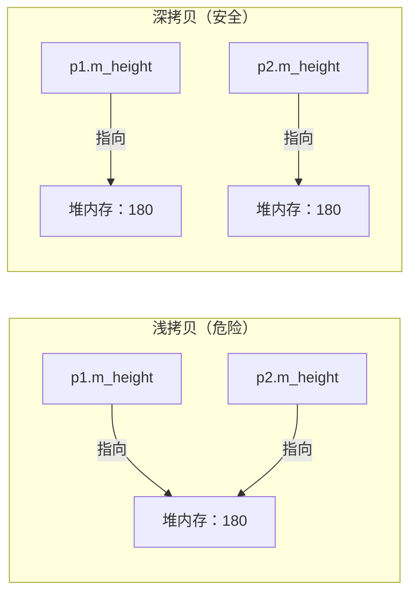
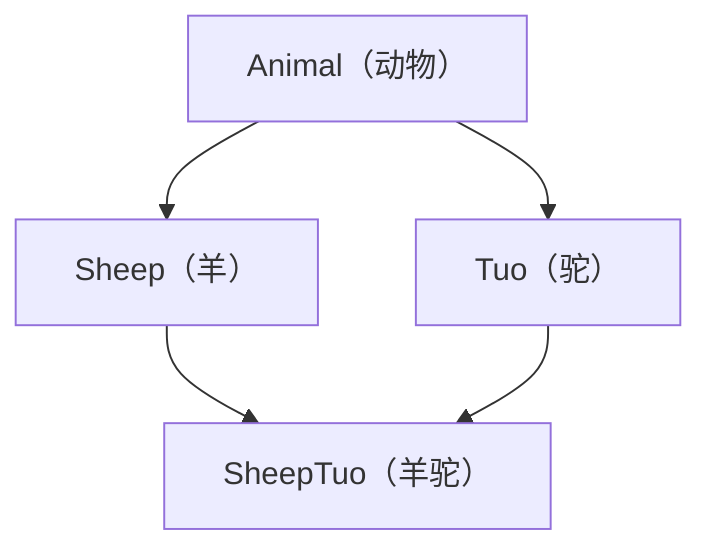
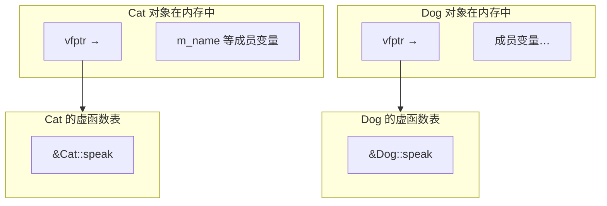

## 面向对象编程概述

面向过程的程序把数据和处理数据的函数分开：数据散落在各处，函数靠参数接收它们、靠返回值交还它们。程序小的时候这种组织方式足够清晰，规模一大就会暴露两个问题——改一个功能要动十几个文件，功能相似的代码只能靠复制粘贴。面向对象换了一种组织方式：把**数据**和**操作数据的方法**打包成对象，由对象自己对外提供接口。这一节先立起四个基本认识——**类和对象是什么关系**、**三大特性各自解决什么问题**、**访问权限怎样把内部细节挡在外面**、**为什么成员变量应当私有化**。后面所有的语法，都建立在"类是一个类型、对象是这个类型的变量"这个前提上。

### 从面向过程到面向对象

面向对象最核心的动作只有一个：**把数据和操作数据的方法打包成一个独立的、可复用的模块**。面向过程的写法里，数据是公共的，函数通过参数读写它们，二者之间只有约定、没有归属——谁都有权修改一份数据，出了问题也就找不到责任人。打包之后，数据归对象所有，外部只能通过对象公开的接口去读写，影响范围被关在类的内部。

**面向对象编程**（Object-Oriented Programming，OOP）的组织单位从"函数流程"变成了"对象"。现实世界本来就是由一个个对象组成的：人有姓名和年龄，也有走路和说话的能力；车有颜色和价格，也有加速和刹车的能力。每个对象既有**属性**（数据），也有**行为**（操作数据的方法）。OOP 让代码的组织方式向人认识世界的方式靠拢，这正是它比面向过程更贴近直觉的原因。

#### 类与对象

**类**（Class）是自定义的数据类型，**对象**（Object）是用这个类型定义的变量——前者是图纸，后者是按图纸造出来的实物。类里既有**成员变量**（属性），也有**成员函数**（行为），两者写在同一对花括号内，共同描述"这个东西有什么、能做什么"。

| 概念 | 类比 | C++ 中的角色 |
| :--- | :--- | :--- |
| **类**（Class） | 设计图纸——定义"这个东西应该有什么属性、能做什么" | 自定义的**数据类型**：成员变量（属性）+ 成员函数（行为） |
| **对象**（Object） | 按图纸造出来的实物——一台具体的车、一个具体的人 | 类的**实例**（Instance）：用类这个类型定义的变量 |

下面这段代码定义了一个 `Student` 类，把三个属性和一个输出行为放在一起，再在 `main` 里按这份"图纸"造出两个对象：

```cpp
#include <iostream>
#include <string>
using namespace std;

// 定义一个"学生"类（图纸）
class Student {
public:                          // 公开访问权限
    // 成员变量（属性）
    string name;
    int age;
    double score;

    // 成员函数（行为）
    void showInfo() {
        cout << "姓名：" << name
             << " 年龄：" << age
             << " 成绩：" << score << endl;
    }
};

int main() {
    // 用类创建对象（按图纸造实物）
    Student stu1;                // 实例化一个 Student 对象
    stu1.name = "张三";
    stu1.age = 18;
    stu1.score = 95.5;
    stu1.showInfo();             // 调用对象的成员函数

    Student stu2;                // 同一个类可以造出多个互不干扰的对象
    stu2.name = "李四";
    stu2.age = 20;
    stu2.score = 88.0;           // 每个对象的成员变量各自独立
    stu2.showInfo();
    return 0;
}
```

程序输出：

```
姓名：张三 年龄：18 成绩：95.5
姓名：李四 年龄：20 成绩：88
```

`stu1` 和 `stu2` 是两个完全独立的实体：修改 `stu1.name` 不会影响 `stu2.name`，因为它们各自持有一份成员变量。**类只是类型的定义，不占对象的内存；只有实例化出来的对象才真正占据空间。** 这一点在讨论对象内存模型时还会再回来。

> **注意**：`class` 是从 `struct` 演化来的（结构体的用法见 C++程序设计基础-7 结构体），两者在语法上几乎完全等价，**唯一的区别是默认访问权限**——`struct` 的成员默认公开，`class` 的成员默认私有。习惯上，只描述一组纯数据时用 `struct`，需要封装、需要成员函数的面向对象设计用 `class`；这条约定没有编译器强制，但它能把设计意图直接传达给读代码的人。

#### 三大特性

封装、继承、多态不是三个彼此独立的语法点，而是一条**递进的路线**：先把数据和方法包起来（封装），再让类之间形成父子关系以复用代码（继承），最后在继承的基础上让父类指针调用到子类自己的实现（多态）。

| 特性 | 要解决的问题 | 核心手段 |
| :--- | :--- | :--- |
| **封装**（Encapsulation） | 如何保护数据不被外部随意修改？ | 把属性和行为打包，用访问权限控制谁能看到什么 |
| **继承**（Inheritance） | 如何复用已有代码、表达"是一种"的关系？ | 子类自动获得父类的全部成员，并可以添加自己的特性 |
| **多态**（Polymorphism） | 如何让同一段代码对不同对象产生不同行为？ | 虚函数机制——父类指针或引用调用到子类的重写版本 |

三者的递进关系很重要：**没有封装，继承会把内部细节直接暴露给子类**；**没有继承，多态无从谈起**——多态讨论的正是父类指针指向子类对象时的行为。本篇后面的每一节，都是这条路线的一段展开。

### 封装与访问控制

封装不是一句口号，它的实现手段就是**访问权限**：在类里明确声明哪些成员对外公开、哪些只在内部可见。C++ 提供三种权限，它们分别决定了成员在**类内部**、**子类**和**类外部**三个位置能不能被访问。

#### 三种访问权限

| 权限 | 关键字 | 类内部访问 | 子类访问 | 类外部访问 |
| :--- | :--- | :---: | :---: | :---: |
| 公共 | `public` | ✅ | ✅ | ✅ |
| 保护 | `protected` | ✅ | ✅ | ❌ |
| 私有 | `private` | ✅ | ❌ | ❌ |

下面的类把对外接口放在 `public` 区，把数据放在 `private` 区——外部只能通过 `setName`／`getName` 这两个公开函数间接操作数据：

```cpp
#include <iostream>
#include <string>
using namespace std;

class Person {
public:                           // 公共：对外接口
    void setName(string n) {      // 通过公开函数间接设置私有属性
        name = n;
    }
    string getName() {            // 通过公开函数间接获取私有属性
        return name;
    }

private:                          // 私有：内部细节，外部不可见
    string name;                  // 姓名——外部不能直接访问
    int password;                 // 密码——外部绝对不能访问
};

int main() {
    Person p;
    p.setName("张三");
    cout << p.getName() << endl;  // ✅ 通过公开接口访问
    // p.name = "李四";           // ❌ 编译错误！name 是私有的
    // p.password = 123456;       // ❌ 编译错误！password 是私有的
    return 0;
}
```

程序输出：

```
张三
```

> **注意**：把成员变量设为 `private`、再对外提供必要的 `public` 成员函数（俗称 getter/setter），是封装的标准做法。它的价值在于**把变化的影响范围关在类内部**：如果将来内部实现要改——比如年龄的表示从 `int` 改成 `string`——只需要改 getter/setter 的实现，所有调用处一行都不用动。

#### 成员属性私有化

把属性私有化还有一个更实际的好处：**可以在写入口处校验数据是否合法**。这在公开属性上做不到——外部直接赋值时，类完全插不上手。

```cpp
#include <iostream>
#include <string>
using namespace std;

class Student {
public:
    void setName(string n) { name = n; }
    string getName() { return name; }

    void setAge(int a) {
        if (a < 0 || a > 150) {         // 数据有效性检查
            cout << "年龄不合法！" << endl;
            return;
        }
        age = a;
    }
    int getAge() { return age; }

private:
    string name;
    int age;
};

int main() {
    Student stu;
    stu.setAge(25);                      // ✅ 合法，正常写入
    stu.setAge(-5);                      // 输出：年龄不合法！（被拦截）
    return 0;
}
```

程序输出：

```
年龄不合法！
```

> **注意**：如果 `age` 是公开的，`stu.age = -5;` 这样的非法数据会悄悄进入程序，编译器不会给出任何提示，错误要等到很久以后才以奇怪的形式暴露出来。封装的价值不只在于"不让你看"，更在于"**让你按规则来**"。

## 构造函数与析构函数

封装解决了"数据怎么保护"，却留下两个必须回答的问题：对象刚被创建出来时，成员变量的初值是什么？对象销毁时，它占用的堆内存、打开的文件该由谁归还？C++ 用**构造函数**和**析构函数**这两个特殊成员函数回答它们——两者都由编译器在固定的时机自动调用，程序员不需要（也不能）手动触发。

### 对象的初始化与清理

构造函数负责初始化，析构函数负责清理，它们的调用时机由**对象的生命周期**决定，而不是由你在代码的哪一行决定。理解这一点，才能看懂后面那些"为什么先构造父类""为什么析构顺序和构造相反"的规则。

#### 构造与析构

**构造函数**（Constructor）在对象创建时被自动调用，用来给成员变量一个合法的初值；**析构函数**（Destructor）在对象销毁前被自动调用，用来释放对象持有的资源。两者都不写返回值，连 `void` 也不写。

| | 构造函数（Constructor） | 析构函数（Destructor） |
| :--- | :--- | :--- |
| **调用时机** | 对象创建时，由编译器自动调用 | 对象销毁前，由编译器自动调用 |
| **作用** | 初始化对象的成员变量 | 清理对象占用的资源（释放堆内存、关闭文件等） |
| **语法** | `类名(参数列表) { ... }` | `~类名() { ... }` |
| **有无返回值** | 无（连 `void` 也不写） | 无 |
| **能否重载** | ✅ 可以（参数不同即可） | ❌ 不可以（没有参数） |

下面这个类在构造和析构里各打印一句话，用输出来暴露它们的调用时机：

```cpp
#include <iostream>
using namespace std;

class Person {
public:
    // 构造函数：对象创建时自动调用
    Person() {
        cout << "Person 构造函数被调用" << endl;
    }

    // 析构函数：对象销毁前自动调用
    ~Person() {
        cout << "Person 析构函数被调用" << endl;
    }
};

int main() {
    Person p;          // 创建对象 → 自动调用构造函数
    return 0;          // main 结束前，p 被销毁 → 自动调用析构函数
}
```

程序输出：

```
Person 构造函数被调用
Person 析构函数被调用
```

> **注意**：如果没有写构造函数和析构函数，编译器会自动提供一个空版本（什么都不做），所以"不写也能编译"。但**一旦你写了任何构造函数，编译器就不再提供默认的无参构造函数**——此时 `Person p;` 这种写法会因为没有匹配的无参构造而编译失败。这时要么自己补一个无参构造，要么创建对象时老老实实传参。

> **易错点**：只要类里出现了 `new` 出来的堆内存、打开的文件句柄或网络连接这类需要手动归还的资源，就**必须自己写析构函数**——编译器生成的那个空析构不会替你 `delete`。反过来，一个只用值类型成员的类通常不需要写析构函数，交给编译器生成的版本就够了。

#### 三种构造函数

按参数区分，构造函数只有三类：**无参构造**、**有参构造**和**拷贝构造**。前两类负责把对象从无到有地造出来，拷贝构造负责用一个已有对象初始化一个新对象。三者的名字都必须是类名，靠参数列表区分。

下面这段代码把三类构造函数写在一起，并在 `main` 里演示了各自的调用写法：

```cpp
#include <iostream>
#include <string>
using namespace std;

class Person {
public:
    // 1. 无参构造（默认构造）
    Person() {
        cout << "无参构造函数" << endl;
    }

    // 2. 有参构造
    Person(int a) {
        age = a;
        cout << "有参构造函数，age = " << age << endl;
    }

    // 3. 拷贝构造——用已有的对象初始化新对象
    Person(const Person& p) {
        age = p.age;                               // 把已有对象的属性复制过来
        cout << "拷贝构造函数，age = " << age << endl;
    }

    ~Person() { cout << "析构函数" << endl; }

    int age;
};

int main() {
    Person p1;                   // 无参构造——注意不能写成 Person p1();
    Person p2(18);               // 有参构造——括号法
    Person p3 = Person(20);      // 有参构造——显式法
    Person p4 = p2;              // 拷贝构造——用 p2 初始化 p4
    Person p5(p2);               // 拷贝构造——括号法
    return 0;
}
```

运行这段代码可以看到三类构造函数都被调用了，并且 `main` 结束时 5 个对象按**构造的逆序**析构。拷贝构造的参数必须写成 `const Person&`：**用引用是因为传值会再次触发拷贝构造（无穷递归），加 `const` 是因为拷贝一份数据本来就不该修改源对象。**

> **易错点**：`Person p1();` **不是**创建对象，而是**函数声明**——它声明了一个名为 `p1`、返回 `Person` 类型、不带参数的函数。这是 C++ 从 C 继承下来的解析规则（被称为"最令人烦恼的解析"）：只要写成"类型 + 名字 + 空括号"，编译器就认为你在声明函数。想调用无参构造函数，直接写 `Person p1;` 就好，不要画蛇添足加括号。

### 拷贝控制

拷贝构造是三类构造函数里唯一"有陷阱"的一个：它的默认版本由编译器生成，行为是逐字节复制，对只用值类型成员的类完全够用，但只要类里出现指针，默认版本就会埋下一颗定时炸弹。

#### 三种调用时机

拷贝构造函数在三种情况下会被自动调用：**用一个已有对象初始化新对象**、**对象按值传给函数**、**函数按值返回局部对象**。识别这三种场景，就能预判程序在哪里偷偷做了一次拷贝。

```cpp
#include <iostream>
using namespace std;

class Person {
public:
    Person() { cout << "默认构造" << endl; }
    Person(const Person& p) { cout << "拷贝构造" << endl; }
};

// 场景 1：用已有对象初始化新对象
void test1() {
    Person p1;
    Person p2(p1);          // 拷贝构造
}

// 场景 2：值传递——把对象作为函数参数
void func(Person p) { }     // 形参 p 由实参拷贝而来
void test2() {
    Person p1;
    func(p1);               // 调用 func 时触发拷贝构造
}

// 场景 3：值返回——函数返回局部对象
Person createPerson() {
    Person p;
    return p;               // 返回时可能触发拷贝构造
}

int main() {
    test1();                // 场景 1
    test2();                // 场景 2
    createPerson();         // 场景 3
    return 0;
}
```

> **注意**：场景 3 在现代编译器上通常会被**返回值优化**（RVO）消除，实际运行时不调用拷贝构造。但这只是优化，不是语言保证的语义——**拷贝构造的调用时机是语言规则，优化只是让它在某些场合不出现**。判断代码有没有额外的拷贝开销，要看优化结果而不是靠猜。

#### 深拷贝与浅拷贝

只要类里有一个指向堆内存的指针，**默认的拷贝构造就会出事**：它只复制指针本身的值（这叫**浅拷贝**），于是两个对象的指针指向同一块内存，析构时同一块内存被 `delete` 两次，程序崩溃。

```cpp
#include <iostream>
using namespace std;

class Person {
public:
    Person(int age, int height) {
        m_age = age;
        m_height = new int(height);            // 在堆上分配内存
    }

    // 自定义拷贝构造——深拷贝
    Person(const Person& p) {
        m_age = p.m_age;
        m_height = new int(*p.m_height);       // 在堆上新开一块内存，把内容复制过去
    }

    ~Person() {
        if (m_height != nullptr) {
            delete m_height;                   // 释放各自独立的堆内存
            m_height = nullptr;
        }
    }

    int m_age;
    int* m_height;                             // 指向堆内存的指针
};

int main() {
    Person p1(18, 180);
    Person p2 = p1;        // 调用自定义拷贝构造——p2 拥有自己的堆内存
    return 0;
}
```

两者的差别可以用一张图概括——浅拷贝让两个指针指向同一个地址，深拷贝让它们各指一处：



> **注意**：判断要不要深拷贝的规则很简单——**类里有 `new` 分配的堆内存，就必须自己写拷贝构造函数和析构函数**。由此还引出一条 C++ 中最经典的规则，**大三律**（Rule of Three）：拷贝构造函数、赋值运算符重载、析构函数这三者管的是同一份资源，要么全写，要么全不写——只写其中一两个，必然在某个角落漏掉资源的释放或复制。

### 初始化列表与成员对象

到这里，构造函数的调用时机和拷贝语义都清楚了。还剩两个工程细节：**成员该在哪里初始化**，以及**成员本身也是对象时谁先构造**。

#### 初始化列表

初始化列表写在构造函数参数列表之后、函数体之前，语法是 `成员(值)`。对 `const` 成员、引用成员和没有默认构造函数的成员对象来说，**它不是一种可选写法，而是唯一的写法**。

```cpp
#include <iostream>
using namespace std;

class Person {
public:
    // 初始化列表：在参数列表后、函数体前用 成员(值) 的语法
    Person(int a, int b, int c) : m_a(a), m_b(b), m_c(c) {
        // 函数体内可以写其他逻辑，但初始化已经在列表阶段完成
    }

    void print() {
        cout << m_a << " " << m_b << " " << m_c << endl;
    }

private:
    int m_a;
    int m_b;
    int m_c;
};

int main() {
    Person p(1, 2, 3);
    p.print();
    return 0;
}
```

程序输出：

```
1 2 3
```

| 情况 | 必须使用初始化列表？ | 原因 |
| :--- | :---: | :--- |
| `const` 成员变量 | ✅ | `const` 变量必须在定义时初始化，不能在函数体内赋值 |
| 引用成员变量 | ✅ | 引用必须在定义时绑定，不能后续"重新绑定" |
| 成员是另一个类的对象且该类无默认构造 | ✅ | 需要在初始化列表阶段就调用该成员的构造函数 |

> **易错点**：初始化列表和"在函数体内赋值"不是等价的两种写法。初始化列表是在对象构造的**最早阶段**完成初始化——分配内存的同时就赋上值；而函数体内赋值是**先调用成员的默认构造函数把它造出来，再在函数体里覆盖一遍**。对 `int` 这样的内置类型，差别只是效率；对 `const` 成员、引用成员和没有默认构造函数的成员对象，函数体内赋值根本编译不过——它们在进入函数体之前就必须被初始化。

#### 类对象作为成员

一个类的对象可以作为另一个类的成员，这时的规则是**先构造成员对象，再构造本类；析构顺序正好相反，先析构本类，再析构成员对象**。原因也直接：本类的构造函数体可能会用到成员对象，所以成员必须先就绪；而析构时本类还持有对成员的依赖，所以要最后归还。

```cpp
#include <iostream>
#include <string>
using namespace std;

class Phone {
public:
    Phone(string brand) : m_brand(brand) {
        cout << "Phone 构造" << endl;
    }
    ~Phone() { cout << "Phone 析构" << endl; }
    string m_brand;
};

class Person {
public:
    Person(string name, string phoneBrand) : m_name(name), m_phone(phoneBrand) {
        cout << "Person 构造" << endl;
    }
    ~Person() { cout << "Person 析构" << endl; }

    string m_name;
    Phone m_phone;          // 另一个类的对象作为成员
};

int main() {
    Person p("张三", "iPhone");
    return 0;
}
```

程序输出：

```
Phone 构造
Person 构造
Person 析构
Phone 析构
```

这份输出正好印证了上面两条顺序：构造时成员对象在前、本类在后；析构时反过来。注意 `m_phone(phoneBrand)` 这一句必须在初始化列表里写——`Phone` 没有无参构造，函数体内赋值是没有机会的。

## 对象模型与 this 指针

会写类之后，接下来的问题是：对象在内存里到底存了什么？为什么同一个成员函数能被成千上万个对象共用？这两个问题的答案，就是理解多态底层机制的前置知识——**虚函数表**。

### 成员变量与成员函数分开存储

结论先说：**成员函数不属于对象**，它们和普通函数一样存放在代码区，同类型的对象共用同一份代码；**只有非静态成员变量才占据对象的内存**。

```cpp
#include <iostream>
using namespace std;

class Person {
public:
    int m_A;                  // 非静态成员变量——属于对象，占对象空间
    static int m_B;           // 静态成员变量——不属于对象（存在全局区）
    void func() { }           // 非静态成员函数——不属于对象（存在代码区）
    static void sfunc() { }   // 静态成员函数——不属于对象（存在代码区）
};
int Person::m_B = 10;         // 静态成员变量在类外初始化

int main() {
    Person p;
    cout << "sizeof(p) = " << sizeof(p) << endl;
    return 0;
}
```

程序输出：

```
sizeof(p) = 4
```

尽管这个类里有两个成员函数和一个静态成员变量，对象 `p` 的大小只有 4 字节——正好是一个 `int`（`m_A`）。也就是说，`sizeof(对象)` 等于所有非静态成员变量大小之和（还要考虑内存对齐）。

> **注意**：一个没有任何非静态成员变量的空对象，`sizeof` 是 1 而不是 0——C++ 要求每个对象有唯一的内存地址，编译器必须给它留出至少一个字节。另外，静态成员变量属于类而不是对象，它存在全局区，必须在类外单独初始化（写成 `int Person::m_B = 10;`）。

对象只存数据、所有对象共享代码，这引出一个新问题：**同一个成员函数被所有对象共用，它怎么知道这次调用的是谁？** 答案就是 `this` 指针。

### this 指针与常函数

`this` 是隐含在每个非静态成员函数里的一个指针，指向**调用该成员函数的那个对象**。编译器在编译成员函数时，会悄悄把 `this` 作为一个隐含参数插进去——这就是"共享的代码如何服务不同的对象"的全部秘密。

#### this 指针

`this` 最常见的用途是**区分同名的成员变量和形参**：当形参也叫 `age` 时，`age` 指的是形参，`this->age` 才是成员变量。它还有一个用途是**返回对象自身**，从而支持链式调用。

```cpp
#include <iostream>
using namespace std;

class Person {
public:
    Person(int age) {
        // 当成员变量和形参同名时，用 this 区分
        this->age = age;       // this->age 是成员变量，age 是形参
    }

    // 返回对象本身，支持链式调用
    Person& addAge(int n) {
        this->age += n;
        return *this;          // *this 就是当前对象本身
    }

    int age;
};

int main() {
    Person p(18);
    p.addAge(1).addAge(1).addAge(1);   // 链式调用——每次返回 *this
    cout << p.age << endl;
    return 0;
}
```

程序输出：

```
21
```

`addAge` 的返回类型必须是 `Person&` 而不是 `Person`：返回引用时，链式调用里的每一次操作都作用在同一个对象上；如果返回值，每一步操作的都是一个临时拷贝，`p` 本身永远不会被改变。

> **注意**：在编译器内部，`this` 的类型是 `Person* const`——一个**指针常量**。你不能改变 `this` 的指向（它始终指向当前对象），但可以通过它修改对象的成员。这也解释了为什么 `const` 成员函数里的 `this` 会变成 `const Person* const`：连它指向的对象也不能改了。

#### 空指针访问

空指针也能调用成员函数，因为**成员函数的代码不在对象里**——调用它只需要知道代码的位置，不需要访问对象的数据。但只要函数体真正用到了 `this`（也就是访问了成员变量），程序立刻崩溃。

```cpp
#include <iostream>
using namespace std;

class Person {
public:
    void showClassName() {
        cout << "我是 Person 类" << endl;     // 没有用到 this——安全
    }

    void showAge() {
        cout << "年龄：" << m_age << endl;     // 等价于 this->m_age——危险！
    }

    int m_age;
};

int main() {
    Person* p = nullptr;
    p->showClassName();                        // ✅ 可以运行（没有用到 this）
    // p->showAge();                           // ❌ 崩溃！访问了 this->m_age
    return 0;
}
```

程序输出：

```
我是 Person 类
```

> **易错点**：`p->showAge()` 崩溃的根源不是"通过空指针调用了函数"，而是函数体里执行了 `this->m_age`——对一个空指针做解引用。这也提醒一件事：**成员函数不访问任何成员变量时，它可以被空指针安全地调用**，所以"能不能调用"取决于函数体，而不是取决于调用形式。

#### 常函数

在成员函数的参数列表后面加 `const`，表示这是一个**常函数**：它承诺不修改对象的任何成员变量。在常函数内部，`this` 的类型变成 `const Person* const`，任何试图修改成员变量的语句都会被编译器拦下——除非那个成员被 `mutable` 修饰。

```cpp
#include <iostream>
using namespace std;

class Person {
public:
    void show() const {                  // 常函数——承诺不修改成员
        // m_a = 100;                    // ❌ 错误！const 成员函数不能修改成员变量
        m_b = 100;                       // ✅ mutable 成员可以被修改
        cout << m_a << " " << m_b << endl;
    }

    int m_a = 10;
    mutable int m_b = 20;                // mutable：即使在常函数中也可以修改
};

int main() {
    const Person p;                      // 常对象
    p.show();                            // 常对象只能调用常函数
    return 0;
}
```

程序输出：

```
10 100
```

> **注意**：`const` 对象只能调用常函数，反过来，常函数可以被常对象和普通对象调用。原因是权限不能放大——如果常对象能调用一个会修改成员的普通函数，那么"这个对象不可修改"的承诺就被破坏了。`mutable` 是这条规则留的口子，用于计数器、缓存这类**逻辑上不算"内容"的成员**。

## 友元

封装把私有成员挡在外面，但总有一些外部代码需要访问它们——比如重载 `<<` 的那个全局函数，它必须看到对象内部的字段才能输出。C++ 的答案是**友元**（Friend）：由类的设计者主动授权的、受控的例外。关键字是 `friend`，它打破了封装，但**打破的权力握在类自己手里**。

### 三种友元形式

友元有三种粒度：把整个全局函数设为友元、把一整个类设为友元、或者只把另一个类的**某一个成员函数**设为友元。粒度越细，对外暴露的面越小，因此授权时应当**按最小需要来选**。

#### 全局函数做友元

把全局函数声明为友元后，这个函数就能访问类的私有成员。写法是在类内用 `friend` 加函数声明，函数本身定义在类外。

```cpp
#include <iostream>
#include <string>
using namespace std;

class Building {
    friend void visit(Building* b);     // 声明 visit 为友元

public:
    Building() : livingRoom("客厅"), bedRoom("卧室") {}
    string livingRoom;                   // 公共成员

private:
    string bedRoom;                      // 私有成员——但友元可以访问
};

void visit(Building* b) {
    cout << "访问 " << b->livingRoom << endl;
    cout << "访问 " << b->bedRoom << endl;   // 友元可以访问私有成员！
}

int main() {
    Building b;
    visit(&b);
    return 0;
}
```

程序输出：

```
访问 客厅
访问 卧室
```

> **注意**：`friend` 声明可以写在类的任何位置，写在一开头（`public` 之前）是常见风格，因为它表达的是"这个类是给谁开门的"，而不是成员的一部分。

#### 类做友元

把整个类声明为友元时，那个类的**所有成员函数**都能访问本类的私有成员。适合两个类在实现上需要深度协作的场景。

```cpp
#include <iostream>
#include <string>
using namespace std;

class Building {
    friend class Visitor;               // 声明 Visitor 类为友元

public:
    Building() : livingRoom("客厅"), bedRoom("卧室") {}
    string livingRoom;

private:
    string bedRoom;
};

class Visitor {
public:
    void visit(Building* b) {
        cout << b->livingRoom << endl;
        cout << b->bedRoom << endl;      // Visitor 的成员函数可访问 Building 的私有成员
    }
};

int main() {
    Building b;
    Visitor v;
    v.visit(&b);
    return 0;
}
```

程序输出：

```
客厅
卧室
```

#### 成员函数做友元

如果有多个类需要访问本类，并且其余成员函数不应该乱看，正确的做法是使用**最细的粒度**：只把另一个类的某一个成员函数设为友元。写法比前两种多一步——需要三样东西：被访问类的前置声明、完整的授权方类、以及带作用域限定的友元声明。

```cpp
#include <iostream>
#include <string>
using namespace std;

class Building;                          // 前置声明

class Visitor {
public:
    void visit(Building* b);             // 只有这个函数是友元
    void otherFunc();                    // 这个不是友元
};

class Building {
    friend void Visitor::visit(Building* b);  // 只把 Visitor::visit 声明为友元

public:
    Building() : livingRoom("客厅"), bedRoom("卧室") {}
    string livingRoom;

private:
    string bedRoom;
};

void Visitor::visit(Building* b) {
    cout << b->livingRoom << endl;
    cout << b->bedRoom << endl;          // 友元函数——可以访问私有成员
}

void Visitor::otherFunc() {
    cout << "otherFunc 不是友元，看不到 bedRoom" << endl;
}

int main() {
    Building b;
    Visitor v;
    v.visit(&b);
    v.otherFunc();
    return 0;
}
```

程序输出：

```
客厅
卧室
otherFunc 不是友元，看不到 bedRoom
```

前置声明 `class Building;` 是必须的：`Visitor` 里要用到 `Building*`，编译器至少得知道 `Building` 是一个类名。**注意这里只能声明指针或引用参数**——前置声明没有提供类的完整定义，按值传参或访问成员都会编译失败。

## 运算符重载

C++ 允许为已有的运算符**重新定义含义**，让它们能作用于自定义类型：`+` 原本只能算 `int` 和 `double`，重载之后可以让两个自定义对象直接相加。这让自定义类型的用法向内置类型靠拢。前面学的友元在这里派上了用场——输出运算符 `<<` 只有写成全局函数，调用顺序才符合直觉。

### 算术与输出运算符

这两个运算符都是二元的，左边和右边各有一个操作数，重载后的行为也最直观：一个负责算出新对象，一个负责把对象输出到流。

#### 加号运算符重载

重载 `+` 有两种写法——**成员函数**和**全局函数**，二者只能选一种。"只能选一种"不是风格问题：同时定义会让 `p1 + p2` 同时匹配两个候选函数，编译器无法判断该用哪个，直接报二义性错误。

先看成员函数写法，左边的操作数就是调用该函数的对象：

```cpp
#include <iostream>
using namespace std;

class Point {
public:
    Point(int x, int y) : m_x(x), m_y(y) {}

    // 成员函数方式重载 + 号
    Point operator+(const Point& other) {
        return Point(m_x + other.m_x, m_y + other.m_y);
    }

    int m_x, m_y;
};

int main() {
    Point p1(10, 10);
    Point p2(20, 20);
    Point p3 = p1 + p2;              // 等价于 p1.operator+(p2)
    cout << p3.m_x << ", " << p3.m_y << endl;
    return 0;
}
```

程序输出：

```
30, 30
```

如果希望两个操作数的地位对等，可以改用全局函数，把两个操作数都写成参数：

```cpp
#include <iostream>
using namespace std;

class Point {
public:
    Point(int x, int y) : m_x(x), m_y(y) {}
    int m_x, m_y;                    // 全局函数要访问，所以必须是公开的
};

// 全局函数方式重载 + 号（与上面的成员函数版二选一，不能同时定义）
Point operator+(const Point& p1, const Point& p2) {
    return Point(p1.m_x + p2.m_x, p1.m_y + p2.m_y);
}

int main() {
    Point p1(10, 10);
    Point p2(20, 20);
    Point p3 = p1 + p2;              // 等价于 operator+(p1, p2)
    cout << p3.m_x << ", " << p3.m_y << endl;
    return 0;
}
```

程序输出：

```
30, 30
```

#### 左移运算符重载

想让 `cout << 自定义对象` 直接输出内容，就要重载 `<<`。它**只能写成全局函数**，通常再配合友元访问私有成员：写成成员函数会变成 `对象 << cout`，调用顺序完全反了。

```cpp
#include <iostream>
using namespace std;

class Person {
    friend ostream& operator<<(ostream& out, const Person& p);

private:
    int m_a = 10;
    int m_b = 20;
};

// 全局函数重载 <<（返回 ostream& 以支持链式调用）
ostream& operator<<(ostream& out, const Person& p) {
    out << "a=" << p.m_a << ", b=" << p.m_b;
    return out;
}

int main() {
    Person p;
    cout << p << " 结束" << endl;
    return 0;
}
```

程序输出：

```
a=10, b=20 结束
```

返回类型必须是 `ostream&`，不能是 `void`，也不能按值返回：`cout << p << " 结束"` 会被解析成 `(cout << p) << " 结束"`，只有返回流本身的引用，后面那一段才有东西可接。

> **易错点**：`cout << obj` 等价于 `operator<<(cout, obj)`，**第一个操作数是 `ostream&`**。如果把它写成成员函数，调用形式就变成 `obj.operator<<(cout)`，写作 `obj << cout`——所以 `<<`（以及输入流用的 `>>`）只能重载为全局函数。它需要访问私有成员时，再在类里声明为友元，这两件事经常一起出现。

### 递增与赋值运算符

这两个运算符都会修改对象自己，但返回值的选择不一样：一个返回引用，一个返回引用，而前置和后置 `++` 的差别恰恰藏在返回值里。

#### 递增运算符重载

前置 `++` 和后置 `++` 通过一个 `int` **占位参数**来区分：`operator++()` 是前置，`operator++(int)` 是后置，那个 `int` 只是给编译器看的标记，不会被使用。前置返回引用，后置返回值。

```cpp
#include <iostream>
using namespace std;

class MyInt {
public:
    MyInt(int n) : m_num(n) {}

    // 前置 ++：先加后返回，返回引用（返回对象自己）
    MyInt& operator++() {
        m_num++;
        return *this;
    }

    // 后置 ++：先返回旧值后加，返回值（返回的是临时拷贝），int 是占位参数——只用于区分
    MyInt operator++(int) {
        MyInt temp = *this;
        m_num++;
        return temp;
    }

    int m_num;
};

int main() {
    MyInt a(5);
    MyInt b = ++a;      // 前置：a 先自增到 6，返回 a 本身
    MyInt c = a++;      // 后置：先把旧值 6 拷贝给 c，a 再自增到 7
    cout << a.m_num << " " << b.m_num << " " << c.m_num << endl;
    return 0;
}
```

程序输出：

```
7 6 6
```

> **注意**：**前置返回引用、后置返回值的规则不能反。** 前置 `++` 返回 `*this`，所以 `++++a` 这样的连续调用作用在同一个对象上；后置 `++` 必须返回一个**新的临时对象**（它代表自增之前的旧值），如果返回引用，调用方拿到的就是函数结束时已经被销毁的对象。后置版本比前置多一次拷贝，这也是"能用前置就别用后置"的性能原因。

#### 赋值运算符重载

类里有堆内存时，`=` 和拷贝构造函数一样必须自己做深拷贝。编译器默认生成的 `operator=` 只做浅拷贝，和默认拷贝构造错在同一处。

```cpp
#include <iostream>
using namespace std;

class Person {
public:
    Person(int age) {
        m_age = new int(age);
    }

    // 重载 = ——深拷贝
    Person& operator=(const Person& p) {
        if (this == &p) {              // 自我赋值：直接返回
            return *this;
        }
        if (m_age != nullptr) {        // 先释放自己的旧内存
            delete m_age;
            m_age = nullptr;
        }
        m_age = new int(*p.m_age);     // 重新从堆上分配一份
        return *this;                  // 返回 *this 支持 a = b = c 连续赋值
    }

    ~Person() { delete m_age; }

    int* m_age;
};

int main() {
    Person a(18);
    Person b(20);
    b = a;                             // b 的旧内存被释放，新内存内容来自 a
    cout << *b.m_age << endl;
    return 0;
}
```

程序输出：

```
18
```

> **易错点**：`operator=` 的第一行必须先判断 `this == &p`。因为赋值的第一步是 `delete m_age`，如果调用方写的是 `a = a`，释放完之后再去读 `*p.m_age` 读的就是自己刚释放掉的内存——**先释放后读取的顺序，决定了自我赋值会崩溃**。另外返回类型必须是 `Person&`，这样 `a = b = c` 才能从右往左连续赋值。

### 关系与调用运算符

最后两个运算符都不产生新的数据对象：一个只做判断，一个让对象可以像函数一样被调用。

#### 关系运算符重载

重载 `==` 之后，对象之间比较的是**内容**而不是内存地址；`!=` 可以直接复用 `==` 的结果，不必重写一遍比较逻辑。

```cpp
#include <iostream>
#include <string>
using namespace std;

class Person {
public:
    string name;
    int age;

    bool operator==(const Person& other) {
        return name == other.name && age == other.age;
    }

    bool operator!=(const Person& other) {
        return !(*this == other);      // 复用 == 的实现
    }
};

int main() {
    Person p1;
    p1.name = "张三";
    p1.age = 18;

    Person p2 = p1;                    // 成员都是值语义，默认拷贝构造够用
    Person p3;
    p3.name = "李四";
    p3.age = 18;

    cout << (p1 == p2) << endl;        // 1——内容完全相同
    cout << (p1 == p3) << endl;        // 0——姓名不同
    cout << (p1 != p3) << endl;        // 1——!= 复用 == 的结果
    return 0;
}
```

程序输出：

```
1
0
1
```

> **注意**：如果不重载 `==`，两个对象之间根本不能用 `==` 比较——编译器不会替你按成员逐个比较。"怎么算相等"属于类的语义（比如姓名和年龄都相同才算相等），只能由类的设计者定义。

#### 函数调用运算符

重载 `()` 之后，对象可以像函数一样被调用，这种对象称为**仿函数**（Functor）。它的价值在于：**对象可以携带状态**，而普通函数不行——标准库算法正是用仿函数来接收"行为参数"。关于仿函数在算法里的用法，见 C++程序设计基础-11 STL标准模板库。

```cpp
#include <iostream>
using namespace std;

class MyPrint {
public:
    void operator()(string text) const {    // 重载 ()
        cout << text << endl;
    }
};

int main() {
    MyPrint printer;
    printer("Hello World");                 // 对象像函数一样被调用——仿函数
    return 0;
}
```

程序输出：

```
Hello World
```

## 继承

继承表达的是"**是一种**"（is-a）关系：学生是一种人，跑车是一种车。子类自动获得父类的全部成员，再在上面添加自己独有的部分。它解决的是**代码复用**——把多个类共有的成员提取到父类，子类只关注差异。同时它也决定了对象在内存里怎么排布、构造和析构按什么顺序发生。

### 继承的语法与权限

语法本身只有一行：`class 子类 : 继承方式 父类`。真正需要想清楚的是继承方式，它决定了父类的成员到子类之后还剩多少可见性。

#### 继承的基本语法

子类自动拥有父类的全部成员（包括成员函数），不需要重新定义；子类自己新增的成员与父类成员并存。

```cpp
#include <iostream>
using namespace std;

// 父类（基类）
class Animal {
public:
    void eat() { cout << "动物在吃东西" << endl; }
};

// 子类（派生类）：继承方式 父类
class Dog : public Animal {
public:
    void bark() { cout << "狗在汪汪叫" << endl; }
};

int main() {
    Dog d;
    d.eat();         // 继承自 Animal——无需重新定义
    d.bark();        // Dog 自己的方法
    return 0;
}
```

程序输出：

```
动物在吃东西
狗在汪汪叫
```

相关的术语固定下来是这样：

| 术语 | 说明 |
| :--- | :--- |
| 父类 / 基类（Base Class） | 被继承的类 |
| 子类 / 派生类（Derived Class） | 继承父类的类 |
| 继承方式 | `public`、`protected`、`private`——决定父类成员在子类中的访问权限 |

> **注意**：继承最大的价值是**减少重复代码**：多个类共有的成员提取到父类中，子类只写自己独有的部分。这和生活中"把共性抽象出来"的思维方式完全一致，也正是"是一种"关系成立时的自然结果——如果两个类之间不是"是一种"的关系，就不该用继承。

#### 三种继承方式

继承方式改变的是父类成员在子类中的**访问权限**，规则是"**取两者中更严格的那个**"：

| 父类成员权限 | `public` 继承后 | `protected` 继承后 | `private` 继承后 |
| :--- | :--- | :--- | :--- |
| `public` | 仍为 `public` | 变为 `protected` | 变为 `private` |
| `protected` | 仍为 `protected` | 变为 `protected` | 变为 `private` |
| `private` | **不可访问** | **不可访问** | **不可访问** |

> **注意**：父类的私有成员在子类中**永远不可直接访问**，不管用什么继承方式。但要说清一件事：**它们确实被子类继承了**，也实实在在占据子类对象的内存空间，只是被编译器的访问控制藏了起来。如果子类需要用到它们，只能通过父类提供的 `public` 成员函数间接访问。这一点在下一小节的 `sizeof` 实验里会得到验证。

> **建议**：绝大多数场景都应该用 `public` 继承，它表达的是标准的"是一种"关系。`protected` 和 `private` 继承极少使用——它们表达的是"用父类的实现来组装自己"（实现继承），而不是"我是父类的一种"（接口继承），用组合往往更清晰。

### 继承中的对象模型

语法层面的问题解决之后，更关键的是子类对象在内存里到底长什么样：父类的私有成员在不在里面？构造和析构谁先谁后？子类和父类出现同名成员时，编译器选哪一个？

#### 私有成员也被继承

**父类的所有成员（包括私有成员）都实实在在地存在于子类对象中**，只是私有成员被编译器隐藏了，子类无法在代码里直接访问。

```cpp
#include <iostream>
using namespace std;

class Base {
public:
    int m_A;
protected:
    int m_B;
private:
    int m_C;             // 私有成员
};

class Son : public Base {
public:
    int m_D;             // 子类自己新增的成员
};

int main() {
    cout << "sizeof(Son) = " << sizeof(Son) << endl;
    return 0;
}
```

程序输出：

```
sizeof(Son) = 16
```

如果私有成员没有被继承，`sizeof(Son)` 应该只有 12（三个 `int`）。实际输出的 16 说明 m_C 就在对象里——**访问权限控制的是"能不能在代码里提到这个名字"，不是"这块内存存不存在"。**

#### 构造与析构顺序

创建子类对象时的构造顺序是**先父后子**，销毁时的析构顺序是**先子后父**，正好相反。

```cpp
#include <iostream>
using namespace std;

class Base {
public:
    Base()  { cout << "Base 构造" << endl; }
    ~Base() { cout << "Base 析构" << endl; }
};

class Son : public Base {
public:
    Son()  { cout << "Son 构造" << endl; }
    ~Son() { cout << "Son 析构" << endl; }
};

int main() {
    Son s;
    return 0;
}
```

程序输出：

```
Base 构造
Son 构造
Son 析构
Base 析构
```

顺序的合理性不难理解：父类是子类的基础，子类的构造函数体里可能会用到父类的成员，所以父类必须先构造完成；析构时反过来，先把子类自己的部分清理干净，再交还给父类去清理。

#### 同名成员的处理

子类和父类出现同名成员时，**子类直接访问的是自己的那一份**；要访问父类的同名成员，必须加上作用域限定 `父类名::`。

```cpp
#include <iostream>
using namespace std;

class Base {
public:
    int m_A = 100;
    void func() { cout << "Base::func" << endl; }
};

class Son : public Base {
public:
    int m_A = 200;
    void func() { cout << "Son::func" << endl; }
};

int main() {
    Son s;
    cout << s.m_A << endl;             // 200（子类自己的）
    cout << s.Base::m_A << endl;       // 100（通过作用域访问父类的）
    s.func();                          // Son::func
    s.Base::func();                    // Base::func
    return 0;
}
```

程序输出：

```
200
100
Son::func
Base::func
```

> **易错点**：子类的同名成员函数会**隐藏父类的所有同名版本**，而不只是参数相同的那一个。如果父类还有 `void func(int)`，而子类定义了 `void func()`，那么 `s.func(10)` 会直接编译失败——父类的 `func(int)` 已经被藏起来了，必须写成 `s.Base::func(10)` 才能调用。这是"名字隐藏"而不是"函数重载"，二者发生作用的范围不同。

### 多继承与菱形继承

一个子类可以同时继承多个父类。它能表达"兼具多种能力"，但也把命名冲突和内存冗余的问题一起带了进来——这正是理解虚继承的前提。

#### 多继承

多继承的语法只是在冒号后面用逗号列出多个父类。它带来的最大问题是**命名冲突**：两个父类有同名成员时，编译器无法判断该用哪一个，必须由程序员用作用域显式指定。

```cpp
#include <iostream>
using namespace std;

class Base1 {
public:
    int m_A = 10;
};

class Base2 {
public:
    int m_A = 20;      // 与 Base1 同名
};

class Son : public Base1, public Base2 {
    // 同时拥有 Base1 和 Base2 的成员
};

int main() {
    Son s;
    // cout << s.m_A << endl;      // ❌ 二义性：编译器不知道要哪一个
    cout << s.Base1::m_A << endl;  // 10——用作用域区分
    cout << s.Base2::m_A << endl;  // 20
    return 0;
}
```

程序输出：

```
10
20
```

正因为这种二义性难以彻底消除，Java 等语言干脆放弃了对多继承的支持，改用接口来表达"具备多种能力"；在 C++ 里，多继承在大多数场景下也都能用更清晰的设计（组合、接口类）替代，**日常开发中并不推荐使用**。

#### 菱形继承与虚基类

菱形继承是多继承最经典的问题场景：两个子类继承同一个父类，孙类又同时继承这两个子类。此时孙类会拥有**两份**相同的祖类成员——一份从路径 A 来，一份从路径 B 来。



两份成员带来两个后果：**数据冗余**（同一份信息存了两遍），以及**访问歧义**（`st.m_age` 到底指哪一份？）。解决方法是**虚继承**——在中间层继承祖类时加 `virtual` 关键字，让编译器保证孙类中只保留一份祖类成员：

```cpp
#include <iostream>
using namespace std;

class Animal {
public:
    int m_age;
};

// 虚继承——解决菱形问题
class Sheep : virtual public Animal { };
class Tuo   : virtual public Animal { };

class SheepTuo : public Sheep, public Tuo { };

int main() {
    SheepTuo st;
    st.m_age = 5;                      // 只有一份 m_age，访问不再歧义
    cout << st.m_age << endl;
    return 0;
}
```

程序输出：

```
5
```

> **注意**：虚继承是有代价的。它的底层实现需要额外存一个指针（`vbptr`，虚基类表指针）来定位那份共享的祖类成员，对象体积会略微变大，访问虚基类成员时也多一次间接寻址。这正是菱形继承被视为设计缺陷的原因——**它迫使编译器和程序员为一个不合理的继承结构付出额外的复杂度**。最好的处理方式不是在继承链上打 `virtual` 补丁，而是一开始就避免菱形继承。

## 多态

继承解决了代码复用，却没有解决另一个问题：父类指针指向子类对象时，调用的到底是父类的函数还是子类的函数？如果答案是"父类的函数"，那么哪怕你手里拿着一条狗，它也只能发出动物的声音。**多态**让这个选择推迟到运行时，由对象的**实际类型**决定。

### 多态的条件与用法

**多态**（Polymorphism）的含义是：同一行调用代码，作用在不同类型的对象上会产生不同的行为。它的实现依赖三个条件，缺一不可。

| 条件 | 说明 |
| :--- | :--- |
| **有继承关系** | 必须存在父类和子类的层级关系 |
| **子类重写父类的虚函数** | 函数名、参数列表、返回值完全相同，父类函数必须带 `virtual` |
| **父类指针或引用指向子类对象** | `Animal* p = new Dog;` 或 `Animal& r = dog;` |

下面这个例子用同一个 `doSpeak` 函数处理不同的动物，实际调用到哪一个 `speak` 由传入的对象类型决定：

```cpp
#include <iostream>
using namespace std;

class Animal {
public:
    virtual void speak() {                    // virtual 关键字——声明为虚函数
        cout << "动物在说话" << endl;
    }
};

class Cat : public Animal {
public:
    void speak() override {                   // override 可选但推荐——编译器帮你检查是否真的在重写
        cout << "小猫在说话" << endl;
    }
};

class Dog : public Animal {
public:
    void speak() override {
        cout << "小狗在说话" << endl;
    }
};

// 多态的核心用法：同一个函数、同一个父类引用，行为取决于传入的对象类型
void doSpeak(Animal& animal) {
    animal.speak();
}

int main() {
    Cat cat;
    Dog dog;
    doSpeak(cat);        // 输出：小猫在说话（传入 Cat → 调用 Cat::speak）
    doSpeak(dog);        // 输出：小狗在说话（传入 Dog → 调用 Dog::speak）
    return 0;
}
```

程序输出：

```
小猫在说话
小狗在说话
```

> **易错点**：忘记写 `virtual`，编译器**不会报任何错**，但行为完全退化——退化成**静态绑定**（在编译期就按指针的静态类型把函数地址定死），`doSpeak` 会永远调用 `Animal::speak()`，两次输出都是"动物在说话"。这是多态最常见的隐性 bug：代码看起来完全正确，行为却和预期不符。子类那边写 `override` 能让编译器替你检查"是否真的在重写父类的虚函数"，写错了会直接报错，建议一律加上。

### 抽象类与虚析构

有些父类的虚函数根本无法给出有意义的实现——"动物"这个概念本身不知道怎么叫。语言对此给出了明确支持：**纯虚函数**。另一个必须处理的问题是资源释放：通过父类指针 `delete` 子类对象时，析构函数必须是虚的。

#### 纯虚函数与抽象类

把虚函数声明成 `= 0` 就得到**纯虚函数**，它只有声明、没有实现；含有纯虚函数的类称为**抽象类**，**不能被实例化**，它的唯一用途就是被继承，由子类补上实现。

```cpp
#include <iostream>
using namespace std;

class Animal {
public:
    virtual void speak() = 0;        // 纯虚函数——不提供实现，子类必须重写
};

class Cat : public Animal {
public:
    void speak() override {
        cout << "小猫在说话" << endl;
    }
};

int main() {
    // Animal a;                     // ❌ 错误！抽象类不能实例化
    Animal* p = new Cat;             // ✅ 可以用指针指向子类对象
    p->speak();
    delete p;                        // 这里 Animal 还没有虚析构函数——见下一小节
    return 0;
}
```

程序输出：

```
小猫在说话
```

抽象类的规则有三条：**不能创建抽象类的对象**；**如果子类没有重写全部纯虚函数，子类仍然是抽象类**；抽象类通常应当配上虚析构函数。纯虚函数的真正价值是把"必须实现什么"写进类型系统——父类说清接口，子类负责实现，忘记实现就根本编译不出对象。

#### 虚析构与纯虚析构

通过父类指针 `delete` 子类对象时，如果父类的析构函数**不是虚的**，编译器只会根据指针的静态类型调用父类的析构函数，**子类的析构函数根本不会被调用**——子类里在堆上分配的成员就此泄漏。

```cpp
#include <string>
using namespace std;

class Animal {
public:
    virtual ~Animal() { }            // 虚析构——确保 delete 父类指针时子类析构被调用
};

class Cat : public Animal {
public:
    string* m_name;
    Cat(string name) { m_name = new string(name); }
    ~Cat() { delete m_name; }        // 子类析构负责释放自己的堆内存
};

int main() {
    Animal* p = new Cat("Tom");
    delete p;                        // 如果 ~Animal() 不是 virtual，Cat::~Cat() 不会被调用！
    return 0;
}
```

> **易错点**：`Animal* p = new Cat; delete p;` 中，如果 `~Animal()` 不是虚函数，编译器按**静态类型**（`Animal*`）来决定调用哪个析构函数，结果只执行了 `Animal::~Animal()`，`Cat::~Cat()` 以及它内部的 `delete m_name` 永远不会执行——这块堆内存就漏掉了，而且不会有任何报错或提示。**只要一个类会被当作父类使用，就应该把析构函数声明为虚函数**，这条规则没有例外。（手工 `new`／`delete` 的配对问题在现代 C++ 中通常交给智能指针自动处理，见 C++程序设计基础-12 现代C++；但智能指针解决的是"谁来释放"，虚析构解决的是"释放到哪一层"，两者不能相互替代。）

> **注意**：析构函数也可以写成纯虚的——`virtual ~类名() = 0;`，这样含有它的类也是抽象类。但纯虚析构和普通纯虚函数有一处不同：**它必须有函数体实现**，要在类外补上 `类名::~类名() { }`。原因是对象销毁时析构链一定会执行到父类这一层，没有函数体就没法链接。

### 多态的底层实现

多态不是编译器的魔法，它背后有一套确定的机制。理解这套机制，才能解释"为什么虚函数会让对象变大""为什么虚析构能沿着继承链逐层调用"。

#### 虚函数表

**每一个包含虚函数的类，在编译时都会生成一张虚函数表**（vftable，虚函数表）：表里按顺序记录该类所有虚函数的地址。子类重写了哪个虚函数，子类自己的虚函数表里对应的那一项就换成子类的函数地址——**重写的本质是覆盖表中的一项**。



#### 虚函数指针

虚函数表属于**类**，而每个**对象**在自己的内存最前端存一个**虚函数表指针**（vfptr），指向所属类的那张表。于是通过父类指针或引用调用虚函数时，实际执行路径是：

```
父类指针 p → 对象内存开头的 vfptr → 该对象的虚函数表 → 函数地址 → 调用
```

`Animal* p = new Cat; p->speak();` 和 `Animal* p = new Dog; p->speak();` 调用的是同一行代码，但因为两个对象的 `vfptr` 分别指向 `Cat` 和 `Dog` 的虚函数表，最终跳转到的函数地址不同——**这就是"运行时才知道调用谁"的全部机制**。

> **注意**：给一个类加上虚函数，`sizeof` 会增加 4 或 8 字节（一个指针的大小），多出来的正是 `vfptr`。这是验证虚函数表机制最直观的方法：写两个只有成员函数不同的类，一个带 `virtual`，一个不带，分别打印 `sizeof` 就能看到差别。

## 小结

1. 面向对象把数据和操作数据的方法打包成对象，封装、继承、多态是递进的三步：先把数据包起来，再让类之间形成父子关系，最后让父类指针调用到子类的实现。
2. `class` 与 `struct` 的唯一区别是默认访问权限；封装的标准做法是成员变量私有、只通过公开接口读写，并在接口处做数据校验。
3. 构造函数在对象创建时初始化成员，析构函数在对象销毁前释放资源；一旦类里有 `new` 出来的堆内存，就必须自己写析构函数。
4. 类里有堆内存时，拷贝构造和赋值运算符必须自己做深拷贝，否则两个对象指向同一块内存、被 `delete` 两次——拷贝构造、赋值运算符重载、析构函数三者要么全写要么全不写，这就是大三律。
5. 对象只存非静态成员变量，成员函数存在代码区被所有对象共享，`this` 指针正是成员函数用来知道自己服务于哪个对象的隐含参数。
6. 友元和运算符重载都是有边界的例外：友元由类的设计者主动授权、粒度可以细到一个成员函数，`<<` 只能写成全局函数，因为 `cout` 必须留在左操作数的位置。
7. `virtual` 是多态的开关，继承、子类重写、父类指针或引用指向子类对象三个条件缺一不可；忘记 `virtual` 会退化成静态绑定，而通过父类指针 `delete` 子类对象时，父类析构函数必须是虚的。
